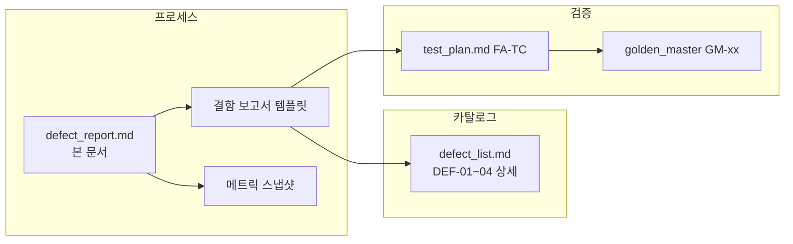
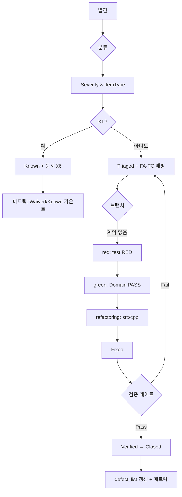

# Feedback Analyzer — 결함 관리 프로세스 (Defect Report)

| 항목 | 내용 |
|------|------|
| 문서 버전 | process-1.0 |
| 작성 관점 | QA 리드 (심각도·유형·메트릭·워크플로) |
| 기준선 | Phase 0~7 완료 · DEF-01~04 **해소** · FA-TC **67/67** Green · GM-01~04 PASS |
| 근거 | `docs/defect_list.md`, `docs/test_plan.md`, `docs/requirements_analysis.md`, `.cursorrules` |
| 역할 구분 | **결함 목록** = `defect_list.md` (카탈로그·재현·해소) · **본 문서** = 등록·분류·종료 **프로세스** |

---

## 목차

1. [목적·범위](#1-목적범위)
2. [용어](#2-용어)
3. [Severity × ItemType](#3-severity--itemtype)
4. [결함 보고서 템플릿](#4-결함-보고서-템플릿)
5. [워크플로 (한글)](#5-워크플로-한글)
6. [브랜치·검증 게이트](#6-브랜치검증-게이트)
7. [메트릭·대시보드](#7-메트릭대시보드)
8. [DEF-01~04 적용 예시](#8-def-0104-적용-예시)
9. [문서·추적 참조](#9-문서추적-참조)

---

## 1. 목적·범위

### 1.1 목적

- 신규·잔여 결함을 **동일한 심각도(Severity)·항목 유형(ItemType)** 으로 분류한다.
- TDD 브랜치(`red` → `green` → `refactoring`)와 **FA-TC·GM·Mom Test**에 연결해 재현·해소·회귀를 추적한다.
- QA 리드가 주기적으로 **메트릭**으로 품질 추세(오픈 건수, 해소율, 회귀율)를 판단할 수 있게 한다.

### 1.2 in / out of scope

| 포함 | 제외 |
|------|------|
| DEF-01~04 및 후속 신규 결함의 등록·종료 규칙 | 코드 스멜만 존재·동작 계약 충족 (→ `code_quality_report.md`) |
| FA-TC·AC·Mom·GM 연계 필수 | Logger UI·multi-line 등 **미션 3** 미구현 (별도 AC, P2) |
| `kw`(main) vs `fil`(전체 서브키) **Known Limitation** 처리 | 프로덕션 배포 SLA·외부 이슈 트래커 연동 |

### 1.3 산출물 관계



---

## 2. 용어

| 용어 | 정의 |
|------|------|
| **결함 ID** | `DEF-NN` (카탈로그) 또는 `BUG-YYYY-NNN` (운영 중 신규) |
| **Severity** | 사용자·계약·데이터에 미치는 **영향 크기** (S1~S5) |
| **ItemType** | 결함이 속한 **기술·품질 차원** (기능·정합성·회귀 등) |
| **목표 계약 (AC)** | `test_plan.md` §1.3 — GREEN/refactoring Pass 기준 |
| **레거시 관측** | RED 단계에서 문서화된 **의도적 불일치** (유형 B TC) |
| **Known Limitation** | 버그가 아닌 **문서화된 계약 한계** (`defect_list.md` §6) |

---

## 3. Severity × ItemType

### 3.1 Severity (심각도)

| 등급 | 명칭 | 정의 | 대표 신호 | 대응 SLA (학습 프로젝트) |
|------|------|------|-----------|-------------------------|
| **S1** | Blocker | 핵심 흐름 불가·데이터 손실·빌드/ctest 전면 실패 | 서버 기동 불가, 세션 전건 유실 | **즉시** · merge 차단 |
| **S2** | Critical | **교차 API 계약 붕괴** (sent↔fil, kw↔fil, download, CSV `text`) | FA-TC-29/30/34/39 **FAIL**, Mom H2/H4/H5/H6 Fail | **현재 스프린트** · P0 TC |
| **S3** | Major | 단일 API 오류·AC 미충족·GM 스냅샷 drift | FA-TC P0 1건 FAIL, GM-xx 불일치 | P0 Green 후 |
| **S4** | Minor | P1 변형·UX·경고 문구·부분 통합 | FA-TC-38, HTTP P1 | P1 또는 미션별 |
| **S5** | Trivial | 문서·주석·포맷·관측용 P2 | FA-TC-51, 스타일 | 백로그 |

**에스컬레이션:** 동일 근본 원인으로 S2가 2건 이상이면 **S1으로 승격** 검토(릴리스 게이트).

### 3.2 ItemType (항목 유형)

| 코드 | ItemType | 설명 | 대표 모듈·증상 |
|------|----------|------|----------------|
| **FN** | Functional | 단일 API 출력이 명세·AC와 불일치 | `sent`, `kw`, `fil` 단독 오류 |
| **CI** | Consistency | **두 API 이상** 집계·필터·뷰 불일치 | DEF-01 sent↔fil, DEF-02 kw↔fil |
| **DI** | Data Integrity | Session·download·CSV 적재·인코딩 | DEF-03 fil_data, DEF-04 `text` 컬럼 |
| **RG** | Regression | 해소·리팩토링 **이후** 재발 | FA-TC-32, GM-08/09 FAIL |
| **TG** | Test Gap | 결함은 있으나 FA-TC·경계 매트릭스 **미매핑** | §6 B-xx 미커버 분기 |
| **DC** | Documentation | README·AC vs 구현 인지 불일치 | Mom 실패, 사용자 혼란 |
| **KL** | Known Limitation | 의도적 비대칭·범위 밖 (버그 아님) | `kw` main-only vs `fil` 전 서브키 |
| **PF** | Performance | 기능 정확하나 임계 초과 | FA-TC-51 (1000건) |

### 3.3 Severity × ItemType 매트릭스

**셀:** 기본 Severity · **[ ]** = ItemType 해당 시 등급 조정 규칙

| ItemType ↓ \ Severity → | S1 | S2 | S3 | S4 | S5 |
|-------------------------|----|----|----|----|-----|
| **FN** Functional | — | DEF급 단일 API | 일반 오분류 | 엣지 입력 | — |
| **CI** Consistency | [S1] 3개 이상 API 연쇄 불일치 | **DEF-01/02 표준** | 2 API 부분 불일치 | 필터 subset만 | — |
| **DI** Data Integrity | [S1] 전체 세션 유실 | **DEF-03/04 표준** | BOM·인코딩만 | upload 통계 없음 | — |
| **RG** Regression | [S1] GM 전건 FAIL | FA-TC-32 FAIL | GM 1건 drift | P1 IT | — |
| **TG** Test Gap | — | P0 경계 미커버 | P1 미커버 | P2 | — |
| **DC** Documentation | — | 사용자 핵심 흐름 오해 | AC 문서 누락 | README | typo |
| **KL** Known Limitation | — | — | — | **S5 고정** | §6 한계 |
| **PF** Performance | 크래시 | — | — | — | 관측만 |

**매트릭스 적용 규칙**

1. **CI + DEF 대표 입력** → 기본 **S2** (Mom 가설 직결 시 우선순위 상향).
2. **KL** → Severity **S5 고정**, 상태는 `Known` (Closed 아님, `Waived` 가능).
3. **RG** + GM-08/09 → 최소 **S2**, merge 전 **S1** 취급 가능.
4. **TG** → 결함 자체 Severity는 낮을 수 있으나, **연계 CI가 S2면 TG도 P0 TC 추가**로 동급 처리.

### 3.4 상태 (Status)

| 상태 | 의미 | 종료 가능 |
|------|------|-----------|
| **New** | 보고됨, 미분류 | 아니오 |
| **Triaged** | Severity·ItemType·FA-TC 할당 완료 | 아니오 |
| **In Progress** | red/green/refactoring/feature 작업 중 | 아니오 |
| **Fixed** | 코드·support 반영, ctest Green | 아니오 (검증 전) |
| **Verified** | FA-TC·GM·(해당 시) Mom Pass | **예 → Closed** |
| **Closed** | Verified + 메트릭 반영 | — |
| **Known** | KL — 수정 계획 없음, 문서화만 | — |
| **Deferred** | 미션·릴리스 밖 보류 | — |

---

## 4. 결함 보고서 템플릿

### 4.1 단건 보고 (복사용)

```markdown
## [BUG-YYYY-NNN] 또는 DEF-NN: <한글 제목>

| 필드 | 값 |
|------|-----|
| 보고일 | YYYY-MM-DD |
| 보고자 | |
| Severity | S1 \| S2 \| S3 \| S4 \| S5 |
| ItemType | FN \| CI \| DI \| RG \| TG \| DC \| KL \| PF |
| 상태 | New \| Triaged \| In Progress \| Fixed \| Verified \| Closed \| Known \| Deferred |
| 브랜치 | spec \| red \| green \| refactoring \| feature/newFeature |
| 연계 DEF | DEF-NN 또는 — |
| 연계 AC | AC-SENT-01 \| AC-KW-02 \| AC-DEF-03 \| … |
| 연계 FA-TC | FA-TC-XX (P0/P1/P2) |
| Golden Master | GM-XX 또는 — |
| Mom Test | H1~H6 또는 — |

### 환경
- OS / 컴파일러:
- 빌드: `build` \| `build-cov`
- 커밋 SHA:

### Given
- 피드백·CSV·세션 상태:
- Fixture: `def01NeutralAmbiguous()` \| `mainOnlyShipping()` \| …

### When
- API/호출: `sent()` \| `fil(s,k)` \| `parse(csv)` \| GET `/download` \| …
- Seam: LegacyAdapter \| Domain* \| 프로덕션 `src/cpp/`

### Then (기대)
- 목표 AC / 사용자 기대:

### Then (실측)
- 레거시 또는 현재 빌드 실측값:

### 재현 절차 (수동)
1. …
2. …

### 영향 분석
- 영향 API:
- 데이터 정합성:
- 회귀 위험:

### 해소 계획
| 단계 | 브랜치 | 작업 | 검증 |
|------|--------|------|------|
| 1 | red | FA-TC-XX RED 추가/강화 | ctest **의도적 FAIL** |
| 2 | green | Domain* 또는 support | FA-TC PASS |
| 3 | refactoring | `src/cpp/` 최소 수정 | FA-TC-32, GM |
| 4 | — | Mom 수동 | Hx Pass |

### 검증 결과 (종료 시 기입)
- [ ] `ctest` 대상 FA-TC Green
- [ ] `ctest -R "^GoldenMaster$"` (해당 GM)
- [ ] `run_coverage_gate.ps1` (support 변경 시)
- [ ] `defect_list.md` 카탈로그 갱신

### 메모·첨부
- 스크린샷 / CSV 샘플 / 로그:
```

### 4.2 일괄 등록 (스프린트 스냅샷)

| ID | 제목 | Sev | Type | 상태 | FA-TC | GM | Mom | 담당 브랜치 |
|----|------|-----|------|------|-------|-----|-----|-------------|
| DEF-01 | 감정 집계·필터 불일치 | S2 | CI | Closed | 29, 32 | GM-02 | H4 | refactoring P0 |
| DEF-02 | kw main vs fil 스킵 | S2 | CI | Closed | 16, 30 | — | H2 | refactoring P1 |
| … | | | | | | | | |

### 4.3 Known Limitation 전용 (짧은 형식)

```markdown
## KL-01: kw(main) vs fil(전체 서브키)

| Severity | S5 |
| ItemType | KL |
| 상태 | Known |
| 근거 | defect_list.md §6, AC-KW-02는 main-only 일치만 요구 |
| 검증 | FA-TC-16/30 Pass — 서브키 전용 문장은 범위 밖 |
| 조치 | 문서 유지 · 집계 통일은 별도 AC/미션 |
```

---

## 5. 워크플로 (한글)

### 5.1 전체 흐름



### 5.2 발견 (Discovery)

| 채널 | 담당 | 산출 |
|------|------|------|
| **RED FA-TC** | QA·개발 | 의도적 FAIL 메시지 → AC 갭 확정 |
| **Mom Test H1~H6** | QA 리드 | 수동 Pass/Fail (`defect_list.md` §7) |
| **Golden Master drift** | green/refactoring | `ctest -R GoldenMaster` 실패 |
| **커버리지 게이트** | green | Domain&lt;90% · Boundary&lt;85% → **TG** 후보 |
| **코드 리뷰** | refactoring | `code_quality_report.md` 스멸 vs **계약 결함** 구분 |

**원칙:** 계약 불일치만 **결함**으로 등록. 스멜만이면 `refactoring_plan.md` Step으로 분리.

### 5.3 분류 (Triage) — QA 리드

1. **ItemType** 결정 (CI/DI 우선 — DEF 패턴과 대조).
2. **Severity** 매트릭스(§3.3) 적용.
3. **P0/P1** (`test_plan.md` §2.1) 매핑.
4. 기존 **DEF-NN** 재발이면 **RG** + 동일 ID 재오픈(메트릭: Reopen).
5. **KL** 후보는 AC·§6와 대조 — 버그 등록 금지, `Known` 처리.

### 5.4 구현·검증 (Fix & Verify)

| 순서 | 활동 | Pass 조건 |
|------|------|-----------|
| 1 | FA-TC RED (필요 시) | 목표 AC 기준 **FAIL** |
| 2 | green Domain / refactoring prod | 해당 FA-TC **PASS** |
| 3 | 회귀 앵커 | **FA-TC-32** + GM-08/09 (해당 시) |
| 4 | 전체 회귀 | `ctest` **67/67** (또는 현행 기준선) |
| 5 | 커버리지 | support 변경 시 `run_coverage_gate.ps1` PASS |
| 6 | GM | 변경 범위 GM만; drift 시 사유 기록 (`golden_master.md`) |
| 7 | Mom (권장) | H2/H4/H5/H6 수동 Pass |
| 8 | 카탈로그 | `defect_list.md` 해소·Phase·Step 반영 |

**종료(Closed) 필수:** 상태 **Verified** + §6.2 게이트 전항 Pass + `defect_list.md` 동기화.

### 5.5 재오픈·보류

| 조건 | 조치 |
|------|------|
| Closed 후 FA-TC-32/GM FAIL | **RG**, Reopen, Severity ≥ S2 |
| 미션 3 (upload 통계 등) | **Deferred**, FA-TC-38 연계 |
| KL 이슈를 버그로 재보고 | Triage에서 **Known** 유지, AC 신규 필요 시 feature 브랜치 |

---

## 6. 브랜치·검증 게이트

### 6.1 브랜치별 결함 처리 소유

| 브랜치 | 결함 관련 산출 | `src/cpp/` |
|--------|----------------|------------|
| **spec** | 본 문서, `defect_list.md`, `test_plan.md` | 수정 금지 |
| **red** | FA-TC RED, 재현 고정 | 수정 금지 |
| **green** | Domain*, 커버리지, GM 최초 | 최소만 |
| **refactoring** | DEF 해소 Step | plan 범위 |
| **feature** | 신규 AC·TC·GM | 기능 범위 |

### 6.2 merge / 스프린트 게이트 (QA 리드 승인)

| 게이트 | 명령·산출 | 실패 시 |
|--------|-----------|---------|
| **G1** Unit·일관성 | `ctest --test-dir build --output-on-failure` | S2 이상 오픈 유지 |
| **G2** Golden Master | `ctest -R "^GoldenMaster$"` | RG, GM 갱신 금지 |
| **G3** 커버리지 | `.\scripts\run_coverage_gate.ps1 -BuildDir build-cov` | TG + support 보강 |
| **G4** 결함 카탈로그 | P0 DEF **Closed** 또는 **Known** | release 보류 |
| **G5** (선택) Mom | H2/H4/H5/H6 수동 | DC 또는 CI 재분류 |

### 6.3 검증 명령 (공통)

```powershell
cmake --build build --target feedback_analyzer_tests feedback_analyzer
ctest --test-dir build --output-on-failure
ctest --test-dir build -R "^GoldenMaster$"
.\scripts\run_coverage_gate.ps1 -BuildDir build-cov
```

---

## 7. 메트릭·대시보드

### 7.1 핵심 KPI

| 메트릭 ID | 이름 | 정의 | 목표 (현재 기준선) | 산출 주기 |
|-----------|------|------|-------------------|-----------|
| **M1** | Open Defects | 상태 ∈ {New, Triaged, In Progress, Fixed} | **0** (P0 DEF 해소 후) | 스프린트 말 |
| **M2** | P0 Closure Rate | Closed P0 / (Closed P0 + Open P0) | **100%** | DEF 마일스톤 |
| **M3** | DEF Resolution | DEF-01~04 Verified/Closed | **4/4** | Phase 7 완료 시 |
| **M4** | FA-TC Defect Link | S2+ 결함당 ≥1 P0 FA-TC | **100%** | Triage 시 |
| **M5** | Regression Rate | Reopen(RG) / Closed (30일) | **0%** | refactoring 후 |
| **M6** | GM Pass Rate | PASS GM / 실행 GM | **100%** (GM-01~04) | green·refactor |
| **M7** | Mom Pass Rate | Pass H / 실행 H (H2,H4,H5,H6) | **100%** (자동+수동) | 릴리스 전 |
| **M8** | Test Gate Green | ctest passed / total | **67/67** | 매 commit |
| **M9** | Coverage Gate | Domain≥90%, Boundary≥85% | PASS | green·support 변경 |
| **M10** | Known Limitations | KL 상태 건수 | **1** (§6 kw/fil) | 문서 검토 |
| **M11** | MTTR (days) | Triaged → Verified 영업일 | 학습용 참고 | 스프린트 |
| **M12** | Severity Mix | S1~S5별 Open/Closed | S1/S2 Open=0 | QA 리뷰 |

### 7.2 스냅샷 템플릿 (주간·마일스톤)

```markdown
## 결함 메트릭 스냅샷 — YYYY-MM-DD

| 메트릭 | 값 | 목표 | 판정 |
|--------|-----|------|------|
| M1 Open | | 0 | |
| M3 DEF Resolved | 4/4 | 4/4 | |
| M8 ctest | 67/67 | 67/67 | |
| M6 GM | 4/4 | 4/4 | |
| M9 Coverage | Domain __% / Boundary __% | ≥90 / ≥85 | |
| M10 KL | 1 | 1 | |
| M5 Regression (30d) | 0% | 0% | |

### Severity × Status
| Sev | Open | Closed | Known |
|-----|------|--------|-------|
| S2 | | 4 | |
| S5 | | | 1 |

### ItemType × Closed (누적)
| Type | 건수 |
|------|------|
| CI | 2 |
| DI | 2 |
```

### 7.3 현재 기준선 스냅샷 (2026-05-22)

| 메트릭 | 값 | 판정 |
|--------|-----|------|
| M1 Open (P0 DEF) | 0 | ✅ |
| M3 DEF Resolution | 4/4 Closed | ✅ |
| M4 FA-TC Link | DEF-01→29,32 · DEF-02→16,30 · DEF-03→39~42 · DEF-04→34 | ✅ |
| M6 GM Pass | GM-01~04 PASS | ✅ |
| M7 Mom (자동) | H2/H4/H5/H6 FA-TC·GM Pass | ✅ (수동 Mom 권장) |
| M8 ctest | 67/67 | ✅ |
| M10 KL | KL-01 (`defect_list.md` §6) | Known |

---

## 8. DEF-01~04 적용 예시

| DEF | 제목 | Severity | ItemType | 상태 | 대표 FA-TC | GM | Mom |
|-----|------|----------|----------|------|------------|-----|-----|
| DEF-01 | 감정 집계·필터 불일치 | S2 | CI | Closed | 06, 17, **29**, 32 | GM-02 | H4 |
| DEF-02 | kw `main` vs fil 스킵 | S2 | CI | Closed | **16**, 24, **30** | GM-01 보조 | H2 |
| DEF-03 | download / `fil_data` | S2 | DI | Closed | **39**~**42** | GM-03 | H5 |
| DEF-04 | CSV `text` 미인식 | S2 | DI | Closed | **34**, 33 | GM-04 | H6 |

**신규 결함 보고 시:** §4.1 템플릿 작성 → §3.3 매트릭스로 Sev·Type 확정 → §5.4 게이트로 Verified → `defect_list.md`에 카탈로그 항목 추가(DEF-05~ 또는 BUG-ID).

---

## 9. 문서·추적 참조

| 문서 | 역할 |
|------|------|
| `docs/defect_list.md` | DEF 카탈로그·재현·해소·Mom·kw/fil 한계 |
| `docs/test_plan.md` | FA-TC·RED/GREEN·경계 매트릭스·커버리지 |
| `docs/requirements_analysis.md` | FA-001~·Mom·AC 원본 |
| `docs/refactoring_plan.md` | Phase Step ↔ DEF 해소 |
| `docs/golden_master.md` | GM 생성·갱신 규칙 |
| `docs/code_quality_report.md` | 레거시 근거 (결함 vs 스멸) |
| `docs/coverage_report.md` | M9 산출 |
| `README.md` | TODO #10 본 문서 |

### 9.1 QA 리드 체크리스트 (결함 1건 종료)

- [ ] Severity × ItemType 매트릭스 적용 기록
- [ ] §4.1 템플릿 Given-When-Then·AC·FA-TC·GM·Mom 기입
- [ ] red → green → refactoring 경로 및 커밋 추적
- [ ] G1~G3 명령 Pass
- [ ] `defect_list.md` 상태·Phase 반영
- [ ] §7.2 메트릭 스냅샷 갱신(마일스톤 시)

---

*작성: QA 리드 · README TODO #10 · `defect_list.md`·`test_plan.md` 연계 결함 관리 프로세스.*
