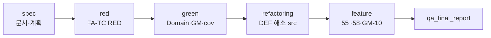

# Feedback Analyzer — QA 최종 보고서

| 항목 | 내용 |
|------|------|
| 문서 버전 | qa-final-1.0 |
| 작성 관점 | QA 리드 (종합 검증·회고) |
| 검증 일자 | 2026-05-22 |
| 기준선 | Phase 0~7 리팩토링 완료 · feature FA-TC-55~58 · GM-01~04 + GM-10 |
| 근거 문서 | `docs/requirements_analysis.md`, `docs/test_plan.md`, `docs/defect_list.md`, `docs/refactoring_plan.md`, `docs/code_quality_report.md`, `docs/coverage_report.md` |

---

## 목차

1. [종합 판정](#1-종합-판정)
2. [검증 실행 결과 (ctest · lcov)](#2-검증-실행-결과-ctest--lcov)
3. [커버리지](#3-커버리지)
4. [결함(DEF) 상태](#4-결함def-상태)
5. [Before / After](#5-before--after)
6. [Mom Test 요약](#6-mom-test-요약)
7. [회고](#7-회고)
8. [잔여 리스크·권장 조치](#8-잔여-리스크권장-조치)
9. [부록](#9-부록)

---

## 1. 종합 판정

| 영역 | 판정 | 근거 |
|------|------|------|
| **기능 계약 (P0 DEF)** | **PASS** | DEF-01~04 해소 · FA-TC-06/16/17/29/30/33~34/39~41 Green |
| **회귀 (FA-TC + GM)** | **PASS** | `build`·`build-cov` 유닛 70/70 · Catch2 69 cases · GM 집계 PASS |
| **커버리지 게이트** | **PASS** | Domain **97.3%** · Boundary **92.3%** · Overall **95.9%** (`build-cov/coverage.info`) |
| **구조 품질** | **PASS (학습 목표)** | Phase 0~7 20 Step · God Module·이중 사전·`fil_data` 제거 |
| **배포 준비** | **조건부 PASS** | HTTP 통합 타겟 미빌드 시 ctest 1건 NOT_RUN · H3(업로드 통계) 미해소 |

**QA 결론:** TDD green 기준선(목표 계약)과 리팩토링 산출물(`src/cpp/`)이 **정합**한다. 프로덕션 수준 SLA가 아닌 **학습·리팩토링 챌린지** 범위에서 **미션 2~7·DEF 해소 목표는 달성**했다.

---

## 2. 검증 실행 결과 (ctest · lcov)

### 2.1 실행 환경

| 항목 | 값 |
|------|-----|
| OS | Windows 10 (26200) |
| 빌드 (유닛) | `build-cov` (Ninja, `FA_ENABLE_COVERAGE=ON`) |
| 빌드 (스모크) | `build` |
| 테스트 실행 파일 | `build-cov/feedback_analyzer_tests.exe` |

### 2.2 ctest (`build-cov`)

```powershell
ctest --test-dir build-cov --output-on-failure
ctest --test-dir build-cov -R "^GoldenMaster$"
ctest --test-dir build-cov -E "NOT_BUILT"
```

| 지표 | 결과 (2026-05-22 실측) |
|------|-------------------------|
| 등록 테스트 | **71** |
| 유효 유닛 (`-E NOT_BUILT`) | **70/70 PASS** |
| Golden Master 집계 | **PASS** (GM-01~04, GM-10 포함) |
| Catch2 직접 실행 | **69 test cases**, **137 assertions** — All passed |
| 실패/미실행 | **1** — `feedback_analyzer_integration_tests_NOT_BUILT` (통합 타겟 미빌드 placeholder) |

**GM 스냅샷 (approved):**

| ID | 파일 | 연계 DEF / FA-TC |
|----|------|------------------|
| GM-01 | `tests/golden/gm01_analyze_aggregate.approved.txt` | 혼합 집계 |
| GM-02 | `tests/golden/gm02_filter_neutral.approved.txt` | DEF-01 · FA-TC-29 |
| GM-03 | `tests/golden/gm03_download_csv.approved.txt` | DEF-03 · FA-TC-40 |
| GM-04 | `tests/golden/gm04_upload_csv.approved.txt` | DEF-04 · FA-TC-34 |
| GM-10 | `tests/golden/gm10_trend_aggregate.approved.txt` | FA-TC-55 · AC-TREND-01 |

### 2.3 ctest (`build`, 회귀 확인)

```powershell
ctest --test-dir build -E "NOT_BUILT"
```

| 지표 | 결과 |
|------|------|
| 유닛 + GM | **70/70 PASS** |

### 2.4 lcov · 커버리지 게이트

```powershell
.\scripts\run_coverage_gate.ps1 -BuildDir build-cov
```

| 단계 | 결과 |
|------|------|
| `lcov --zerocounters` | OK |
| `feedback_analyzer_tests.exe` | exit 0 |
| `lcov --capture` → `build-cov/coverage.info` | 24 `.gcda` 파일 처리 |
| `parse_coverage_gate.py` | **GATE PASS** |

산출물: `docs/coverage_report.md` (게이트 실행 시 자동 갱신)

---

## 3. 커버리지

### 3.1 게이트 요약 (`build-cov/coverage.info`)

| 지표 | 임계값 (`test_plan` §9) | 실측 | 상태 |
|------|-------------------------|------|------|
| **Domain** (support Domain + `CsvUploadParser` + `InMemoryDownloadSource`) | ≥ 90% | **97.3%** (108/111 lines) | PASS |
| **Boundary** (경계 분기) | ≥ 85% | **92.3%** (24/26 branches) | PASS |
| **Overall** (게이트 대상 합산) | ≥ 90% | **95.9%** (185/193 lines) | PASS |
| Boundary lines (보조) | — | 100.0% (8/8) | — |

### 3.2 Domain 파일별 (lcov)

| 파일 | Line % | Hit/Total | 비고 |
|------|--------|-----------|------|
| `tests/support/DomainFeedbackFilter.cpp` | 100.0% | 21/21 | DEF-01/02 회귀 앵커 |
| `tests/support/InMemoryDownloadSource.cpp` | 100.0% | 23/23 | DEF-03 뷰 모델 |
| `src/cpp/CsvUploadParser.cpp` | 97.7% | 43/44 | 프로덕션 승격 (DEF-04) |
| `tests/support/DomainKeywordCounter.cpp` | 92.9% | 13/14 | miss L27 |
| `tests/support/DomainSentimentAnalyzer.cpp` | 88.9% | 8/9 | miss L17 |

**측정 제외 (의도):** `main.cpp`, `HttpRouter`, `HtmlRenderer`, `httplib.h` — 통합·수동 Mom Test 영역 (`test_plan` §9.1).

### 3.3 프로덕션 `src/cpp/` (lcov 캡처 포함, 게이트 외 참고)

게이트 실행 시 레거시/프로덕션 모듈도 `.gcda`에 포함된다. 대표 모듈:

| 모듈 | 역할 | QA 관점 |
|------|------|---------|
| `Filters.cpp` | 필터 | DEF-01/02 Step 검증 경로 |
| `TextAnalyzer.cpp` | 집계 | `SentimentClassifier` 위임 |
| `SentimentClassifier.cpp` | AC-SENT-02 가중치 | feature 이후 FA-TC-05/07/56 변경 |
| `FileHandler.cpp` | AC-FILE-01 | FA-TC-57 |
| `TrendCsvParser.cpp` / `TrendAnalyzer.cpp` | AC-TREND-01 | FA-TC-55, GM-10 |

Domain 게이트는 **계약 구현의 정확성**을, 프로덕션 lcov는 **리팩토링·feature 이후 실행 경로 존재**를 보조한다.

### 3.4 경계·보강 테스트

`tests/test_coverage_boundary.cpp` — FA-TC-01~54 외 **Cov_*** TC 14건으로 CSV 헤더 only, 필터 0건, unknown category 등 Boundary 라인을 보강한다.

---

## 4. 결함(DEF) 상태

상세: [`docs/defect_list.md`](./defect_list.md) (defect-1.0)

### 4.1 요약

| ID | 레거시 증상 | 해소 | 검증 |
|----|-------------|------|------|
| **DEF-01** | `sent` 중립 ≠ `fil(중립)` | Phase 0, 5.2 · `fa::classifySentiment` | FA-TC-17/29, **GM-02** |
| **DEF-02** | `kw`는 main만, `fil`은 main 스킵 | Phase 1.1 | FA-TC-16/24/30 |
| **DEF-03** | `fil_data` only download, 스테일 | Phase 2 · Session 뷰 | FA-TC-39~42, **GM-03** |
| **DEF-04** | CSV `fields[0]` only | Phase 2.3 · `CsvUploadParser` | FA-TC-34, **GM-04** |

**상태:** DEF-01~04 **Closed (해소)** — `src/cpp/`가 green Domain 계약과 **동형**.

### 4.2 문서화된 한계 (버그 아님)

| 항목 | 내용 | Mom |
|------|------|-----|
| `kw` vs `fil` 스캔 범위 | 집계는 `main`만 · 필터는 main+서브키 | H2 — **main-only 문장**에서 Pass |
| upload 후 통계 | `/upload` 직후 `sent`/`kw` 미호출 | H3 — **Fail 유지** (FA-TC-38) |

### 4.3 feature 이후 의도적 동작 변경

| 입력 | Before (AC-SENT-01) | After (AC-SENT-02) | TC |
|------|---------------------|---------------------|-----|
| `나쁘지 않아요` | 부정 (`나쁘` 부분매칭) | **중립** (부정어 취소) | FA-TC-05, 56 |
| `최고…불만 실망 최악` | 긍정 우선 | **부정** (가중치 합) | FA-TC-07, 56b |

---

## 5. Before / After

### 5.1 아키텍처·품질

| 관점 | Before (레거시·red) | After (green + refactoring + feature) |
|------|---------------------|----------------------------------------|
| **감정 사전** | `Constants` + `Filters::S_KEYWORDS` 이중 | `Constants` + `fa::classifySentiment` 단일 |
| **키워드 필터** | `main` skip → DEF-02 | `main` 포함 전체 서브맵 스캔 |
| **다운로드** | `main.cpp` `fil_data` static | `Session` download 뷰 + `FileHandler::saveResult` |
| **CSV** | col0 only | `text` 헤더 컬럼 인덱스 |
| **main.cpp** | ~372줄 God Module | 부트스트랩 + `HttpRouter` + `HtmlRenderer` |
| **중복** | `containsAny` ×2 | `KeywordMatcher.h` |
| **전역** | `globalSent`/`globalKw`, `cout` 덤프 | 제거 · 순수 반환 |
| **테스트** | 없음 → RED 의도 FAIL | 70 ctest · 69 Catch2 · GM 5종 |

### 5.2 검증 수치

| 지표 | Before (spec/red) | After (QA 실측) |
|------|-------------------|-----------------|
| FA-TC (핵심 P0 DEF) | RED FAIL (목표 AC) | **PASS** (prod + Domain) |
| ctest | 의도적 FAIL | **70/70** 유닛 (+ GM) |
| Domain 커버리지 | — | **97.3%** |
| Boundary 커버리지 | — | **92.3%** |
| DEF-01 대표 문장 `fil(중립)` | 0건 | **1건** (GM-02) |
| `id,text` 업로드 본문 | `1` | **`안녕`** (GM-04) |

### 5.3 브랜치·산출물 타임라인



| 단계 | 대표 산출 | 테스트 상태 |
|------|-----------|-------------|
| spec | requirements, test_plan, code_quality | — |
| red | `tests/*.cpp` | DEF TC **FAIL** |
| green | `tests/support/`, GM-01~09 | FA-TC **Green**, `src/cpp` diff 0 |
| refactoring | Phase 0~7, 20 commits | **67+** TC 유지 |
| feature | Trend, FileHandler, Sentiment DB | FA-TC-55~58, GM-10 |

---

## 6. Mom Test 요약

| ID | 가설 | 레거시 | 현재 (자동) | 수동 권장 |
|----|------|--------|-------------|-----------|
| **H1** | analyze 후 감정 통계 | Pass | Pass (FA-TC-02~08, 45) | 1문장 입력 확인 |
| **H2** | 카테고리 필터 일치 | **Fail** (DEF-02) | **Pass** (FA-TC-16/30) | `배송` only |
| **H3** | 업로드 후 대시보드 통계 | **Fail** | **Fail 유지** (FA-TC-38) | CSV 업로드 후 stats 유무 |
| **H4** | 감정 필터 = 집계 | **Fail** (DEF-01) | **Pass** (FA-TC-29, GM-02) | def01 + 중립 필터 |
| **H5** | 필터 결과만 CSV | **Fail** (DEF-03) | **Pass** (FA-TC-39~42, GM-03) | analyze→download→filter |
| **H6** | README CSV 형식 | **Fail** (DEF-04) | **Pass** (FA-TC-34, GM-04) | `id,text` 업로드 |

수동 절차: [`docs/defect_list.md`](./defect_list.md) §7

---

## 7. 회고

### 7.1 잘 된 점

1. **계약 선행 고정** — DEF를 FA-TC·AC로 먼저 쓴 뒤 green Domain → refactoring 승격 순서가 회귀를 막았다. Phase마다 GM-02/03/04로 **최소 검증 축**이 명확했다.
2. **Seam 분리** — `tests/support/`가 레거시 무수정 red/green을 가능하게 했고, 동일 코드가 `src/cpp/`로 **안전하게 이전**되었다.
3. **1 Step = 1 Commit** — 20 Step 리팩토링에서 실패 시 `git revert` 단위가 작아 디버깅 비용이 낮았다.
4. **lcov 게이트 자동화** — Domain/Boundary 분리 임계값이 “테스트 많이”가 아니라 **경계 분기**를 강제했다.
5. **Golden Master** — HTML 전체가 아닌 **도메인 스냅샷**만 고정해 Phase 4 UI 분리와 충돌을 줄였다.

### 7.2 아쉬운 점·교훈

1. **HTTP 통합 ctest 불안정** — `feedback_analyzer_integration_tests`가 coverage 빌드에서 **NOT_BUILT**로 남는다. IT 8건을 CI 기본 경로에 넣으려면 `feedback_analyzer` 선행 빌드·타겟 의존성을 CMake에 명시해야 한다.
2. **이중 커버리지 스토리** — README 초기 Overall 98.1% vs 현재 95.9%는 **게이트 대상 파일 집합·feature 코드 추가**에 따른 차이이다. 리포트마다 `coverage.info` 생성 시각과 manifest를 함께 기록할 것.
3. **H3 미해소** — DEF-04만으로는 Mom “업로드 후 분석” 기대를 채우지 못한다. 별도 AC·미션 3(Logger UI, upload 트리거)이 필요하다.
4. **kw/fil 스캔 차이** — DEF-02 해소 후에도 집계·필터 **범위 차이**는 사용자 혼동 요인이다. UI에 “집계는 main 키워드 기준” 안내가 있으면 H2 수동 Pass율이 올라간다.
5. **가중치 감성(AC-SENT-02)** — feature가 FA-TC-05/07 기대를 바꿨다. **AC 버전 태그**(`AC-SENT-01` vs `02`)를 TC·GM에 명시하지 않으면 green/refactor 회귀 해석이 어렵다.

### 7.3 프로세스 권장 (다음 프로젝트)

| practices | 적용 |
|-----------|------|
| RED → GREEN → Refactor | 유지 |
| TC-ID = 커밋 = CoT | 유지 |
| GM은 게이트 PASS 후만 갱신 | 유지 |
| PR 체크리스트 | `ctest -E NOT_BUILT` + `run_coverage_gate.ps1` + `GoldenMaster` 3줄 고정 |
| 결함 종료 | `defect_list` + `defect_report` Severity 연동 |

---

## 8. 잔여 리스크·권장 조치

| 우선 | 항목 | 권장 조치 |
|------|------|-----------|
| P1 | HTTP IT NOT_BUILT | `cmake --build build --target feedback_analyzer feedback_analyzer_integration_tests` 후 ctest 전건 |
| P2 | H3 upload 통계 | `/upload` 후 `analyzeSentiment`/`countKeywords` 호출 또는 UX 안내 (미션 3) |
| P2 | `architecture.md` | README TODO #11 선택 산출 |
| P3 | DomainSentimentAnalyzer L17 | Boundary TC 1건 추가 시 Domain 100% 근접 |
| P3 | 수동 Mom H2/H4/H5/H6 | 배포 전 `docs/defect_list.md` §7 체크리스트 1회 |

---

## 9. 부록

### 9.1 FA-TC 구현 매핑 (`tests/`)

| 파일 | FA-TC 범위 |
|------|------------|
| `test_text_analyzer_sent.cpp` | 01~08 |
| `test_text_analyzer_kw.cpp` | 09~16 |
| `test_filters.cpp` | 17~28 |
| `test_consistency.cpp` | 29~32 |
| `test_csv_session.cpp` | 33~43 |
| `test_feature.cpp` | 55~58 |
| `test_golden_master.cpp` | 53 (GM 집계) |
| `test_coverage_boundary.cpp` | Cov_* 보강 |
| `test_perf_skip.cpp` | 51, 54 |
| `integration/test_http_integration.cpp` | 38, 44~52 (타겟 빌드 시) |

### 9.2 검증 명령 (복사용)

```powershell
cmake --build build --target feedback_analyzer_tests feedback_analyzer
ctest --test-dir build -E "NOT_BUILT" --output-on-failure
ctest --test-dir build -R "^GoldenMaster$"
.\scripts\run_coverage_gate.ps1 -BuildDir build-cov
```

### 9.3 문서 참조

| 문서 | 역할 |
|------|------|
| [`requirements_analysis.md`](./requirements_analysis.md) | FA-001~055 · Mom · HTTP 계약 |
| [`test_plan.md`](./test_plan.md) | FA-TC-01~58 · 커버리지 · GM |
| [`defect_list.md`](./defect_list.md) | DEF 재현·해소·한계 |
| [`refactoring_plan.md`](./refactoring_plan.md) | Phase 0~7 Step |
| [`code_quality_report.md`](./code_quality_report.md) | 레거시 스멜 Before 근거 |
| [`coverage_report.md`](./coverage_report.md) | lcov 게이트 최신 수치 |

### 9.4 Report 폴더 이력

| Report | 내용 |
|--------|------|
| [`Report/05.green-fa-tc-pass-report-2026-05-22.md`](../Report/05.green-fa-tc-pass-report-2026-05-22.md) | green Domain · src diff 0 |
| [`Report/09.refactor-phase0-4-report-2026-05-22.md`](../Report/09.refactor-phase0-4-report-2026-05-22.md) | DEF 해소 Phase 0~4 |
| [`Report/12.feature-newFeature-report-2026-05-22.md`](../Report/12.feature-newFeature-report-2026-05-22.md) | FA-TC-55~58 · GM-10 |

---

*QA 종합 검토 완료 — `README.md` TODO #12 연동 · 커버리지·ctest 수치는 `run_coverage_gate.ps1` 실행 시 `docs/coverage_report.md`와 동기화된다.*
