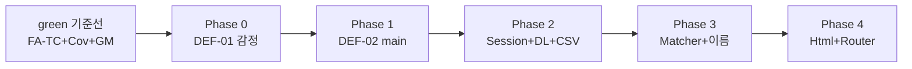

# Feedback Analyzer — 리팩토링 실행 계획 (Phase 0~4)

| 항목 | 내용 |
|------|------|
| 문서 버전 | refactor-1.0 |
| 작성 관점 | 모던 C++ 리팩토링 코치 |
| 전제 브랜치 | **green 완료 후** (`refactoring`에서만 `src/cpp/` 수정) |
| 기준선 | FA-TC **67/67** Green · 커버리지 게이트 PASS · GM-01~04 approved |
| 근거 | `docs/code_quality_report.md`, `docs/test_plan.md`, `docs/requirements_analysis.md`, `docs/golden_master.md`, `.cursorrules` §10 |
| 커밋 규칙 | **1 Step = 1 Commit** (`refactor(phase-N): …`) |

---

## 목차

1. [진입 조건·게이트](#1-진입-조건게이트)
2. [실행 원칙](#2-실행-원칙)
3. [Phase 로드맵 요약](#3-phase-로드맵-요약)
4. [Phase 0 — DEF-01 감정 단일 소스](#phase-0--def-01-감정-단일-소스)
5. [Phase 1 — DEF-02 키워드 `main` 정책 통일](#phase-1--def-02-키워드-main-정책-통일)
6. [Phase 2 — `fil_data` / Session / download 일원화](#phase-2--fil_data--session--download-일원화)
7. [Phase 3 — `containsAny` 공통화·네이밍](#phase-3--containsany-공통화네이밍)
8. [Phase 4 — `main.cpp` 분리](#phase-4--maincpp-분리)
9. [전체 체크리스트](#9-전체-체크리스트)
10. [문서·브랜치 추적](#10-문서브랜치-추적)

---

## 1. 진입 조건·게이트

### 1.1 green 기준선 (이미 충족 시 `refactoring` 착수)

| 게이트 | 확인 명령 | 기대 |
|--------|-----------|------|
| FA-TC | `ctest --test-dir build --output-on-failure` | 67/67 PASS |
| 커버리지 | `.\scripts\run_coverage_gate.ps1 -BuildDir build-cov` | Domain ≥90%, Boundary ≥85% |
| Golden Master | `ctest --test-dir build -R "^GoldenMaster$"` | GM-01~04 PASS |

### 1.2 Step 완료 게이트 (매 커밋 후 필수)

```powershell
cmake --build build --target feedback_analyzer_tests feedback_analyzer
ctest --test-dir build --output-on-failure
ctest --test-dir build -R "^GoldenMaster$"
.\scripts\run_coverage_gate.ps1 -BuildDir build-cov
```

| Phase | GM 필수 | 비고 |
|-------|---------|------|
| 0, 1 | GM-02 (DEF-01) | Domain 스냅샷 — 레거시와 무관하나 FA-TC-29·32 회귀 확인 |
| 2 | GM-02, **GM-03** | download·upload 경로 변경 |
| 3, 4 | GM-01~04 전건 | 구조 변경 후 전체 GM |

**금지:** FA-TC FAIL·커버리지 FAIL 상태에서 `tests/golden/*.approved.txt` 갱신.

### 1.3 목표 계약 (green Domain = 리팩토링 목표)

| ID | 내용 | 레거시 정합 Phase |
|----|------|-------------------|
| AC-SENT-01 | `sent`·`fil` 단일 사전·동일 우선순위 (긍→부→기본 중립) | **0** |
| AC-KW-01 | `kw`·`fil` 동일 키 집합 (`main` 포함) | **1** |
| AC-KW-02 | `main`만 있는 문장도 집계·필터 일치 | **1** |
| AC-DL-03 | download = “현재 뷰” (analyze 후 전체, filter 후 subset) | **2** |
| AC-DEF-04 | CSV `text` 컬럼 인식 | **2** |

`tests/support/` Domain 구현은 이미 위 AC를 만족한다. **본 계획은 `src/cpp/` 레거시를 Domain 계약에 맞추는 Step 목록**이다.

---

## 2. 실행 원칙

| 원칙 | 설명 |
|------|------|
| **1 Step = 1 Commit** | 한 PR/세션에서 여러 Step 금지 (`.cursorrules` §refactoring) |
| **범위** | `docs/refactoring_plan.md`에 적힌 **현재 Step 파일만** 수정 |
| **테스트 수정** | 기본 **금지**. 레거시 동작이 AC에 맞춰지면서 기존 “레거시 관측” assertion만 바뀌는 경우는 **해당 TC 1건 + CoT** 후 허용 |
| **support** | `tests/support/`는 회귀 앵커 — Step에서 **복사·승격**만, Domain 의미 변경 금지 |
| **CoT** | Step 착수 전·커밋 전 **질문 3개**에 답한 뒤 진행 (`docs/test_plan.md` §8.1 확장) |
| **롤백** | `git revert <commit>` 또는 Step 전 `git stash` — **tests/golden**은 의도적 AC 변경 시에만 `-Force` 재생성 |

### 2.1 CoT 질문 템플릿 (Step 공통)

각 Step 표의 **CoT**는 아래 3축을 따른다.

1. **계약:** 이 변경 후 `sent`/`fil`/`kw`/download/CSV 중 무엇이 바뀌며, FA-TC·GM 중 어떤 ID가 검증 축인가?
2. **최소성:** 이번 커밋에서 하지 않을 일(다음 Phase)은 무엇인가?
3. **회귀:** 실패 시 롤백 커밋·재현 입력(픽스처 문장 1개)은?

### 2.2 커밋 메시지 형식

```
refactor(phase-0): Step 0.1 Filters sentiment uses Constants
```

---

## 3. Phase 로드맵 요약



| Phase | DEF/스멜 | Step 수 | 핵심 산출 |
|-------|----------|---------|-----------|
| **0** | DEF-01 | 2 | `S_KEYWORDS` 제거, `Constants` 단일 감정 사전 |
| **1** | DEF-02 | 1 | `fil` 카테고리 스캔에 `main` 포함 |
| **2** | DEF-03, DEF-04 | 3 | `fil_data` 제거, Session download 뷰, `CsvUploadParser` 승격 |
| **3** | Duplicate, 네이밍 | 3 | `KeywordMatcher`, rename, global·cout 정리 |
| **4** | God Module | 3 | `HtmlRenderer`, `HttpRouter`, `main` 부트스트랩만 |

**총 Step:** 12 · **총 커밋:** 12 (각 Step 1:1)

---

## Phase 0 — DEF-01 감정 단일 소스

**Phase 목표:** `Filters::fil` 감정 분기가 `TextAnalyzer::sent`와 **동일 소스·동일 순서**를 사용한다 (`Constants::SENTIMENT_KEYWORDS`, 긍정→부정→그 외 중립).

**완료 정의:** FA-TC-17, 29, 32(레거시 경로 추가 시) · Mom **H4** · GM-02 유지.

### Phase 0 체크리스트

- [ ] Step 0.1 — `Filters.h` 감정 분기를 `Constants` 기준으로 교체
- [ ] Step 0.2 — `S_KEYWORDS`·`initFilterKeywords` 제거 및 초기화 정리
- [ ] Phase 0 게이트: ctest + GM-02 + 커버리지

---

### Step 0.1 — `Filters` 감정 분기를 `sent`와 동일 규칙으로 교체

| 항목 | 내용 |
|------|------|
| **목표** | DEF-01 해소: 중립 필터가 `S_KEYWORDS["중립"]` 매칭에만 의존하지 않음 |
| **변경 파일** | `src/cpp/Filters.h` (필수), `src/cpp/Filters.cpp` (변경 없을 수 있음) |
| **레거시 허용** | `TextAnalyzer.h` **참조만** (규칙 복사, 아직 공통 추출 안 함) |
| **구현 요약** | `fil` 감정 루프에서 `S_KEYWORDS` 대신 `Constants::SENTIMENT_KEYWORDS` 사용; `else if (중립 키워드)` 분기 **삭제**; 기본 라벨 `중립` 후 긍·부 검사 (`sent`와 동일) |
| **리스크** | `괜찮` 등 **사전 겹침** 문장(FA-TC-22)에서 긍·중 라벨이 Domain과 다를 수 있음 → Domain은 긍·부만 검사하므로 **sent 쪽과 동일**이면 OK |
| **롤백** | `git revert` Step 0.1 커밋 |
| **ctest** | `ctest --test-dir build --output-on-failure` · `feedback_analyzer_tests "FA_TC_17_*"` · `"FA_TC_29_*"` · `"FA_TC_32_*"` |
| **1 Step = 1 Commit** | `refactor(phase-0): Step 0.1 align fil sentiment with sent` |

**CoT 질문 3개**

1. `"보통 배송은 괜찮아요"` + `fil(중립)` 호출 시 **건수 1**이 되는가? (`sent` 중립=1과 동시 만족?)
2. 이번 Step에서 **`initFilterKeywords` / `S_KEYWORDS`를 아직 지우지 않는** 이유는? (다음 Step 0.2와 커밋 분리)
3. 실패 시 **어느 map 키**가 기대와 다른지 로그 없이 구분 가능한가?

---

### Step 0.2 — `S_KEYWORDS` 및 `initFilterKeywords` 제거

| 항목 | 내용 |
|------|------|
| **목표** | 감정 키워드 **단일 소스**를 `Constants`로 고정; Shotgun Surgery(감정) 제거 |
| **변경 파일** | `src/cpp/Filters.h`, `src/cpp/Filters.cpp`, `src/cpp/main.cpp`, `tests/test_env.hpp` |
| **레거시 허용** | `Constants.cpp` — 감정 사전 **내용 변경은 하지 않음** (데이터 Step 아님) |
| **구현 요약** | `S_KEYWORDS` static·`initFilterKeywords()` 삭제; `main()` 및 `test_env.hpp`에서 `Filters::initFilterKeywords()` 호출 제거 |
| **리스크** | 링크 오류(`initFilterKeywords` 참조 잔존) · 다른 TU에서 `Filters.cpp`만 빌드하는 타겟 누락 없음 확인 |
| **롤백** | `git revert` Step 0.2 (0.1과 함께 되돌리면 Phase 0 전체 취소) |
| **ctest** | 전체 `ctest` + `run_coverage_gate.ps1` (Filters.cpp 라인 변동) |
| **1 Step = 1 Commit** | `refactor(phase-0): Step 0.2 remove Filters S_KEYWORDS` |

**CoT 질문 3개**

1. `Constants::init()` **한 번**으로 감정·카테고리 사전이 모두 준비되는가?
2. `Filters.cpp`가 **빈 TU**에 가깝워지면 CMake `FA_LEGACY_SOURCES` 유지가 필요한가?
3. Step 0.1만 revert하고 0.2를 유지하면 **빌드가 깨지는** 이유는?

---

## Phase 1 — DEF-02 키워드 `main` 정책 통일

**Phase 목표:** `fil` 키워드 단계가 `kw`와 같이 **`main` 키를 스캔**한다 (`DomainFeedbackFilter`와 동일: `main` skip 제거).

**완료 정의:** FA-TC-16, 24, 30 · AC-KW-01/02 · Mom **H2** · GM-03은 Phase 2에서 download 연동 후 재확인.

### Phase 1 체크리스트

- [ ] Step 1.1 — `Filters.h`에서 `main` skip 제거
- [ ] Phase 1 게이트: ctest + FA-TC-30·32 + GM-02

---

### Step 1.1 — 카테고리 필터에 `main` 키 포함

| 항목 | 내용 |
|------|------|
| **목표** | DEF-02 해소: `"배송"` only 문장이 `kw`·`fil(배송)` 모두 ≥1 |
| **변경 파일** | `src/cpp/Filters.h` |
| **레거시 허용** | `TextAnalyzer.h` — `kw`는 **`main`만** 유지 (Domain `DomainKeywordCounter`와 동일; **fil만** 전체 서브맵 스캔) |
| **구현 요약** | `if (subEntry.first == "main") continue;` **삭제**; `DomainFeedbackFilter`와 같이 `catMap` 전 엔트리 순회 |
| **리스크** | 서브키만 매칭되는 문장은 **fil 건수 ≥ kw** 가능 — AC는 **main-only 일치**가 핵심 |
| **롤백** | `git revert` Step 1.1 |
| **ctest** | `"FA_TC_16_*"` · `"FA_TC_24_*"` · `"FA_TC_30_*"` · `"FA_TC_32_*"` |
| **1 Step = 1 Commit** | `refactor(phase-1): Step 1.1 fil keyword scan includes main` |

**CoT 질문 3개**

1. `"배송"` only에서 `kw["배송"]>=1` **and** `fil(배송).size()>=1`인가?
2. `kw`를 서브키까지 확장하지 **않는** 이유는? (FA-TC-09~15 회귀 범위)
3. `fil`이 서브키까지 스캔할 때 **한 문장이 한 카테고리에 1번만** 포함되는가? (`break` 유지?)

---

## Phase 2 — `fil_data` / Session / download 일원화

**Phase 목표:** `main.cpp`의 `fil_data` 제거; **Session + download 뷰**로 analyze/filter/download 정합 (DEF-03, DEF-04). 정책은 `tests/support/InMemoryDownloadSource`·`CsvUploadParser`와 **동형**.

**완료 정의:** FA-TC-33~34, 39~41 · GM-03, GM-04 · Mom **H5, H6**.

### Phase 2 체크리스트

- [ ] Step 2.1 — Session에 download 뷰 API 추가
- [ ] Step 2.2 — `main.cpp`에서 `fil_data` 제거·핸들러 연동
- [ ] Step 2.3 — `CsvUploadParser` 프로덕션 승격 및 `/upload` 연동
- [ ] Phase 2 게이트: ctest + GM-02·03·04 + 수동 Mom H5

---

### Step 2.1 — Session download 뷰 모델 추가

| 항목 | 내용 |
|------|------|
| **목표** | `InMemoryDownloadSource`와 동일 상태 기계를 **프로덕션 Session**에 도입 |
| **변경 파일** | `src/cpp/Session.h`, `src/cpp/Session.cpp` (신규 메서드) |
| **레거시 허용** | `tests/support/InMemoryDownloadSource.*` — **수정 금지** (동작 참조만) |
| **구현 요약** | 예: `refreshAfterAnalyze(feedbacks)`, `applyFilterResult(filtered, success)`, `getDownloadView()`, `renderDownloadCsv()` 또는 동등 API; 필터 0건 시 뷰 **불변** (FA-TC-41) |
| **리스크** | static 상태 **테스트 오염** — FA-TC-39~42는 Domain `InMemoryDownloadSource`로 유지, Session 통합 TC는 P1 |
| **롤백** | `git revert` Step 2.1 |
| **ctest** | 기존 Domain DL TC Green 유지; `feedback_analyzer` 빌드만 확인 |
| **1 Step = 1 Commit** | `refactor(phase-2): Step 2.1 Session download view API` |

**CoT 질문 3개**

1. analyze 직후 download에 **전체 `currentFeedbacks`**가 나가는가? (FA-TC-39 목표)
2. filter 결과 0건일 때 **이전 download 뷰**가 유지되는가? (FA-TC-41)
3. UTF-8 BOM·`text\n` 헤더는 **어느 함수 한 곳**에서만 생성되는가?

---

### Step 2.2 — `fil_data` 제거 및 HTTP 핸들러 연동

| 항목 | 내용 |
|------|------|
| **목표** | DEF-03 해소: `/download`가 Session download 뷰를 사용 |
| **변경 파일** | `src/cpp/main.cpp`, `src/cpp/Session.h`, `src/cpp/Session.cpp` |
| **레거시 허용** | `FileHandler.h` — **미연동 유지** (Phase 4 또는 제거 Step에서 처리) |
| **구현 요약** | `static fil_data` 삭제; `/analyze` 성공 시 `refreshAfterAnalyze`; `/filter` 성공·실패 시 `applyFilterResult`; `/download`는 Session CSV 렌더 |
| **리스크** | 필터 warning HTML 시 **빈 stats**와 download 불일치 UX — FA-TC-48·49는 P1 |
| **롤백** | `git revert` Step 2.2 |
| **ctest** | 전체 ctest + **GM-03** 필수 + `FA_TC_39_*` ~ `FA_TC_41_*` (Domain) |
| **1 Step = 1 Commit** | `refactor(phase-2): Step 2.2 wire download to Session remove fil_data` |

**CoT 질문 3개**

1. filter **성공 후** analyze로 입력 추가 시 download가 **stale**하지 않게 하려면 analyze에서 refresh가 필요한가?
2. `/download`가 **빈 fil_data** 대신 “마지막 analyze 집합”을 주는지 Mom H5 관점에서 맞는가?
3. `feedback_analyzer.exe` 수동 시나리오: analyze → download → filter → download **3단계** 기대값은?

---

### Step 2.3 — CSV `text` 컬럼 파싱 승격 (DEF-04)

| 항목 | 내용 |
|------|------|
| **목표** | `id,text` 형식에서 본문 `안녕` 적재; README 필수 컬럼 `text` 준수 |
| **변경 파일** | `src/cpp/CsvUploadParser.h`, `src/cpp/CsvUploadParser.cpp` (support에서 승격), `src/cpp/main.cpp`, `CMakeLists.txt` (`feedback_analyzer`·`FA_LEGACY_SOURCES`) |
| **레거시 허용** | `tests/support/CsvUploadParser.*` **유지** (동일 로직 복사 후 include 경로만 조정 가능) |
| **구현 요약** | `/upload`에서 `parseCsvLine`+col0 대신 `CsvUploadParser::parse`; 헤더 `text` 인덱스 탐색 |
| **리스크** | support·prod **이중 유지** — Phase 3 이후 support가 prod 헤더를 include하도록 정리 가능 (별 Step) |
| **롤백** | `git revert` Step 2.3 |
| **ctest** | `FA_TC_33_*` · `FA_TC_34_*` · **GM-04** |
| **1 Step = 1 Commit** | `refactor(phase-2): Step 2.3 upload uses CsvUploadParser text column` |

**CoT 질문 3개**

1. `text\n행1` 단일 컬럼 CSV는 **col0=행1**로 여전히 동작하는가?
2. upload 직후 **sent/kw 미호출**은 이번 Step 범위 밖인가? (FA-TC-38 / 미션 3)
3. `parseCsvLine`을 main에 남기는가, Parser로 **완전 이전**하는가?

---

## Phase 3 — `containsAny` 공통화·네이밍

**Phase 목표:** 중복 `containsAny` 제거; API 이름 `fil`→`filterFeedbacks` 등; 전역 부작용·죽은 코드 정리 (P1 스멜).

**완료 정의:** FA-TC 전건 · Shotgun Surgery 완화 · 미션 4 네이밍.

### Phase 3 체크리스트

- [ ] Step 3.1 — `KeywordMatcher` 프로덕션 추출
- [ ] Step 3.2 — `fil` / `sent` / `kw` rename
- [ ] Step 3.3 — `globalSent`/`globalKw`·`cout`·Session dead 멤버 정리
- [ ] Phase 3 게이트: ctest + GM-01~04 + 커버리지

---

### Step 3.1 — `KeywordMatcher` 공통화

| 항목 | 내용 |
|------|------|
| **목표** | `TextAnalyzer`·`Filters` 중복 `containsAny` → 단일 구현 |
| **변경 파일** | `src/cpp/KeywordMatcher.h` (신규), `src/cpp/TextAnalyzer.h`, `src/cpp/Filters.h`, `tests/support/KeywordMatcher.hpp` (prod 헤더 위임 또는 삭제 후 include 변경) |
| **레거시 허용** | `tests/support/Domain*.cpp` — `fa_support::containsAny` → `#include "KeywordMatcher.h"` |
| **구현 요약** | `fa_support::containsAny`와 동일 시맨틱의 `fa::containsAny` 또는 namespace 통일 |
| **리스크** | 헤더 순환·ODR — **inline header only** 권장 |
| **롤백** | `git revert` Step 3.1 |
| **ctest** | 전체 ctest + 커버리지 (Boundary 분기 동일) |
| **1 Step = 1 Commit** | `refactor(phase-3): Step 3.1 extract KeywordMatcher` |

**CoT 질문 3개**

1. Domain·Legacy·support가 **동일 inline 함수**를 쓰는가?
2. 이번 Step에서 **rename 하지 않는** 이유는?
3. `httplib.h`·`main.cpp`는 **diff 0**인가?

---

### Step 3.2 — 공개 API rename (`fil` → `filterFeedbacks` 등)

| 항목 | 내용 |
|------|------|
| **목표** | 축약명 제거; 의도 드러나는 이름 (미션 4) |
| **변경 파일** | `src/cpp/TextAnalyzer.h`, `src/cpp/Filters.h`, `src/cpp/main.cpp`, `tests/support/Legacy*Adapter.hpp` (호출부만) |
| **레거시 허용** | Catch2 테스트명 `FA_TC_*` **변경 금지** |
| **구현 요약** | `fil`→`filterFeedbacks`, `sent`→`analyzeSentiment`, `kw`→`countKeywords` (또는 프로젝트 합의 full name 일관 적용) |
| **리스크** | grep 누락 링크 오류 · **한 커밋에 rename만** (동작 변경 0) |
| **롤백** | `git revert` Step 3.2 |
| **ctest** | 전체 ctest |
| **1 Step = 1 Commit** | `refactor(phase-3): Step 3.2 rename analyzer and filter APIs` |

**CoT 질문 3개**

1. `LegacyFiltersAdapter::filter`는 **내부에서** `filterFeedbacks`만 호출하는가?
2. `globalSent`/`globalKw` 이름도 이번에 바꾸는가, Step 3.3으로 미루는가?
3. rename 후 **GM 스냅샷 갱신이 불필요**한 이유는? (Domain 경로 불변)

---

### Step 3.3 — 전역 부작용·Lava Flow 정리

| 항목 | 내용 |
|------|------|
| **목표** | 테스트 격리·SRP: `globalSent`/`globalKw` 제거, `Filters` stdout 제거, Session 미사용 멤버 삭제 |
| **변경 파일** | `src/cpp/TextAnalyzer.h`, `src/cpp/TextAnalyzer.cpp`, `src/cpp/Filters.h`, `src/cpp/Session.h`, `src/cpp/Session.cpp` |
| **레거시 허용** | `FileHandler.h` 삭제는 **선택** — 사용처 없으면 별 Step 또는 Phase 4 후 |
| **구현 요약** | 반환값만 사용; `fil` 내 `std::cout` 제거; `internalData`/`filterOptions`/`getOldDataFromSession` 정리 또는 `[[deprecated]]` |
| **리스크** | `globalSent`에 의존하던 **외부 코드 없음** 확인 (테스트는 Domain 위주) |
| **롤백** | `git revert` Step 3.3 |
| **ctest** | ctest + `run_coverage_gate.ps1` |
| **1 Step = 1 Commit** | `refactor(phase-3): Step 3.3 remove globals and filter stdout` |

**CoT 질문 3개**

1. `TextAnalyzer.cpp` static map 제거 후 **링커 심볼**이 깨지지 않는가?
2. `Filters::fil` stdout 제거가 **FA-TC 실패를 유발하지 않는** 이유는? (Domain TC만 assert)
3. `getOldDataFromSession` 삭제 시 **main.cpp 참조 0**인가?

---

## Phase 4 — `main.cpp` 분리

**Phase 목표:** God Module 해소 — HTML·라우팅·요청 파싱을 분리; `main.cpp`는 부트스트랩·와이어링만.

**완료 정의:** `main.cpp` **~80줄 이하** 목표 · FA-TC-44~50 P1 통합은 선택 · 미션 5.

### Phase 4 체크리스트

- [ ] Step 4.1 — `HtmlRenderer` 분리 (`renderPage`, `escapeHtml`)
- [ ] Step 4.2 — `HttpRouter` (또는 `AppRoutes`) — 라우트·핸들러
- [ ] Step 4.3 — `main.cpp` 슬림화·CMake 타겟 업데이트
- [ ] Phase 4 게이트: `feedback_analyzer` 실행 smoke + ctest + GM 전건

---

### Step 4.1 — `HtmlRenderer` 추출

| 항목 | 내용 |
|------|------|
| **목표** | SRP: 프레젠테이션(~130줄 raw HTML) 분리 |
| **변경 파일** | `src/cpp/HtmlRenderer.h`, `src/cpp/HtmlRenderer.cpp` (신규), `src/cpp/main.cpp` |
| **레거시 허용** | `UIComponents` — 카테고리 옵션 생성만 **호출** (로직 이동 없음) |
| **구현 요약** | `renderPage(...)`, `escapeHtml` 이동; 시그니처 **동일** 유지 (ISP 개선는 이후) |
| **리스크** | UTF-8 리터럴·raw string **바이트 동일** — FA-TC-50 escape 회귀 |
| **롤백** | `git revert` Step 4.1 |
| **ctest** | ctest; 선택 `FA_TC_50_*` (IT 있으면) |
| **1 Step = 1 Commit** | `refactor(phase-4): Step 4.1 extract HtmlRenderer` |

**CoT 질문 3개**

1. HTML 출력 문자열이 **바이트 단위 동일**한가? (GM/IT 없어도 diff 최소?)
2. `Logger` 연동은 **main 핸들러에만** 남는가?
3. `HtmlRenderer`가 **httplib**에 의존하지 않는가?

---

### Step 4.2 — `HttpRouter` / 핸들러 등록 분리

| 항목 | 내용 |
|------|------|
| **목표** | 라우트 5개·try/catch 오케스트레이션을 `main`에서 분리 |
| **변경 파일** | `src/cpp/HttpRouter.h`, `src/cpp/HttpRouter.cpp` (또는 `AppRoutes.*`), `src/cpp/main.cpp` |
| **레거시 허용** | `parseForm`, `urlDecode`, `parseCsvLine` — Router 또는 `RequestParser`로 **이동만** |
| **구현 요약** | `registerRoutes(httplib::Server&, AppContext&)` 형태; static 의존은 **참조 주입** 또는 namespace `app` |
| **리스크** | 람다 캡처·static `textAnalyzer` 순서 — **동작 동일** 우선 |
| **롤백** | `git revert` Step 4.2 |
| **ctest** | ctest + `feedback_analyzer.exe` smoke (GET `/`, POST `/analyze`) |
| **1 Step = 1 Commit** | `refactor(phase-4): Step 4.2 extract HttpRouter` |

**CoT 질문 3개**

1. `/upload` multipart 경로가 **이전과 동일**한가?
2. 예외 시 `renderPage` error 분기가 **한 곳**으로 모였는가?
3. Router가 **Session·TextAnalyzer·Filters**를 어떻게 받는가? (전역 static 최소화?)

---

### Step 4.3 — `main.cpp` 부트스트랩만 유지

| 항목 | 내용 |
|------|------|
| **목표** | `main()` = `Constants::init()` + 서버 listen + Router 등록 |
| **변경 파일** | `src/cpp/main.cpp`, `CMakeLists.txt` |
| **레거시 허용** | `FileHandler` — 삭제 시 **이 Step 또는 별 1 Commit** (`refactor(phase-4): remove unused FileHandler`) |
| **구현 요약** | 잔여 static 정리; include 정돈; 빌드 타겟에 새 cpp 추가 |
| **리스크** | MinGW `_WIN32_WINNT` 정의 누락 |
| **롤백** | `git revert` Step 4.3 |
| **ctest** | 전체 게이트 + GM-01~04 + 커버리지 |
| **1 Step = 1 Commit** | `refactor(phase-4): Step 4.3 slim main bootstrap only` |

**CoT 질문 3개**

1. `main.cpp` 라인 수가 **80±20** 이내인가?
2. 새 cpp 추가 후 **feedback_analyzer**·**tests** 타겟 모두 링크되는가?
3. Phase 4 완료 후 **docs/defect_list.md**에 DEF-01~04 “해소”를 기록할 준비가 되었는가?

---

## 9. 전체 체크리스트

### 9.1 브랜치·문서

- [ ] `git checkout refactoring` (또는 `green`에서 분기)
- [ ] 본 문서 `docs/refactoring_plan.md` 검토·승인
- [ ] `README.md` TODO #5 `[x]`, #6 진행 표시

### 9.2 Phase 0 (DEF-01)

- [ ] Step 0.1 — Filters 감정 = Constants + sent 규칙
- [ ] Step 0.2 — `S_KEYWORDS` 제거
- [ ] FA-TC-17, 29, 32 · GM-02

### 9.3 Phase 1 (DEF-02)

- [ ] Step 1.1 — `main` skip 제거
- [ ] FA-TC-16, 24, 30, 32

### 9.4 Phase 2 (DEF-03, DEF-04)

- [ ] Step 2.1 — Session download API
- [ ] Step 2.2 — `fil_data` 제거
- [ ] Step 2.3 — CsvUploadParser 승격
- [ ] FA-TC-33~34, 39~41 · GM-03, GM-04

### 9.5 Phase 3 (중복·네이밍)

- [ ] Step 3.1 — KeywordMatcher
- [ ] Step 3.2 — API rename
- [ ] Step 3.3 — global·cout·Session dead code

### 9.6 Phase 4 (God Module)

- [ ] Step 4.1 — HtmlRenderer
- [ ] Step 4.2 — HttpRouter
- [ ] Step 4.3 — slim main

### 9.7 종료 (refactoring 완료)

- [ ] FA-TC 67/67 · 커버리지 · GM-01~04
- [ ] `docs/defect_list.md` 작성 (TODO #7)
- [ ] Mom Test H2, H4, H5, H6 **Pass** 수동 체크
- [ ] `docs/qa_final_report.md` (TODO #12, 선택)

---

## 10. 문서·브랜치 추적

| Step | DEF | FA-TC (대표) | Mom | GM |
|------|-----|--------------|-----|-----|
| 0.1~0.2 | DEF-01 | 17, 29, 32 | H4 | GM-02 |
| 1.1 | DEF-02 | 16, 24, 30 | H2 | — |
| 2.1~2.2 | DEF-03 | 39~41 | H5 | GM-03 |
| 2.3 | DEF-04 | 33, 34 | H6 | GM-04 |
| 3.x | 스멜 | 08, 22 (Domain) | — | 01~04 |
| 4.x | God Module | 44~50 (P1 IT) | H1 | — |

| 문서 | 역할 |
|------|------|
| `docs/test_plan.md` | FA-TC·CoT·커버리지·GM 마스터 |
| `docs/code_quality_report.md` | P0~P3 스멜 근거 |
| `docs/requirements_analysis.md` | HTTP·계약·Mom Test |
| `docs/golden_master.md` | GM 갱신 절차 |
| `docs/defect_list.md` | Phase 완료 후 DEF 재현·해소 기록 (**다음 산출물**) |

---

## 부록 A — Step ↔ 커밋·파일 매트릭스

| Step | 커밋 예시 | 주요 변경 파일 |
|------|-----------|----------------|
| 0.1 | `refactor(phase-0): Step 0.1 …` | `Filters.h` |
| 0.2 | `refactor(phase-0): Step 0.2 …` | `Filters.h/cpp`, `main.cpp`, `test_env.hpp` |
| 1.1 | `refactor(phase-1): Step 1.1 …` | `Filters.h` |
| 2.1 | `refactor(phase-2): Step 2.1 …` | `Session.h/cpp` |
| 2.2 | `refactor(phase-2): Step 2.2 …` | `main.cpp`, `Session.*` |
| 2.3 | `refactor(phase-2): Step 2.3 …` | `CsvUploadParser.*`, `main.cpp`, `CMakeLists.txt` |
| 3.1 | `refactor(phase-3): Step 3.1 …` | `KeywordMatcher.h`, `TextAnalyzer.h`, `Filters.h`, support |
| 3.2 | `refactor(phase-3): Step 3.2 …` | `TextAnalyzer.h`, `Filters.h`, `main.cpp`, Legacy adapters |
| 3.3 | `refactor(phase-3): Step 3.3 …` | `TextAnalyzer.*`, `Filters.h`, `Session.*` |
| 4.1 | `refactor(phase-4): Step 4.1 …` | `HtmlRenderer.*`, `main.cpp` |
| 4.2 | `refactor(phase-4): Step 4.2 …` | `HttpRouter.*`, `main.cpp` |
| 4.3 | `refactor(phase-4): Step 4.3 …` | `main.cpp`, `CMakeLists.txt` |

---

## 부록 B — 실패 시 빠른 진단

| 증상 | 확인 순서 |
|------|-----------|
| FA-TC-29 FAIL | Phase 0 Step 0.1 감정 분기 · `def01NeutralAmbiguous` |
| FA-TC-30 FAIL | Phase 1 `main` skip · `mainOnlyShipping` |
| GM-03 FAIL | Phase 2 download 뷰 · BOM·필터 행 수 |
| GM-04 FAIL | Phase 2.3 · `text` 헤더 인덱스 |
| 커버리지 FAIL | support 변경 여부 — **prod만** 바꿨는지 |
| 빌드 FAIL | `CMakeLists.txt`에 신규 `.cpp` 추가 여부 |

---

*다음 단계: `git checkout refactoring` → **Step 0.1** CoT 3문 답변 후 구현·커밋.*
