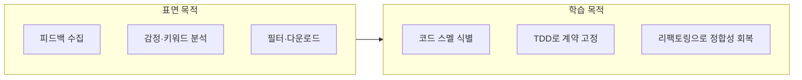
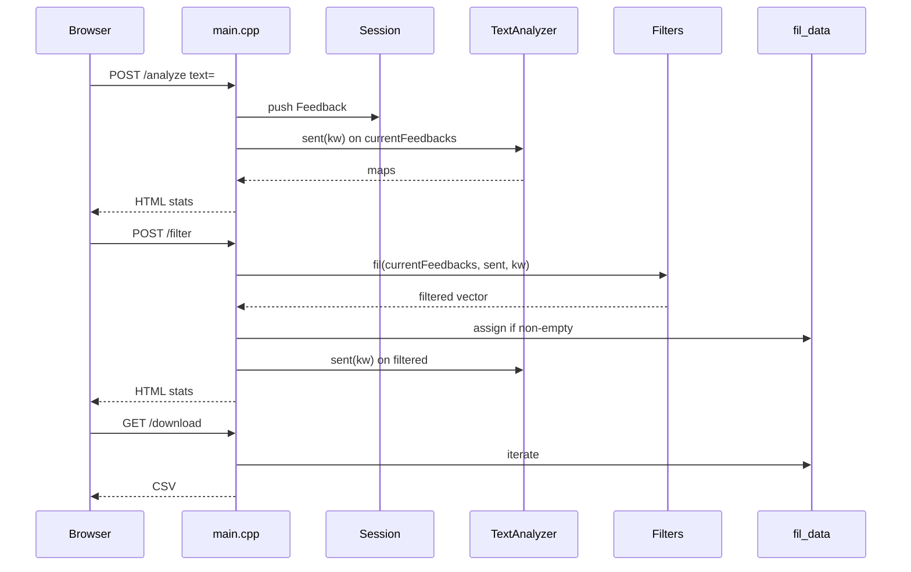

# Feedback Analyzer — 요구사항 분석

> **문서 버전:** spec-1.0  
> **작성 관점:** 시니어 C++ QA 엔지니어 (구현·테스트 설계)  
> **근거:** `README.md`, `project_purpose.md`, `src/cpp/` 레거시 구현, `.cursorrules`  
> **브랜치:** `spec` (레거시 `src/cpp/` 수정 없음)

---

## 목차

1. [프로젝트 정체성](#1-프로젝트-정체성)
2. [HTTP API·데이터 흐름](#2-http-api데이터-흐름)
3. [감정·키워드 분류 계약](#3-감정키워드-분류-계약)
4. [CSV 입출력 규칙 vs 구현 갭](#4-csv-입출력-규칙-vs-구현-갭)
5. [Session / fil_data / download 정합성](#5-session--fil_data--download-정합성)
6. [학습 미션 1~7 매핑](#6-학습-미션-17-매핑)
7. [테스트 시나리오 목록 (FA-001~)](#7-테스트-시나리오-목록-fa-001)
8. [Mom Test 가설·Pass/Fail 신호](#8-mom-test-가설passfail-신호)

---

## 1. 프로젝트 정체성

### 1.1 표면 목적 (README·사용자 관점)

| 항목 | 내용 |
|------|------|
| 제품명 | Feedback Analyzer — 고객 피드백 분석 시스템 |
| 기술 | C++17 + cpp-httplib 웹 앱, `http://localhost:8080` |
| 핵심 가치 | 자연어 피드백 수집 → 감정·키워드 분류 → 필터·시각화 → CSV 다운로드 |
| 입력 | 수동 텍스트, CSV 업로드 |
| 출력 | 감정 분포(긍정/중립/부정), 키워드(5 카테고리) 통계, 필터 결과, CSV |

### 1.2 실제 정체성 (학습용 레거시)

| 항목 | 내용 |
|------|------|
| 공식 명칭 | **리팩토링 챌린지: 고객 피드백 분석 시스템** (`project_purpose.md`) |
| 설계 의도 | 구조화되지 않은 코드, 중복, God Function, 전역 상태, 죽은 코드를 **의도적으로** 포함 |
| 품질 기대 | 프로덕션 수준이 **아님** — TDD·리팩토링·Clean Architecture 학습용 |
| 검증 목표 | `tests/support/` 순수 로직 + FA-TC Green → 커버리지 게이트 → Golden Master → `refactoring`에서 레거시 수정 |
| 브랜치 규칙 | `spec` → `red` → `green` → `refactoring` → `feature/newFeature` |

### 1.3 이중 정체성 요약



**QA 관점 결론:** 요구사항 문서는 **사용자 스토리(표면)** 와 **현재 구현 계약(레거시 실측)** 을 분리해 기술한다. Pass 기준은 “README만 읽은 기대”가 아니라, **의도적 결함(DEF-01~04)을 포함한 관측 가능한 동작** + 미션 완료 후 **목표 계약**으로 이원화한다.

---

## 2. HTTP API·데이터 흐름

### 2.1 엔드포인트 명세

| 메서드 | 경로 | Content-Type | 입력 | 성공 응답 | 분석 실행 |
|--------|------|--------------|------|-----------|-----------|
| GET | `/` | — | 없음 | HTML 대시보드 | 없음 (`Session::initSessionStateUgly`) |
| POST | `/analyze` | `application/x-www-form-urlencoded` | `text` | HTML + 감정·키워드 통계 | **예** (`sent`, `kw` on `Session::currentFeedbacks`) |
| POST | `/upload` | `multipart/form-data` | `file` (.csv) | HTML (통계 **없음**) | **아니오** (적재만) |
| POST | `/filter` | `application/x-www-form-urlencoded` | `sentiment`, `keyword` | HTML + 필터 subset 통계 | **예** (필터 후 `sent`, `kw`) |
| GET | `/download` | — | 없음 | `filtered_feedback.csv` (BOM+`text`) | **아니오** (`fil_data` 스냅샷) |

- **호스트·포트:** `0.0.0.0:8080` (`main.cpp`)
- **문자 인코딩:** HTML/CSV `charset=UTF-8`, CSV 선행 UTF-8 BOM (`\xEF\xBB\xBF`)

### 2.2 요청·상태·응답 데이터 흐름

| 단계 | 액터 | 데이터 읽기 | 데이터 쓰기 | UI 노출 |
|------|------|-------------|-------------|---------|
| 1 | GET `/` | `Session::currentFeedbacks` | — | 시작 메시지, 입력 폼 |
| 2 | POST `/analyze` | form `text` | `currentFeedbacks` push | success + 감정·키워드 stats |
| 3 | POST `/upload` | multipart `file` | `currentFeedbacks` push (행별) | success (건수만), stats 없음 |
| 4 | POST `/filter` | form `sentiment`, `keyword` | `fil_data` ← 필터 결과 | stats 또는 warning |
| 5 | GET `/download` | `fil_data` (main static) | — | 파일 다운로드 |



### 2.3 폼·필터 파라미터 계약

| 파라미터 | 허용 값 | 기본(HTML) | 비고 |
|----------|---------|------------|------|
| `text` | 임의 UTF-8 문자열 | 빈 textarea | trim 후 비어 있으면 추가 안 함 |
| `sentiment` | `전체`, `긍정`, `중립`, `부정` | `전체` | `전체` ≠ 필터 미적용 |
| `keyword` | `전체` + UIComponents 5종 | `전체` | 배송·품질·가격·서비스·사용성 |

### 2.4 부수 출력·미연동 컴포넌트

| 컴포넌트 | 동작 | UI 연동 |
|----------|------|---------|
| `Logger` | `cout`/`cerr` 로그 | **없음** (미션 3: level별 페이지 표시 목표) |
| `FileHandler` | `save` → cout | **미사용** (Lava Flow) |
| `Filters::fil` | `std::cout` 피드백 덤프 | 페이지 미표시 |

---

## 3. 감정·키워드 분류 계약

### 3.1 공통 전제

- **분류 단위:** `Feedback` 1건 = `text` 1문장(줄)
- **매칭 알고리즘:** 부분 문자열 `text.find(kw) != npos` (`containsAny`, TextAnalyzer·Filters **중복 구현**)
- **카테고리 UI 목록:** `UIComponents::CATS` = Constants `CATEGORY_KEYWORDS` 최상위 5키와 일치

### 3.2 감정 분류 — TextAnalyzer::sent vs Filters::fil

| 구분 | `TextAnalyzer::sent` (집계) | `Filters::fil` 감정 분기 (필터) |
|------|-----------------------------|----------------------------------|
| 키워드 소스 | `Constants::SENTIMENT_KEYWORDS` | `Filters::S_KEYWORDS` (**별도 초기화**) |
| 판정 순서 | 긍정 → 부정 → **그 외 전부 중립** | 긍정 → 부정 → **중립 키워드 매칭 시만 중립** |
| 중립 정의 | 키워드 없음·애매 문장 포함 | `S_KEYWORDS["중립"]`에 매칭될 때만 |
| 부작용 | `globalSent = res` | `cout` 덤프 |
| 대표 불일치 | `보통 배송은 괜찮아요` → 집계 **중립** | 동일 문장, 필터 `중립` 선택 시 **0건** 가능 (DEF-01) |

**집계 의사코드 (sent):**

```
if containsAny(text, SENTIMENT_KEYWORDS["긍정"]): 긍정++
else if containsAny(text, SENTIMENT_KEYWORDS["부정"]): 부정++
else: 중립++
```

**필터 의사코드 (fil, sentiment ≠ 전체):**

```
current = 중립
if containsAny(text, S_KEYWORDS["긍정"]): current = 긍정
else if containsAny(text, S_KEYWORDS["부정"]): current = 부정
else if containsAny(text, S_KEYWORDS["중립"]): current = 중립
if current == sFilter: include
```

**교차 영향:** `괜찮`이 긍정·중립 양쪽 사전에 존재 → 모듈별 우선순위에 따라 상이한 라벨 가능.

### 3.3 키워드 분류 — TextAnalyzer::kw vs Filters::fil

| 구분 | `TextAnalyzer::kw` (집계) | `Filters::fil` 키워드 분기 |
|------|---------------------------|----------------------------|
| 스캔 대상 | `CATEGORY_KEYWORDS[cat]["main"]` **만** | `"main"` **제외**, 나머지 서브키(`time`, `physical` 등) |
| 건수 규칙 | 문장당 카테고리 최대 +1 (main 매칭 시) | 서브키 중 하나라도 매칭 시 포함 |
| 예시 문장 | `배송이 빨라요` → 배송 main 매칭 → 집계 +1 | `배송`만 있고 서브키 미매칭 시 필터 **제외** 가능 |
| 부작용 | `globalKw = res2` | — |
| 결함 ID | — | **DEF-02** |

**5개 카테고리 서브키 구조 (Constants):**

| 카테고리 | `main` | 서브키 (필터용) |
|----------|--------|-----------------|
| 배송 | 배송, 택배, … | time, type, status |
| 품질 | 품질, 재질, … | physical, state, content |
| 가격 | 가격, 비용, … | amount, discount, evaluation |
| 서비스 | 서비스, 응대, … | interaction, quality, type_ |
| 사용성 | 사용, 편리, … | ease, guide, action |

### 3.4 목표 계약 (리팩토링 후 기대 — test_plan 연계)

| ID | 목표 |
|----|------|
| AC-SENT-01 | 감정 집계·필터가 **단일 키워드 사전**·동일 우선순위 사용 |
| AC-KW-01 | 키워드 집계·필터가 **동일 키 집합**(`main` 포함 여부 명시) 사용 |
| AC-KW-02 | `main`만 있는 문장도 집계·필터 **일치** |

현재 레거시는 AC 미충족이 **의도적**이다.

---

## 4. CSV 입출력 규칙 vs 구현 갭

### 4.1 문서(README) 규칙

| 항목 | 규칙 |
|------|------|
| 필수 컬럼 | `text` |
| 내용 | 텍스트 컬럼에 피드백 본문 |
| 사용 흐름 | 업로드 → 분석 대시보드 (사용자 시나리오) |

### 4.2 구현 (`main.cpp` POST `/upload`, GET `/download`)

| 항목 | 구현 | 갭 |
|------|------|-----|
| 컬럼 인식 | 첫 줄 무조건 스킵, 데이터는 **`fields[0]`** 만 사용 | `text` 헤더·다른 컬럼 순서 **미지원** (DEF-04) |
| 헤더 | `text` 문자열 검사 없음 | `id,text` 형식 시 `id` 값이 피드백으로 적재 |
| 인용부호 | `parseCsvLine` 기본 처리 | 이스케이프 `""` 등 미검증 |
| 업로드 후 분석 | **미실행** (`sent`/`kw` 호출 없음) | README 시나리오 “업로드 후 테이블·그래프”와 불일치 |
| 다운로드 소스 | `fil_data` only | 필터 없이 다운로드 시 **빈·이전 필터 잔여** (DEF-03) |
| 다운로드 스키마 | BOM + `text\n` + 본문 | 감정·카테고리 컬럼 **없음** |
| 다운로드 대상 | 마지막 성공 필터 결과 | `Session::currentFeedbacks` 전체와 **불일치** |

### 4.3 CSV 갭 매트릭스

| 시나리오 | README 기대 | 현재 구현 | 우선 결함 |
|----------|-------------|-----------|-----------|
| `text` 헤더 + 데이터 | 정상 파싱 | 헤더 스킵 OK, 데이터는 col0 | col0≠text 시 오류 |
| `id,text` | text 사용 | id 적재 | DEF-04 |
| 업로드 직후 통계 | 표시 | 건수 메시지만 | UX 갭 |
| 필터 후 다운로드 | 필터 결과 | fil_data 일치 시 OK | DEF-03 |
| 필터 전 다운로드 | 전체 또는 비활성 | 빈/스테일 CSV | DEF-03 |

---

## 5. Session / fil_data / download 정합성

### 5.1 상태 저장소

| 저장소 | 위치 | 생명주기 | 용도 |
|--------|------|----------|------|
| `Session::currentFeedbacks` | Session.cpp static | 프로세스 전역 | 모든 입력·필터 **소스** |
| `fil_data` | main.cpp static | 프로세스 전역 | **마지막 비어 있지 않은** 필터 결과 |
| `TextAnalyzer::globalSent` | TextAnalyzer | 마지막 `sent` 호출 | 테스트·부작용 (필터 UI 미사용) |
| `TextAnalyzer::globalKw` | TextAnalyzer | 마지막 `kw` 호출 | 동일 |
| `FileHandler fileHandler` | main.cpp | 인스턴스만 존재 | **미호출** |

### 5.2 정합성 규칙 (현재 vs 목표)

| 규칙 ID | 현재 동작 | 목표 (Phase 2 리팩토링) |
|---------|-----------|-------------------------|
| R-SES-01 | `/analyze`, `/upload`는 `currentFeedbacks`에 **누적** | 유지 또는 명시적 reset 정책 문서화 |
| R-SES-02 | `/filter`는 `currentFeedbacks` **변경 안 함** | 동일 |
| R-FIL-01 | 필터 결과 비어 있으면 `fil_data` **갱신 안 함** | 이전 다운로드 내용 잔존 |
| R-FIL-02 | 필터 성공 시 `fil_data = filtered` | download와 일치 |
| R-DL-01 | download ⊂ `fil_data` | ⊂ “현재 사용자가 본 목록” |
| R-DL-02 | 필터 없이 GET `/download` | 빈 CSV 또는 stale |

### 5.3 시퀀스 — 정합성 붕괴 예

```
1. POST /analyze  "배송이 늦어요"     → currentFeedbacks=[A], stats 표시
2. GET  /download                   → fil_data=[] → 빈 CSV (DEF-03)
3. POST /filter sentiment=부정      → fil_data 갱신
4. POST /analyze  "좋아요"          → currentFeedbacks=[A,B], fil_data는 여전히 3단계 스냅샷
5. GET  /download                   → 3단계 결과 (B 미포함 가능)
```

### 5.4 Session API (레거시)

| API | 실제 동작 | 비고 |
|-----|-----------|------|
| `getCurrentFeedbacks()` | static vector 참조 | 유일한 실질 상태 |
| `getOldDataFromSession(key)` | **key 무시**, 동일 vector | 부적절 네이밍 |
| `updateCurrentFeedbacks` | 대입 | main에서 **미사용** |
| `initSessionStateUgly` | no-op | GET `/` 호출 |

---

## 6. 학습 미션 1~7 매핑

`project_purpose.md` §6.1 기준. TDD 단계·산출물·검증 대상을 연결한다.

| 미션 | 학습 내용 (원문) | 연계 요구사항 | spec/red/green | refactoring | feature | 검증 산출물 |
|------|------------------|---------------|----------------|-------------|---------|-------------|
| **1** | 개요·실습 준비 (1h) | 본 문서, 아키텍처 이해, Mom Test | **spec** | — | — | `docs/requirements_analysis.md` |
| **2** | 테스트 구조·커버리지 90%+ (2h) | FA-001~ TC, Catch2, 커버리지 게이트 | **red→green** | — | — | `docs/test_plan.md`, `tests/`, `coverage_report` |
| **3** | 동작 오류 (로그 level, multi-line, **중립 필터**) | DEF-01 수정, Logger UI, textarea | green(계약) | **Phase 0~2** | — | FA-TC 중립·필터, `defect_list` |
| **4** | 네이밍·매직넘버·전역 | `fil`→의미 이름, globalSent/fil_data 캡슐화 | — | **Phase 3~4** | — | 리팩토링 Step ctest |
| **5** | 긴 함수·중복 | `containsAny` 통합, main 분리 | — | **Phase 3~4** | — | `refactoring_plan` Step |
| **6** | 리팩토링 1건 추가 | 팀 합의 1 technique | — | 잔여 Step | — | 커밋·리뷰 |
| **7** | Trend·File DB (3h) | `test_feedback_trend.csv`, 감정 필터 DB화 | — | — | **feature/newFeature** | 기능 AC + 회귀 FA+GM |

### 6.1 미션 3 — 결함-요구사항 추적

| 학습 항목 | 관련 DEF | 현재 코드 근거 | 완료 기준 (AC) |
|-----------|----------|----------------|----------------|
| 중립 필터 수정 | DEF-01 | Filters.cpp `S_KEYWORDS["중립"]` 분기 | `sent`·`fil` 동일 라벨·건수 |
| 로그 level UI | — | Logger.cpp, renderPage에 미연동 | warning/error가 페이지에 선택적 표시 |
| multi-line 입력 | — | textarea 존재, trim은 전체 문자열 | 줄바꿈 포함 피드백 1건으로 처리 정의·테스트 |

### 6.2 미션 7 — 신규 요구사항 (현 코드 없음)

| 기능 | 입력 | 출력 | 비고 |
|------|------|------|------|
| Trend 시각화 | `test_feedback_trend.csv` | 시계열·추이 UI | Constants/Session 확장 |
| 감정 필터 File DB | 필터 키워드 CRUD | 영속 사전 | `S_KEYWORDS` 대체 목표 |

---

## 7. 테스트 시나리오 목록 (FA-001~)

> **형식:** Given-When-Then  
> **ID:** FA-001 … (상세 TC는 `docs/test_plan.md`에서 FA-TC-01과 1:1 매핑 권장)  
> **우선순위:** P0 = 의도적 결함·핵심 계약, P1 = HTTP/통합, P2 = UX·미션 7

### 7.1 TextAnalyzer — 감정 (sent)

| TC-ID | 우선 | Given | When | Then (현 레거시 기대) |
|-------|------|-------|------|------------------------|
| FA-001 | P0 | 빈 `feedbacks` | `sent()` | 긍정=0, 중립=0, 부정=0 |
| FA-002 | P0 | `"정말 좋아요 최고입니다"` | `sent()` | 긍정=1 |
| FA-003 | P0 | `"불만 실망 최악"` | `sent()` | 부정=1 |
| FA-004 | P0 | `"배송이 늦었습니다"` (감정 키워드 없음) | `sent()` | 중립=1 |
| FA-005 | P0 | `"나쁘지 않아요"` | `sent()` | 부정 키워드 `나쁘` 매칭 → 부정=1 |
| FA-006 | P0 | `"보통 배송은 괜찮아요"` | `sent()` | 중립=1 (DEF-01 집계 측) |
| FA-007 | P0 | 긍정·부정 키워드 동시 포함 문장 | `sent()` | **긍정 우선** (긍정=1) |
| FA-008 | P1 | N건 혼합 피드백 | `sent()` | 합계=N, globalSent 동기화 |

### 7.2 TextAnalyzer — 키워드 (kw)

| TC-ID | 우선 | Given | When | Then |
|-------|------|-------|------|------|
| FA-009 | P0 | `"배송이 빨라요"` | `kw()` | 배송≥1 |
| FA-010 | P0 | `"품질이 우수합니다"` | `kw()` | 품질≥1 |
| FA-011 | P0 | `"가격이 비싸요"` | `kw()` | 가격≥1 |
| FA-012 | P0 | `"서비스가 친절해요"` | `kw()` | 서비스≥1 |
| FA-013 | P0 | `"사용이 편리해요"` | `kw()` | 사용성≥1 |
| FA-014 | P0 | 카테고리 무관 문장 | `kw()` | 전 카테고리 0 |
| FA-015 | P0 | 1문장에 배송+품질 main 키워드 | `kw()` | 배송+1, 품질+1 |
| FA-016 | P0 | `"배송"`만 (main 매칭) | `kw()` vs `fil(배송)` | kw>0, fil may 0 (DEF-02) |

### 7.3 Filters — 감정 필터

| TC-ID | 우선 | Given | When | Then |
|-------|------|-------|------|------|
| FA-017 | P0 | `"보통 배송은 괜찮아요"`, sentiment=중립 | `fil()` | **0건** (DEF-01 필터 측) |
| FA-018 | P0 | 동일, sentiment=전체 | `fil()` | 1건 |
| FA-019 | P0 | `"정말 좋아요"`, sentiment=긍정 | `fil()` | 1건 |
| FA-020 | P0 | `"불만입니다"`, sentiment=부정 | `fil()` | 1건 |
| FA-021 | P0 | sentiment=전체 | `fil()` | 입력 전건 통과 |
| FA-022 | P0 | `"괜찮아요"` (중립·긍정 사전 겹침) | `fil(긍정)` vs `fil(중립)` | S_KEYWORDS 우선순위 검증 |

### 7.4 Filters — 키워드 필터

| TC-ID | 우선 | Given | When | Then |
|-------|------|-------|------|------|
| FA-023 | P0 | `"배송이 빨라요"`, keyword=배송 | `fil()` | ≥1 (main+서브) |
| FA-024 | P0 | `"배송"` only, keyword=배송 | `fil()` | 0건 가능 (DEF-02) |
| FA-025 | P0 | keyword=전체 | `fil()` | 감정 필터 후 전건 |
| FA-026 | P0 | sentiment=긍정, keyword=품질 | `fil()` | **교집합** |
| FA-027 | P1 | 존재하지 않는 keyword 문자열 | `fil()` | 0건 |
| FA-028 | P1 | 5카테고리 각 1건 | `fil(각 카테고리)` | 건별 ≥1 |

### 7.5 sent vs fil 일관성 (DEF-01, DEF-02)

| TC-ID | 우선 | Given | When | Then |
|-------|------|-------|------|------|
| FA-029 | P0 | DEF-01 대표 문장 | `sent` 라벨 vs `fil(중립)` | 라벨 불일치 허용(RED) |
| FA-030 | P0 | main-only 배송 문장 | `kw` vs `fil(배송)` | 불일치 허용(RED) |
| FA-031 | P0 | 동일 피드백 집합 | 필터 후 `sent(filtered)` | 부분집합 통계 합=필터 건수 |
| FA-032 | P1 | 리팩토링 후 | 동일 | FA-029/030 **일치** (GREEN) |

### 7.6 CSV

| TC-ID | 우선 | Given | When | Then |
|-------|------|-------|------|------|
| FA-033 | P0 | `text\n행1\n행2` | upload 파싱 | 2건, 본문=행1·행2 |
| FA-034 | P0 | `id,text\n1,안녕` | upload | **id=1 적재** (DEF-04) |
| FA-035 | P0 | 빈 파일 | upload | 0건 추가, 오류 HTML 없음 |
| FA-036 | P1 | 따옴표 포함 CSV | upload | parseCsvLine 동작 확인 |
| FA-037 | P1 | CRLF 줄바꿈 | upload | `\r` 제거 후 파싱 |
| FA-038 | P0 | upload만 수행 | 응답 HTML | sentimentResults **비어 있음** |

### 7.7 Session / download

| TC-ID | 우선 | Given | When | Then |
|-------|------|-------|------|------|
| FA-039 | P0 | analyze만, fil_data 비어 있음 | GET `/download` | **빈 CSV** (헤더만) |
| FA-040 | P0 | filter 성공 후 | GET `/download` | fil_data와 동일 행 |
| FA-041 | P0 | filter 0건 | fil_data | **이전 값 유지** |
| FA-042 | P1 | filter→analyze 추가 입력 | download | fil_data stale 가능 |
| FA-043 | P1 | download CSV | 바이트 | UTF-8 BOM 선행 |

### 7.8 HTTP·통합 (P1)

| TC-ID | 우선 | Given | When | Then |
|-------|------|-------|------|------|
| FA-044 | P1 | 서버 기동 | GET `/` | 200, HTML, UTF-8 |
| FA-045 | P1 | `text=테스트` | POST `/analyze` | 200, 통계 섹션 존재 |
| FA-046 | P1 | 빈 text | POST `/analyze` | 기존 건수 유지 |
| FA-047 | P1 | sample.csv | POST `/upload` | 건수 증가 |
| FA-048 | P1 | feedbacks 비어 있음 | POST `/filter` | warning HTML |
| FA-049 | P1 | 필터 0건 | POST `/filter` | warning, fil_data 불변 |
| FA-050 | P2 | 특수문자 `<>&"` | POST `/analyze` | escapeHtml 적용 |

### 7.9 경계·회귀·미션 (P2)

| TC-ID | 우선 | Given | When | Then |
|-------|------|-------|------|------|
| FA-051 | P2 | 1000건 피드백 | `sent()` | 성능·크래시 없음 (관측) |
| FA-052 | P2 | multi-line textarea | POST `/analyze` | 1 Feedback, 줄바꿈 보존 |
| FA-053 | P2 | Golden Master fixture | ctest GM-01 | 스냅샷 일치 |
| FA-054 | P2 | 커버리지 게이트 | run_coverage_gate | Domain≥90%, Boundary≥85% |
| FA-055 | P2 | 미션7 trend CSV | (미구현) | skip 또는 feature 브랜치 |

**총 시나리오:** 55건 (FA-001 ~ FA-055)

### 7.10 TC ↔ 결함 ↔ Mom Test 추적

| TC-ID | DEF | Mom |
|-------|-----|-----|
| FA-006, FA-017, FA-029 | DEF-01 | H1, H4 |
| FA-016, FA-024, FA-030 | DEF-02 | H2 |
| FA-039~FA-042 | DEF-03 | H5 |
| FA-033~FA-034 | DEF-04 | H3, H6 |

---

## 8. Mom Test 가설·Pass/Fail 신호

실제 사용자(학습자·운영자) 관점 검증 가설. `.cursorrules` §7와 동기화.

| ID | 가설 (사용자는 …) | Pass 신호 | Fail 신호 | 연계 TC |
|----|-------------------|-----------|-----------|---------|
| **H1** | 한 줄 피드백만 넣어도 감정 결과를 바로 본다 | `/analyze` 후 UI 감정 통계 표시, `sent` 합=입력 건수 | 통계 없음·0·명백 오분류 | FA-002~008, FA-045 |
| **H2** | 5개 카테고리로 원하는 피드백만 골라본다 | 카테고리 필터 건수가 사용자 기대와 일치 | `kw` 집계 ≠ `fil` (DEF-02) | FA-009~016, FA-023~028 |
| **H3** | CSV 업로드 후 전체 분석 대시보드를 본다 | 업로드 직후 테이블·통계 | 파싱 실패·빈 통계 (현: **Fail 기본**) | FA-038, FA-047 |
| **H4** | 감정 필터로 좁히면 집계와 일치한다 | 필터 건수·재집계 일치 | 중립 애매 문장 불일치 (DEF-01) | FA-017~022, FA-029 |
| **H5** | 필터한 결과만 CSV로 받는다 | download = 화면 필터 목록 | 필터 전 빈/스테일 (DEF-03) | FA-039~042 |
| **H6** | README 형식(`text` 컬럼) CSV가 통한다 | `text` 컬럼 데이터 분석 | col0만 인식 (DEF-04) | FA-033~034 |

### 8.1 Pass/Fail 판정 요약

| 가설 | 현 레거시 기본 판정 | green/refactor 후 목표 |
|------|---------------------|-------------------------|
| H1 | **Pass** (analyze 경로) | 유지 |
| H2 | **Fail** (main-only 문장) | Pass |
| H3 | **Fail** (upload 무통계) | Pass (분석 트리거 또는 안내) |
| H4 | **Fail** (중립 경계) | Pass |
| H5 | **Fail** (fil_data 전제) | Pass |
| H6 | **Fail** (`id,text` 등) | Pass |

### 8.2 Mom Test 실행 체크리스트 (수동)

1. 브라우저 `http://localhost:8080` 접속
2. `"배송이 너무 늦어요. 화가 납니다."` 입력 → analyze → 부정·배송 확인 (H1)
3. `text` 헤더 CSV 업로드 → 통계 유무 기록 (H3, H6)
4. 감정=중립, 키워드=전체 필터 → `"보통 배송은 괜찮아요"` 건수 (H4)
5. 필터 없이 다운로드 → 파일 내용 (H5)
6. 배송 필터 후 다운로드 → 행 일치 (H5 Pass 케이스)

---

## 부록 A. 모듈 책임 매트릭스

| 모듈 | 책임 (현재) | 테스트 레이어 |
|------|-------------|---------------|
| `main.cpp` | HTTP, HTML, CSV 파싱, fil_data | 통합 FA-044~050 |
| `TextAnalyzer` | sent, kw | 유닛 FA-001~016 |
| `Filters` | fil | 유닛 FA-017~028 |
| `Constants` | 키워드 사전 | init 후 불변 fixture |
| `Session` | currentFeedbacks | FA-039~042 |
| `UIComponents` | 카테고리 목록 | HTML 옵션 일치 |
| `Logger` | 콘솔 로그 | 미션 3 |
| `FileHandler` | 미사용 | 제거 또는 구현 |

## 부록 B. 문서 간 참조

| 문서 | 역할 |
|------|------|
| `docs/test_plan.md` | FA-TC-01 상세, Catch2 이름, GM ID (다음 spec 단계) |
| `docs/code_quality_report.md` | 스멜·안티패턴 정량 |
| `docs/refactoring_plan.md` | DEF 해소 Phase |
| `docs/defect_list.md` | DEF-01~04 재현·해소·Mom H2/H4/H5/H6·kw/fil 한계 |

---

*다음 단계: `docs/test_plan.md`에서 FA-001~055를 FA-TC-XX, Catch2 `TEST_CASE`, Golden Master ID로 구체화한다.*
