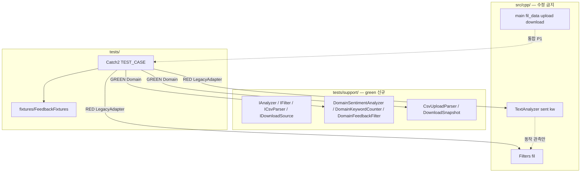

# Feedback Analyzer — 테스트 계획서 (Test Plan)

| 항목 | 내용 |
|------|------|
| 문서 버전 | spec-1.0 |
| 작성 관점 | 시니어 QA 리드 (TDD·계약 고정) |
| 브랜치 | **spec** — `src/cpp/` 레거시 **수정 금지** |
| 근거 | `README.md`, `docs/project_purpose.md`, `docs/requirements_analysis.md`, `docs/code_quality_report.md`, `.cursorrules` |
| 시나리오 ID | FA-001~055 → 본 문서 **FA-TC-01~55** (1:1) |
| Catch2 | FetchContent, `ctest` 통합 |

---

## 목차

1. [목적·범위](#1-목적범위)
2. [TDD 5영역·우선순위](#2-tdd-5영역우선순위)
3. [브랜치·RED/GREEN 소유권](#3-브랜치redgreen-소유권)
4. [Seam 설계 (레거시 무수정 테스트)](#4-seam-설계-레거시-무수정-테스트)
5. [Fake·Fixture](#5-fakefixture)
6. [경계값 매트릭스](#6-경계값-매트릭스)
7. [영역별 FA-TC 상세](#7-영역별-fa-tc-상세)
8. [Chain-of-Thought 템플릿·커밋 예시](#8-chain-of-thought-템플릿커밋-예시)
9. [커버리지 Green 게이트](#9-커버리지-green-게이트)
10. [Golden Master](#10-golden-master)
11. [FA-TC-ID 마스터 목록](#11-fa-tc-id-마스터-목록)

---

## 1. 목적·범위

### 1.1 목적

- 의도적 레거시 결함 **DEF-01~04**를 **관측 가능한 계약(FA-TC)** 으로 고정한다.
- `red` → `green` → `refactoring` 순서에서 **회귀 검출**과 **목표 계약(AC)** 을 분리한다.
- Mom Test 가설 **H1~H6**에 대한 Pass/Fail 신호를 TC·GM에 매핑한다.

### 1.2 in / out of scope

| 포함 | 제외 (본 계획) |
|------|----------------|
| `TextAnalyzer::sent` / `kw` 유닛 | `refactoring` 브랜치 레거시 수정 |
| `Filters::fil` 유닛 | 미션 7 Trend·File DB (feature, FA-TC-55 skip) |
| DEF 일관성·경계·CSV·Session 계약 | Logger UI·multi-line (미션 3, 별도 AC) |
| `tests/support/` Seam·Fixture | 프로덕션 `main.cpp` HTML 스냅샷 전건 (GM은 핵심 흐름만) |

### 1.3 Pass 기준 이원화

| 단계 | Pass 의미 |
|------|-----------|
| **RED** (`red`) | `ctest` **의도적 FAIL** — 목표 계약(AC) 기준 assertion, 레거시·Adapter 불일치 시 실패 메시지 명확 |
| **GREEN** (`green`) | FA-TC **전건 PASS** — `tests/support/` Domain 구현 + Seam 주입 |
| **refactoring** | 레거시 수정 후 FA-TC-29/30/32 **목표 일치** 유지, GM·커버리지 회귀 |

**목표 계약 (리팩토링 후, FA-TC-32 기준)**

| ID | 내용 |
|----|------|
| AC-SENT-01 | `sent`·`fil` 감정 라벨·건수 **단일 사전·동일 우선순위** |
| AC-KW-01 | `kw`·`fil` **동일 키 집합** (`main` 포함 여부 명시) |
| AC-KW-02 | `main`만 있는 문장도 집계·필터 **일치** |

---

## 2. TDD 5영역·우선순위

`.cursorrules` §9 TDD 5영역과 동일 순서.

| 순위 | 영역 | 결함·모듈 | P0 TC (건) | P1 | P2 | Mom |
|------|------|-----------|------------|-----|-----|-----|
| **1** | 감정 분류 일관성 | DEF-01, sent↔fil | 06, 17, 29, 32 (+ sent 01~08) | 08, 31 | 051 | H1, H4 |
| **2** | 키워드 집계·필터 일관성 | DEF-02, kw↔fil | 16, 24, 30 (+ kw 09~15) | 028 | — | H2 |
| **3** | TextAnalyzer `sent`/`kw` | `TextAnalyzer.h` | 01~015 | — | 051 | H1, H2 |
| **4** | Filters `fil` | `Filters.h`, `initFilterKeywords` | 017~027 | 027, 028 | — | H2, H4 |
| **5** | CSV·다운로드·Session | DEF-03, DEF-04, `main` | 033~041 | 036, 037, 042, 043 | 044~050, 052~055 | H3, H5, H6 |

### 2.1 우선순위 정의

| 등급 | 의미 | 실행 순서 (red/green) |
|------|------|------------------------|
| **P0** | DEF·핵심 계약·경계 대표 | FA-TC-01 → 41 (영역 1→5) |
| **P1** | 교집합·HTTP·파싱 변형·stale | P0 Green 후 |
| **P2** | UX·성능 관측·미구현·GM 보조 | green 게이트·GM 이후 또는 `TEST_CASE(..., "[!mayfail]")` |

### 2.2 RED 1차 착수 범위 (권장)

`prompt초안.md` · P0 DEF 중심: **FA-TC-01 ~ FA-TC-30** (영역 1~2 + sent/kw/fil 핵심) → 이후 31~55.

---

## 3. 브랜치·RED/GREEN 소유권

### 3.1 산출물 소유

| 브랜치 | 소유 산출물 | `src/cpp/` | `ctest` 기대 |
|--------|-------------|------------|--------------|
| **spec** | `docs/test_plan.md` (본 문서) | diff **0** | — |
| **red** | `tests/*.cpp`, `tests/fixtures/`, `CMakeLists.txt` 테스트 타겟 | diff **0** | **FAIL** (목표 AC) |
| **green** | `tests/support/*`, `scripts/run_coverage_gate.ps1`, `tests/golden/` (4-C·8 순서) | diff **0** | **PASS** |
| **refactoring** | `src/cpp/` Step별 수정 | plan 범위만 | **PASS** 유지 |

### 3.2 TC 유형별 assertion 소유

| TC 유형 | RED assertion | GREEN 통과 경로 | 비고 |
|---------|---------------|-----------------|------|
| **A. 목표 계약** (DEF 해소 목표) | AC-SENT/KW 충족 기대 → **FAIL** on Legacy Adapter | `Domain*` support 구현 | FA-TC-29, 30, 32 |
| **B. 레거시 관측** (현행 문서화) | `requirements_analysis` §7 Then 그대로 | RED에서만 사용, GREEN 전환 시 **A로 승격** 또는 삭제 | FA-TC-06+017 쌍 (DEF-01 재현) |
| **C. support 순수** | Domain API 직접 | `tests/support/` | FA-TC-01~05, 09~15 |
| **D. 통합·HTTP** | P1, `main` 연동 또는 support `CsvParser`/`DownloadView` | green 후 support + 선택 IT | FA-TC-033~050 |

**원칙:** DEF-01/02 대표 TC(29, 30)는 **유형 A**만 green 완료 조건에 포함. 유형 B는 `red`에서 `Legacy*Adapter` 태그 `[legacy][!mayfail]`로 선택적 유지 가능.

### 3.3 커밋 규칙 (TC 1건 = CoT 1건 = 커밋 1건)

| 브랜치 | 접두어 | 예 |
|--------|--------|-----|
| red | `test(red):` | `test(red): FA-TC-29 sent-fil neutral mismatch` |
| green | `feat(green):` / `test(green):` | `feat(green): FA-TC-29 sentiment filter alignment` |
| spec | `docs(spec):` | `docs(spec): test_plan v1.0` |

---

## 4. Seam 설계 (레거시 무수정 테스트)

레거시 `TextAnalyzer`·`Filters`·`main.cpp`를 **수정하지 않고** RED에서 실패·GREEN에서 통과시키기 위한 경계.

### 4.1 아키텍처



### 4.2 인터페이스·Adapter (green 신규 파일)

| Seam 타입 | 파일 (예정) | 역할 |
|-----------|-------------|------|
| `IAnalyzer` | `tests/support/IAnalyzer.h` | `analyzeSentiment(feedbacks)`, `countKeywords(feedbacks)` |
| `IFeedbackFilter` | `tests/support/IFeedbackFilter.h` | `filter(feedbacks, sentiment, keyword)` |
| `LegacyTextAnalyzerAdapter` | `tests/support/LegacyTextAnalyzerAdapter.h` | `TextAnalyzer` 위임, **globalSent/Kw 부작용 격리** (테스트 전후 스냅샷) |
| `LegacyFiltersAdapter` | `tests/support/LegacyFiltersAdapter.h` | `Filters::fil` + `Filters::initFilterKeywords()` 1회 호출 |
| `DomainSentimentAnalyzer` | `tests/support/DomainSentimentAnalyzer.cpp` | AC-SENT-01 (긍정→부정→중립, 단일 `Constants`) |
| `DomainKeywordCounter` | `tests/support/DomainKeywordCounter.cpp` | AC-KW-01/02 (`main` 포함 동일 스캔) |
| `DomainFeedbackFilter` | `tests/support/DomainFeedbackFilter.cpp` | AC-SENT + AC-KW 정합 |
| `CsvUploadParser` | `tests/support/CsvUploadParser.cpp` | `text` 컬럼 인식 (AC-DEF-04) |
| `InMemoryDownloadSource` | `tests/support/InMemoryDownloadSource.cpp` | `fil_data` 대체 뷰 모델 (AC-DEF-03) |

### 4.3 CMake 링크 전략

| 브랜치 | 타겟 | 링크 |
|--------|------|------|
| red | `feedback_analyzer_tests` | `src/cpp/TextAnalyzer.cpp`, `Filters.cpp`, `Constants.cpp` (**기존 오브젝트 재사용**, 헤더 수정 없음) |
| green | 동일 + `tests/support/*.cpp` | 테스트에서 `SECTION("domain")` / `SECTION("legacy")` 또는 Catch2 태그로 분기 |

**금지:** red/green에서 `TextAnalyzer.h`·`Filters.h` **내용 변경**으로 테스트 통과시키기.

### 4.4 전역 상태 격리 (테스트 간 오염 방지)

| 전역 | 격리 방법 |
|------|-----------|
| `TextAnalyzer::globalSent`, `globalKw` | Adapter 호출 전후 map 복사·복원, 또는 Domain만 사용하는 TC는 Adapter 미사용 |
| `Filters::fil` stdout | `std::streambuf` 리다이렉트 또는 Domain TC만 실행 |
| `Session::currentFeedbacks` | support `SessionFixture::reset()` — **green**에서 in-memory vector 주입, 레거시 Session은 FA-TC-39~42에서 Adapter 또는 통합 skip |
| `fil_data` (main static) | 유닛은 `InMemoryDownloadSource`; HTTP FA-TC-039~042는 P1 통합 또는 support 시뮬레이션 |

### 4.5 Catch2 명명·태그

- 파일: `tests/test_text_analyzer.cpp`, `tests/test_filters.cpp`, `tests/test_csv_session.cpp`, `tests/test_consistency.cpp`
- 이름: `FA_TC_XX_<Slug>` (예: `FA_TC_29_SentimentFilterNeutralMismatch`)
- 태그: `[fa-tc][p0][def-01][domain]` / `[legacy][!mayfail]`

---

## 5. Fake·Fixture

### 5.1 In-memory `Feedback` 벡터

`tests/fixtures/FeedbackFixtures.h` (red에서 헤더만, green에서 구현 확장 가능)

| Factory | 반환 | 용도 |
|---------|------|------|
| `emptyFeedbacks()` | `{}` | FA-TC-01, 035, 048 |
| `singleText(const std::string&)` | 1건 | 대부분 P0 |
| `mixedSentimentSet()` | 긍·부·중립 혼합 N건 | FA-TC-08, 031 |
| `mainOnlyShipping()` | `{"배송"}` | DEF-02, FA-TC-16, 24, 30 |
| `def01NeutralAmbiguous()` | `{"보통 배송은 괜찮아요"}` | DEF-01, FA-TC-06, 17, 29 |
| `fiveCategoriesOneEach()` | 5카테고리 각 1문장 | FA-TC-028 |
| `positiveNegativeOverlap()` | 긍·부 키워드 동시 | FA-TC-07, 022 |

### 5.2 샘플 CSV 문자열 (`tests/fixtures/SampleCsv.h`)

| 상수 | 내용 | 연계 TC |
|------|------|---------|
| `kCsvTextHeader` | `"text\n행1\n행2\n"` | FA-TC-33 |
| `kCsvIdText` | `"id,text\n1,안녕\n"` | FA-TC-34 (DEF-04) |
| `kCsvEmpty` | `""` | FA-TC-35 |
| `kCsvQuoted` | 따옴표·쉼표 포함 1행 | FA-TC-36 |
| `kCsvCrlf` | `\r\n` 줄바꿈 | FA-TC-37 |

**파싱 검증:** green `CsvUploadParser::parse(content)` → `std::vector<Feedback>` (레거시 `main` 로직과 분리).

### 5.3 기대값 헬퍼

```cpp
// tests/fixtures/Expectations.h (개념)
void expectSentiment(const std::map<std::string,int>& m,
                     int pos, int neu, int neg);
void expectKeywordGe(const std::map<std::string,int>& m,
                    const std::string& cat, int min);
```

---

## 6. 경계값 매트릭스

### 6.1 감정·필터 (`sent` / `fil`)

| # | 경계 유형 | 입력/파라미터 | sent 기대 (레거시) | fil 기대 (레거시) | 목표 AC (green) | TC |
|---|-----------|---------------|-------------------|-------------------|-----------------|-----|
| B-S1 | 빈 입력 | `feedbacks={}` | 0,0,0 | 0건 | 동일 | 01, 021 |
| B-S2 | 전체 | `sentiment=전체` | — | 입력=출력 건수 | 동일 | 021, 025 |
| B-S3 | 중립 애매 | `보통 배송은 괜찮아요` + `중립` | 중립=1 | **0건** | 중립=1, fil≥1 | 06, 17, 29 |
| B-S4 | 키워드 없음 | `배송이 늦었습니다` | 중립=1 | 중립 필터 시 0 또는 불일치 | 일치 | 04, 017 |
| B-S5 | 부정 부분매칭 | `나쁘지 않아요` | 부정=1 (`나쁘`) | 부정 필터 1건 | 동일 | 05, 020 |
| B-S6 | 긍정 우선 | 긍·부 동시 | 긍정=1 | 긍정=1 | 동일 | 07, 019 |
| B-S7 | 사전 겹침 | `괜찮아요` | (집계 중립 경로) | 긍정 vs 중립 fil 상이 가능 | 단일 규칙 | 022 |

### 6.2 키워드 (`kw` / `fil`)

| # | 경계 유형 | 입력 | kw (main) | fil (서브만) | 목표 AC | TC |
|---|-----------|------|-----------|--------------|---------|-----|
| B-K1 | main-only | `"배송"` | 배송≥1 | **0건 가능** | 배송≥1, fil≥1 | 16, 24, 30 |
| B-K2 | main+서브 | `"배송이 빨라요"` | 배송≥1 | 배송≥1 | 동일 | 09, 023 |
| B-K3 | 무카테고리 | 일반 문장 | 전부 0 | 0건 | 동일 | 014, 027 |
| B-K4 | 복수 카테고리 | 배송+품질 | 각 +1 | 교집합 필터 | 동일 | 015, 026 |
| B-K5 | keyword=전체 | — | — | 감정 필터 후 전건 | 동일 | 025 |

### 6.3 CSV·Session·Download

| # | 경계 유형 | 조건 | 레거시 기대 | 목표 AC | TC |
|---|-----------|------|-------------|---------|-----|
| B-C1 | text 헤더 | `text\na\nb` | 2건 col0 | `text` 컬럼 | 33 |
| B-C2 | id,text | `id,text\n1,안녕` | col0=`1` | 본문 `안녕` | 34 |
| B-C3 | 빈 파일 | empty | 0건 | 동일 | 35 |
| B-C4 | analyze만 | fil_data 비어 있음 | 빈 CSV | 명시 정책(전체 또는 비활성) | 39 |
| B-C5 | filter 0건 | 결과 없음 | fil_data **유지** | 빈 결과·스냅샷 정책 | 41, 049 |
| B-C6 | upload 무통계 | upload만 | stats 없음 | 분석 트리거 또는 안내 | 38, 047 |

---

## 7. 영역별 FA-TC 상세

> **공통 열:** 우선순위 · Given · When · Then(레거시) · Then(목표 AC) · 브랜치 · Mom/DEF  
> Catch2: `TEST_CASE("FA_TC_XX_...", "[fa-tc][p?]")`

### 7.1 영역 3 — TextAnalyzer `sent` (FA-TC-01 ~ 08)

| ID | P | Given | When | Then (레거시) | Then (목표) | RED/GREEN |
|----|---|-------|------|---------------|-------------|-----------|
| FA-TC-01 | P0 | `feedbacks={}` | `LegacyAdapter::sent` | 긍0·중0·부0 | 동일 | red→green C |
| FA-TC-02 | P0 | `"정말 좋아요 최고입니다"` | sent | 긍1 | 동일 | C |
| FA-TC-03 | P0 | `"불만 실망 최악"` | sent | 부1 | 동일 | C |
| FA-TC-04 | P0 | `"배송이 늦었습니다"` | sent | 중1 | 동일 | C |
| FA-TC-05 | P0 | `"나쁘지 않아요"` | sent | 부1 | 동일 | C |
| FA-TC-06 | P0 | `"보통 배송은 괜찮아요"` | sent | 중1 | 동일 | C, DEF-01 집계측 |
| FA-TC-07 | P0 | 긍·부 키워드 동시 1문장 | sent | 긍1 (긍정 우선) | 동일 | C |
| FA-TC-08 | P1 | 혼합 N건 | sent | 합=N, `globalSent`==반환 | Domain은 global 없음 | red Legacy / green Domain |

### 7.2 영역 3 — TextAnalyzer `kw` (FA-TC-09 ~ 16)

| ID | P | Given | When | Then (레거시) | Then (목표) | RED/GREEN |
|----|---|-------|------|---------------|-------------|-----------|
| FA-TC-09 | P0 | `"배송이 빨라요"` | kw | 배송≥1 | 동일 | C |
| FA-TC-10 | P0 | `"품질이 우수합니다"` | kw | 품질≥1 | 동일 | C |
| FA-TC-11 | P0 | `"가격이 비싸요"` | kw | 가격≥1 | 동일 | C |
| FA-TC-12 | P0 | `"서비스가 친절해요"` | kw | 서비스≥1 | 동일 | C |
| FA-TC-13 | P0 | `"사용이 편리해요"` | kw | 사용성≥1 | 동일 | C |
| FA-TC-14 | P0 | 카테고리 무관 문장 | kw | 5종 모두 0 | 동일 | C |
| FA-TC-15 | P0 | 배송+품질 동시 | kw | 배송+1, 품질+1 | 동일 | C |
| FA-TC-16 | P0 | `"배송"` only | kw≥1, `fil(배송)` | **fil 0건 가능** | kw≥1 **및** fil≥1 | A, DEF-02 |

### 7.3 영역 4 — Filters `fil` 감정 (FA-TC-17 ~ 22)

| ID | P | Given | When | Then (레거시) | Then (목표) | RED/GREEN |
|----|---|-------|------|---------------|-------------|-----------|
| FA-TC-17 | P0 | def01 + `sentiment=중립` | fil | **0건** | 1건 | A, DEF-01 |
| FA-TC-18 | P0 | def01 + `sentiment=전체` | fil | 1건 | 동일 | C |
| FA-TC-19 | P0 | `"정말 좋아요"` + 긍정 | fil | 1건 | 동일 | C |
| FA-TC-20 | P0 | `"불만입니다"` + 부정 | fil | 1건 | 동일 | C |
| FA-TC-21 | P0 | 임의 집합 + 전체 | fil | size=in | 동일 | C |
| FA-TC-22 | P0 | `"괜찮아요"` | fil 긍정 vs 중립 | S_KEYWORDS 우선순위 고정 | AC-SENT-01 단일 | A/P1 |

### 7.4 영역 4 — Filters `fil` 키워드 (FA-TC-23 ~ 28)

| ID | P | Given | When | Then (레거시) | Then (목표) | RED/GREEN |
|----|---|-------|------|---------------|-------------|-----------|
| FA-TC-23 | P0 | `"배송이 빨라요"` + 배송 | fil | ≥1 | 동일 | C |
| FA-TC-24 | P0 | `"배송"` + 배송 | fil | 0건 가능 | ≥1 | A, DEF-02 |
| FA-TC-25 | P0 | + `keyword=전체` | fil | 감정 단계 후 전건 | 동일 | C |
| FA-TC-26 | P0 | 긍정 문장 + `긍정`·`품질` | fil | 교집합 0 또는 1 | 명시 기대값 고정 | P1 |
| FA-TC-27 | P1 | 잘못된 keyword 문자열 | fil | 0건 | 동일 | C |
| FA-TC-28 | P1 | 5카테고리 각 1건 | fil 각각 | 건별≥1 | 동일 | C |

### 7.5 영역 1·2 — 일관성 (FA-TC-29 ~ 32)

| ID | P | Given | When | Then (레거시 RED) | Then (green) | 브랜치 |
|----|---|-------|------|-------------------|--------------|--------|
| FA-TC-29 | P0 | def01 문장 | `sent` 라벨 vs `fil(중립)` 건수 | **불일치 허용→FAIL on AC** | 중립 라벨·1건 일치 | A, DEF-01 |
| FA-TC-30 | P0 | main-only 배송 | `kw` vs `fil(배송)` | 불일치 **FAIL on AC** | 일치 | A, DEF-02 |
| FA-TC-31 | P1 | 필터 subset | `sent(filtered)` | 합=필터 건수 | 동일 | Domain |
| FA-TC-32 | P0 | 동일 집합 | sent·fil·kw | — | FA-29/30 **PASS** (회귀 앵커) | green 필수 |

### 7.6 영역 5 — CSV (FA-TC-33 ~ 38)

| ID | P | Given | When | Then (레거시) | Then (목표) | 구현 Seam |
|----|---|-------|------|---------------|-------------|-----------|
| FA-TC-33 | P0 | `kCsvTextHeader` | Legacy col0 파싱 vs Domain parser | 2건, 본문 일치 | `text` 컬럼 인식 | CsvUploadParser |
| FA-TC-34 | P0 | `kCsvIdText` | parse | col0=`1` | text=`안녕` | A, DEF-04 |
| FA-TC-35 | P0 | empty | parse | 0건 | 동일 | C |
| FA-TC-36 | P1 | quoted CSV | parse | 관측 고정 | 동일 | C |
| FA-TC-37 | P1 | CRLF | parse | `\r` 제거 후 2건 | 동일 | C |
| FA-TC-38 | P0 | upload 시뮬레이션 | 분석 트리거 없음 | stats 비어 있음 | 업로드 후 stats 또는 안내 | P2/미션3 |

### 7.7 영역 5 — Session·Download (FA-TC-39 ~ 43)

| ID | P | Given | When | Then (레거시) | Then (목표) | Seam |
|----|---|-------|------|---------------|-------------|------|
| FA-TC-39 | P0 | analyze만, fil 비음 | download | BOM+`text\n` only | 정책 문서화 후 구현 | InMemoryDownloadSource |
| FA-TC-40 | P0 | filter 성공 | download bytes | == fil_data | == 현재 뷰 | A, DEF-03 |
| FA-TC-41 | P0 | filter 0건 | fil_data | 이전 유지 | 빈·불변 정책 명시 | A |
| FA-TC-42 | P1 | filter→analyze 추가 | download | stale 가능 | 최신 뷰 | A |
| FA-TC-43 | P1 | download | bytes | UTF-8 BOM `\xEF\xBB\xBF` | 동일 | C |

### 7.8 HTTP·통합·회귀 (FA-TC-44 ~ 55)

| ID | P | Given | When | Then | 비고 |
|----|---|-------|------|------|------|
| FA-TC-44 | P1 | 서버 기동 | GET `/` | 200, HTML, UTF-8 | 통합, 선택 subprocess |
| FA-TC-45 | P1 | `text=테스트` | POST `/analyze` | 통계 섹션 존재 | H1 |
| FA-TC-46 | P1 | 빈 text | POST `/analyze` | 건수 유지 | |
| FA-TC-47 | P1 | sample.csv | POST `/upload` | 건수 증가 | H3 |
| FA-TC-48 | P1 | feedbacks 비어 있음 | POST `/filter` | warning HTML | |
| FA-TC-49 | P1 | 필터 0건 | POST `/filter` | warning, fil_data 불변 | DEF-03 |
| FA-TC-50 | P2 | 특수문자 | POST `/analyze` | escapeHtml | |
| FA-TC-51 | P2 | 1000건 | sent | 크래시 없음 | 관측 |
| FA-TC-52 | P2 | multi-line | POST `/analyze` | 1 Feedback, `\n` 보존 | 미션3 |
| FA-TC-53 | P2 | GM fixture | GM-01 ctest | 스냅샷 일치 | §10 |
| FA-TC-54 | P2 | coverage script | run_coverage_gate | Domain≥90%, Boundary≥85% | §9 |
| FA-TC-55 | P2 | trend CSV | — | **skip** `[!mayfail]` | feature |

---

## 8. Chain-of-Thought 템플릿·커밋 예시

### 8.1 CoT 템플릿 (TC 1건당 필수)

```markdown
## FA-TC-XX: <한글 제목>

### Given
- 피드백/픽스처: ...
- Seam: LegacyAdapter | Domain*
- 전역 초기화: Filters::initFilterKeywords() 여부

### When
- 호출: sent() | kw() | fil(s,k) | parse(csv) | ...

### Then
- 기대 map/건수/바이트: ...
- 레거시 관측값(해당 시): ...
- 목표 AC: AC-SENT-01 | AC-KW-02 | ...

### 왜 이 순서인가
- P0 DEF-01 선행: FA-TC-06 관측 후 FA-TC-29 목표 계약
- 의존 Fixture: def01NeutralAmbiguous()

### RED
- 실패 기대 메시지: REQUIRE( filtered.size() == 1 ) failed: 0 == 1
- 브랜치: red · 커밋: test(red): FA-TC-XX ...

### GREEN (해당 시)
- 최소 변경 가설: DomainFeedbackFilter에 main 키 스캔 추가만으로 TC-30 통과
- 브랜치: green · 커밋: feat(green): FA-TC-XX ...
```

### 8.2 커밋 단위 작성 예시 3건

#### 예시 1 — FA-TC-29 (DEF-01, 영역 1, P0)

| 항목 | 내용 |
|------|------|
| Given | `def01NeutralAmbiguous()` 1건 |
| When | `LegacyAdapter::sent` → 라벨 `중립`; `LegacyAdapter::fil(..., 중립, 전체)` |
| Then (RED) | `sent["중립"]==1` **AND** `filtered.size()==1` → **FAIL** (실제 0) |
| Then (GREEN) | `DomainFeedbackFilter` 동일 When → `size==1` **PASS** |
| RED 커밋 | `test(red): FA-TC-29 감정 집계·필터 중립 불일치` |
| GREEN 커밋 | `feat(green): FA-TC-29 DomainFeedbackFilter 중립 규칙 통일` |

#### 예시 2 — FA-TC-16 (DEF-02, 영역 2, P0)

| 항목 | 내용 |
|------|------|
| Given | `mainOnlyShipping()` → `"배송"` |
| When | `kw` 후 `fil(전체, 배송)` |
| Then (RED) | `kw["배송"]>=1` && `fil.size()>=1` → Legacy fil **FAIL** |
| Then (GREEN) | Domain kw·fil **PASS** |
| RED 커밋 | `test(red): FA-TC-16 main-only 배송 kw-fil 불일치` |
| GREEN 커밋 | `feat(green): FA-TC-16 DomainKeywordCounter main 스캔` |

#### 예시 3 — FA-TC-34 (DEF-04, 영역 5, P0)

| 항목 | 내용 |
|------|------|
| Given | `kCsvIdText` fixture 문자열 |
| When | `CsvUploadParser::parse` (green) / legacy col0 시뮬 (red) |
| Then (RED) | 두 번째 필드 `안녕` → legacy 경로 **FAIL** |
| Then (GREEN) | `feedbacks[0].getText()=="안녕"` **PASS** |
| RED 커밋 | `test(red): FA-TC-34 CSV id,text 컬럼 오적재` |
| GREEN 커밋 | `feat(green): FA-TC-34 CsvUploadParser text 헤더 인식` |

---

## 9. 커버리지 Green 게이트

**전제:** FA-TC-01~54 전건 `ctest` Green (FA-TC-55 skip 허용) 후 실행.  
**스크립트:** `scripts/run_coverage_gate.ps1` (green 브랜치에서 신규 추가)

### 9.1 측정 대상 파일

| 분류 | 경로 | gcov/lcov 포함 |
|------|------|----------------|
| **Domain** | `tests/support/DomainSentimentAnalyzer.cpp` | ✅ |
| **Domain** | `tests/support/DomainKeywordCounter.cpp` | ✅ |
| **Domain** | `tests/support/DomainFeedbackFilter.cpp` | ✅ |
| **Domain** | `tests/support/CsvUploadParser.cpp` | ✅ |
| **Domain** | `tests/support/InMemoryDownloadSource.cpp` | ✅ |
| **Boundary** | `tests/support/*` 내 `if (empty)`, `전체`, 애매 문장, `main`-only 분기 | ✅ |
| **제외** | `src/cpp/main.cpp`, `httplib.h`, `UIComponents`, `Logger`, `FileHandler` | ❌ (통합 P1·수동) |
| **참고** | `src/cpp/TextAnalyzer.*`, `Filters.*` | RED Legacy Adapter TC만 실행 시 선택 포함, **게이트 판정은 support 기준** |

### 9.2 Domain / Boundary 정의

| 유형 | 정의 | 예시 분기 |
|------|------|-----------|
| **Domain** | AC-SENT-01, AC-KW-01/02, CSV `text` 컬럼, download 뷰 정책을 구현한 support 코드의 **비즈니스 로직 라인** | 감정 3분기, 5카테고리 루프, 헤더 파싱 |
| **Boundary** | 빈 컨테이너, `전체` 필터, 중립 애매 문장, `main`-only, 0건 필터, 빈 CSV, BOM | `feedbacks.empty()`, `sFilter==전체`, def01, `"배송"` only |

### 9.3 통과 기준 (green 게이트)

| 지표 | 임계값 | 미달 시 조치 |
|------|--------|--------------|
| **Domain 라인 커버리지** | **≥ 90%** | `tests/`만 보강, 1 갭 = 1 CoT = 1 Commit |
| **Boundary 분기 커버리지** | **≥ 85%** | 경계 전용 TC 추가 (§6 매트릭스) |
| **전체 라인** (미션 2) | **≥ 90%** | support+tests 합산, 리포트 `docs/coverage_report.md` |

### 9.4 실행·산출물

```powershell
cmake --build build
ctest --output-on-failure
./scripts/run_coverage_gate.ps1
```

- 산출물: `docs/coverage_report.md`, lcov/info (스크립트 정의 경로)
- **금지:** 커버리지 FAIL 상태에서 `tests/golden/` 생성·갱신

---

## 10. Golden Master

**시점:** green 브랜치 · **FA-TC 전건 Green + 커버리지 게이트 PASS 후** (`.cursorrules` §4 순서 3).

### 10.1 시나리오 ID

| ID | 설명 | 입력 Fixture | 스냅샷 경로 | FA-TC |
|----|------|--------------|-------------|-------|
| **GM-01** | 혼합 3건 감정·키워드 집계 (Domain) | `mixedSentimentSet()` | `tests/golden/gm01_sent_kw_stats.txt` | 08, 53 |
| **GM-02** | DEF-01 대표 문장 sent+fil 요약 | `def01NeutralAmbiguous()` | `tests/golden/gm02_def01_neutral.txt` | 06, 17, 29 |
| **GM-03** | DEF-02 main-only 배송 kw+fil | `mainOnlyShipping()` | `tests/golden/gm03_def02_main_only.txt` | 16, 24, 30 |
| **GM-04** | CSV text 헤더 2건 파싱 | `kCsvTextHeader` | `tests/golden/gm04_csv_text_header.txt` | 33 |
| **GM-05** | 필터 후 download 바이트 (Domain 뷰) | filter 성공 픽스처 | `tests/golden/gm05_download_filtered.csv` | 40, 43 |
| **GM-06** | 5카테고리 키워드 집계 스냅샷 | `fiveCategoriesOneEach()` | `tests/golden/gm06_five_categories.txt` | 28 |
| **GM-07** | 빈 입력 전체 통계 | `emptyFeedbacks()` | `tests/golden/gm07_empty_stats.txt` | 01, 21 |
| **GM-08** | AC-SENT-01 회귀 앵커 (post-refactor) | FA-TC-32 동일 입력 | `tests/golden/gm08_ac_sent_consistency.txt` | 32 |
| **GM-09** | AC-KW-02 회귀 앵커 | FA-TC-30 동일 입력 | `tests/golden/gm09_ac_kw_main_only.txt` | 30, 32 |

### 10.2 스냅샷 형식·생성

- **형식:** UTF-8 텍스트, 줄 끝 `\n` 고정 (CRLF 금지), 키=값 또는 고정 헤더 블록
- **생성:** `scripts/generate_golden_master.ps1` (green, 최초 1회)
- **검증:** `tests/test_golden_master.cpp` — `REQUIRE(load(path) == runScenario(id))`

### 10.3 갱신 규칙

| 조건 | 허용 |
|------|------|
| 의도적 AC 변경 | `docs/golden_master.md`에 사유·승인 기록 후 스크립트 재생성 |
| refactoring Step | GM-08/09 **필수** Green before merge |
| 포맷·공백만 변경 | 금지 — 실패 시 원인 분석 우선 |
| FA-TC 미완료 | **갱신 금지** |

### 10.4 문서

- 상세 절차: `docs/golden_master.md` (green 4-C·8 단계에서 작성)
- README TODO #8과 동기화

---

## 11. FA-TC-ID 마스터 목록

| FA-TC | FA | P | 영역 | DEF | Catch2 Slug (예) | RED | GREEN |
|-------|-----|---|------|-----|------------------|-----|-------|
| FA-TC-01 | FA-001 | P0 | sent | — | SentimentEmpty | C | C |
| FA-TC-02 | FA-002 | P0 | sent | — | SentimentPositive | C | C |
| FA-TC-03 | FA-003 | P0 | sent | — | SentimentNegative | C | C |
| FA-TC-04 | FA-004 | P0 | sent | — | SentimentNeutralNoKw | C | C |
| FA-TC-05 | FA-005 | P0 | sent | — | SentimentPartialNeg | C | C |
| FA-TC-06 | FA-006 | P0 | sent | DEF-01 | SentimentNeutralAmbiguous | C | C |
| FA-TC-07 | FA-007 | P0 | sent | — | SentimentPositiveWins | C | C |
| FA-TC-08 | FA-008 | P1 | sent | — | SentimentMixedN | Legacy | Domain |
| FA-TC-09 | FA-009 | P0 | kw | — | KeywordShipping | C | C |
| FA-TC-10 | FA-010 | P0 | kw | — | KeywordQuality | C | C |
| FA-TC-11 | FA-011 | P0 | kw | — | KeywordPrice | C | C |
| FA-TC-12 | FA-012 | P0 | kw | — | KeywordService | C | C |
| FA-TC-13 | FA-013 | P0 | kw | — | KeywordUsability | C | C |
| FA-TC-14 | FA-014 | P0 | kw | — | KeywordNone | C | C |
| FA-TC-15 | FA-015 | P0 | kw | — | KeywordMultiCategory | C | C |
| FA-TC-16 | FA-016 | P0 | kw+fil | DEF-02 | KeywordMainOnlyMismatch | A | Domain |
| FA-TC-17 | FA-017 | P0 | fil | DEF-01 | FilterNeutralZero | A | Domain |
| FA-TC-18 | FA-018 | P0 | fil | — | FilterNeutralAll | C | C |
| FA-TC-19 | FA-019 | P0 | fil | — | FilterPositive | C | C |
| FA-TC-20 | FA-020 | P0 | fil | — | FilterNegative | C | C |
| FA-TC-21 | FA-021 | P0 | fil | — | FilterSentimentAll | C | C |
| FA-TC-22 | FA-022 | P0 | fil | DEF-01 | FilterOverlapOk | A | Domain |
| FA-TC-23 | FA-023 | P0 | fil | — | FilterCategoryShipping | C | C |
| FA-TC-24 | FA-024 | P0 | fil | DEF-02 | FilterMainOnlyZero | A | Domain |
| FA-TC-25 | FA-025 | P0 | fil | — | FilterKeywordAll | C | C |
| FA-TC-26 | FA-026 | P0 | fil | — | FilterIntersection | P1 | Domain |
| FA-TC-27 | FA-027 | P1 | fil | — | FilterUnknownKeyword | C | C |
| FA-TC-28 | FA-028 | P1 | fil | — | FilterFiveCategories | C | C |
| FA-TC-29 | FA-029 | P0 | 일관성 | DEF-01 | ConsistencySentFilNeutral | A | Domain |
| FA-TC-30 | FA-030 | P0 | 일관성 | DEF-02 | ConsistencyKwFilMain | A | Domain |
| FA-TC-31 | FA-031 | P1 | 일관성 | — | ConsistencyFilteredStats | Domain | Domain |
| FA-TC-32 | FA-032 | P0 | 일관성 | — | ConsistencyPostRefactor | A | PASS |
| FA-TC-33 | FA-033 | P0 | CSV | — | CsvTextHeader | C | Domain |
| FA-TC-34 | FA-034 | P0 | CSV | DEF-04 | CsvIdTextColumn | A | Domain |
| FA-TC-35 | FA-035 | P0 | CSV | — | CsvEmpty | C | C |
| FA-TC-36 | FA-036 | P1 | CSV | — | CsvQuoted | C | C |
| FA-TC-37 | FA-037 | P1 | CSV | — | CsvCrlf | C | C |
| FA-TC-38 | FA-038 | P0 | CSV | — | UploadNoStats | Legacy | P2 |
| FA-TC-39 | FA-039 | P0 | DL | DEF-03 | DownloadWithoutFilter | A | Domain |
| FA-TC-40 | FA-040 | P0 | DL | DEF-03 | DownloadAfterFilter | A | Domain |
| FA-TC-41 | FA-041 | P0 | DL | DEF-03 | DownloadFilterEmptyKeep | A | Domain |
| FA-TC-42 | FA-042 | P1 | DL | DEF-03 | DownloadStale | A | Domain |
| FA-TC-43 | FA-043 | P1 | DL | — | DownloadUtf8Bom | C | C |
| FA-TC-44 | FA-044 | P1 | HTTP | — | HttpGetRoot | IT | IT |
| FA-TC-45 | FA-045 | P1 | HTTP | — | HttpAnalyze | IT | IT |
| FA-TC-46 | FA-046 | P1 | HTTP | — | HttpAnalyzeEmpty | IT | IT |
| FA-TC-47 | FA-047 | P1 | HTTP | — | HttpUpload | IT | IT |
| FA-TC-48 | FA-048 | P1 | HTTP | — | HttpFilterEmpty | IT | IT |
| FA-TC-49 | FA-049 | P1 | HTTP | — | HttpFilterZero | IT | IT |
| FA-TC-50 | FA-050 | P2 | HTTP | — | HttpEscapeHtml | IT | IT |
| FA-TC-51 | FA-051 | P2 | perf | — | Sentiment1k | — | — |
| FA-TC-52 | FA-052 | P2 | HTTP | — | HttpMultiline | IT | IT |
| FA-TC-53 | FA-053 | P2 | GM | — | GoldenMaster01 | GM | GM |
| FA-TC-54 | FA-054 | P2 | cov | — | CoverageGate | script | script |
| FA-TC-55 | FA-055 | P2 | feature | — | TrendSkip | skip | skip |

**범례:** C=레거시·Domain 동일 기대 · A=목표 AC(RED FAIL→GREEN Domain PASS) · IT=통합 선택

**총계:** FA-TC **55**건 (P0: 32 · P1: 15 · P2: 8)

---

## 부록 A. 문서·브랜치 추적

| 문서 | 역할 |
|------|------|
| `docs/requirements_analysis.md` | FA-001~055 원본 Given-When-Then |
| `docs/code_quality_report.md` | DEF 근거 코드 |
| `docs/refactoring_plan.md` | green 후 Phase Step (미작성) |
| `docs/defect_list.md` | DEF 재현·해소·Mom·kw/fil 한계 (defect-1.0) |
| `docs/golden_master.md` | GM 절차 (green 8) |
| `docs/coverage_report.md` | 4-C 산출물 |

## 부록 B. red 착수 체크리스트

- [ ] `git checkout red` (spec 완료 후)
- [ ] Catch2 FetchContent `CMakeLists.txt`
- [ ] `tests/fixtures/FeedbackFixtures.h` + `SampleCsv.h`
- [ ] `tests/support/Legacy*Adapter.h` (헤더 only 가능)
- [ ] FA-TC-01 커밋 → … → FA-TC-30 (P0 DEF)
- [ ] `ctest` 의도적 FAIL 확인

## 부록 C. green 완료 체크리스트

- [ ] FA-TC-01~54 Green
- [ ] `scripts/run_coverage_gate.ps1` PASS
- [ ] GM-01~09 생성·`ctest` Green
- [ ] `README.md` TODO #3 `[x]`, #4-A 진행

---

*다음 단계: `red` 브랜치 — FA-TC-01부터 Catch2 RED 커밋 (`test(red): FA-TC-01 ...`).*
