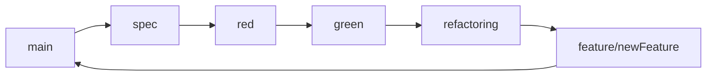
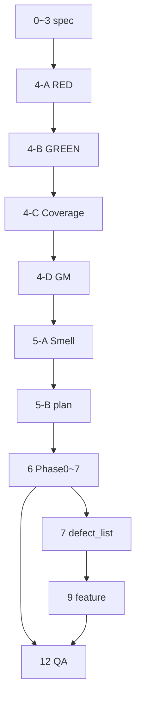

# Feedback Analyzer — TDD/리팩토링 프롬프트 (최적화)

> **기준일:** 2026-05-22 · **브랜치:** `refactoring` (Phase 0~7 완료)  
> **동기화:** `README.md` TODO · `docs/refactoring_plan.md` v1.1 · `Report/` · `Prompt/`

---

## 진행 스냅샷 (이력 기준)

| # | 단계 | 브랜치 | 산출물 | 상태 | Report |
|---|------|--------|--------|------|--------|
| 0 | `.cursorrules` | spec | `.cursorrules` | ✅ | 00 |
| 1 | 요구사항 | spec | `docs/requirements_analysis.md` | ✅ | 01 |
| 2 | 코드 품질 (레거시 기준선) | spec | `docs/code_quality_report.md` | ✅ | 02 |
| 3 | Test Plan | spec | `docs/test_plan.md` | ✅ | 03 |
| 4-A | RED | red | `tests/*.cpp` | ✅ | 04 |
| 4-B | GREEN FA-TC | green | `tests/support/` | ✅ | 05 |
| 4-C | 커버리지 | green | `docs/coverage_report.md` | ✅ | 06 |
| 4-D | Golden Master | green | `tests/golden/`, `docs/golden_master.md` | ✅ | 07 |
| 5-A | 코드 스멜 재점검 | spec/refactor | `code_quality_report` §갱신 권장 | ⚠️ 분석 완료·문서화 선택 | — |
| 5-B | 리팩토링 계획 | spec/refactor | `docs/refactoring_plan.md` | ✅ | 08 |
| 6 | 리팩토링 실행 | refactoring | Phase 0~7 · **20 Step** | ✅ | 09, 10 |
| **7** | **결함 문서화** | refactoring | **`docs/defect_list.md`** | **⏭ 다음** | — |
| 8 | GM 갱신 (§8) | refactor/feature | 동일 절차 | ✅ 최초 확립 · Step 후 갱신 | — |
| 9 | 기능 확장 | feature | 미션 6~7 | ⬜ | — |
| 10~12 | 프로세스·QA | spec/main | defect_report 등 | ⬜ | — |

**검증 기준선 (유지):** FA-TC **67/67** · GM-01~04 · Domain **≥90%** · Boundary **≥85%**

```powershell
cmake --build build --target feedback_analyzer_tests feedback_analyzer
ctest --test-dir build --output-on-failure
ctest --test-dir build -R "^GoldenMaster$"
.\scripts\run_coverage_gate.ps1 -BuildDir build-cov
```

---

## 사용 방법

1. 위 **진행 스냅샷**에서 현재 할 단계(#)를 확인한다.
2. Git 브랜치가 표와 일치하는지 확인한다 (`refactoring` → #7 또는 `feature/newFeature` → #9).
3. **✅ 완료** 단계는 프롬프트 **요약·재실행 참고**만 본다. **⏭/⬜** 단계는 해당 절 **전체 블록**을 복사한다.
4. 단계 종료 시 **후처리 프롬프트** 1회 실행 (Report / Transcript / README / commit·push).
5. 리팩토링 **재개** 시: `docs/refactoring_plan.md` 체크리스트 + **REFACTOR 단일 Step** 프롬프트. (Phase 0~7은 완료 — 새 Phase만 추가 후 실행)

---

## 브랜치 전략



| 브랜치 | `src/cpp/` 수정 | 완료 조건 |
|--------|-----------------|-----------|
| **spec** | ❌ | 문서·계획만 |
| **red** | ❌ | 의도적 RED |
| **green** | ❌ (support·tests만) | FA-TC → 커버리지 → GM |
| **refactoring** | ✅ plan Step만 | ctest+GM+커버리지 Green |
| **feature** | ✅ 기능 범위 | TC+커버리지+GM 회귀 |

**커밋 접두어:** `docs(spec):` · `test(red):` · `feat(green):` · `refactor(phase-N):` · `docs(refactoring):` · `feat(feature):`

**CoT:** 1 TC = 1 Commit · 1 Refactor Step = 1 Commit (냄새·목표·파일·롤백·ctest)

---

## 공통 컨텍스트 (현재 코드베이스)

| 항목 | 내용 |
|------|------|
| 스택 | C++17 · CMake · cpp-httplib · Catch2 |
| 진입점 | `main.cpp` (~23줄) — `Constants::init` · `HttpRouter::registerRoutes` |
| 분석 | `TextAnalyzer::analyzeSentiment` / `countKeywords` |
| 필터 | `Filters::filterFeedbacks` |
| 감성 단일 규칙 | `fa::classifySentiment` (`SentimentClassifier`) — 긍→부→중립 |
| 키워드 집계 | `main` 서브키만 · 필터는 카테고리 **전체 서브맵** 스캔 (의도적 비대칭 가능) |
| 세션 | `Session::getFeedbacks` / `appendFeedback(s)` · download 뷰 |
| UI | `HtmlRenderer::PageModel` · `HttpRouter` 응답 헬퍼 |
| 삭제됨 | `FileHandler.h` · `S_KEYWORDS` · `fil_data` · `globalSent/Kw` |

**주요 경로 (`src/cpp/`)**

| 모듈 | 경로 |
|------|------|
| HTTP | `HttpRouter.h/cpp`, `main.cpp` |
| HTML | `HtmlRenderer.h/cpp` |
| 도메인 | `TextAnalyzer`, `Filters`, `SentimentClassifier`, `KeywordMatcher` |
| 데이터 | `Constants`, `Session`, `CsvUploadParser`, `Feedback.h` |
| 인프라 | `Logger`, `UIComponents` |

**DEF-01~04 (레거시 → 리팩터링 후 레거시 정합)**

| ID | Phase | 레거시 상태 (refactoring 후) |
|----|-------|------------------------------|
| DEF-01 | 0 | ✅ `Constants` 단일 감성 사전 |
| DEF-02 | 1 | ✅ `fil`에 `main` 포함 (kw는 `main`만 — TC로 고정) |
| DEF-03 | 2 | ✅ Session download 뷰 |
| DEF-04 | 2 | ✅ `CsvUploadParser` · `text` 컬럼 |

→ **TODO #7:** `docs/defect_list.md`에 해소·재현·Mom Test 기록

---

## 단계별 프롬프트

> ✅ = 완료(요약) · ⏭ = 다음 작업(전체 블록 사용)

---

### 0~3. spec 기반 문서 — ✅ 완료

| # | 산출물 | Report |
|---|--------|--------|
| 0 | `.cursorrules` | 00 |
| 1 | `docs/requirements_analysis.md` | 01 |
| 2 | `docs/code_quality_report.md` (리팩터링 **전** 스냅샷) | 02 |
| 3 | `docs/test_plan.md` | 03 |

**재실행 시:** `[P] 시니어 …` — `src/cpp` diff 0 유지. Test Plan은 `docs/code_quality_report.md`·`requirements_analysis.md` 참조.

---

### 4-A~4-D. red / green — ✅ 완료

| # | 핵심 | Report |
|---|------|--------|
| 4-A | Catch2 RED · 레거시 diff 0 | 04 |
| 4-B | `tests/support/` Domain · FA-TC 67 Green | 05 |
| 4-C | Domain 97.6% · Boundary 85% | 06 |
| 4-D | GM-01~04 · `GoldenMaster` | 07 |

**제약 (이력):** red/green에서 **기존 `src/cpp/` 레거시 수정 금지** — support·tests만.

**GREEN 단일 TC (재사용):**

```
브랜치 green. FA-TC-XX만 GREEN.
제약: tests/support·tests만. CoT 후 커밋: feat(green): FA-TC-XX <slug>. ctest 확인.
```

---

### 5. 리팩토링 계획 — ✅ (5-B) · ⚠️ (5-A 문서화)

> **순서:** 5-A 스멜 재점검 → 5-B `refactoring_plan.md` (Phase 0~7 반영 완료)

#### 5-A. 코드 스멜 재점검 — ⚠️ 문서 §갱신 권장

```
@src/cpp/ @docs/code_quality_report.md @docs/test_plan.md @README.md

[P] 시니어 C++ 아키텍트
[C] green 완료 후 · src/cpp 수정 금지
[T] code_quality_report.md에 §「Phase 0~7 완료 후」추가
    - 단계 2 대비 해소/잔존 스멜 diff
    - kw(main) vs fil(전체 서브키) 비대칭 명시
    - FA-TC·GM 매핑
[F] docs/code_quality_report.md 갱신 only
```

#### 5-B. 로드맵 — ✅

- 산출물: `docs/refactoring_plan.md` (v1.1, Phase 0~7, 20 Step)
- Report: **08** (계획) · 실행: **09** (Phase 0~4) · **10** (Phase 5~7)

---

### 6. 리팩토링 실행 — ✅ Phase 0~7 완료

**이력:** 20 Commit · `refactor(phase-N): Step N.M` · 매 Step **67/67** + GoldenMaster

| Phase | Step | 요약 |
|-------|------|------|
| 0~1 | 0.1~1.1 | DEF-01/02 |
| 2 | 2.1~2.3 | Session·CSV |
| 3~4 | 3.1~4.3 | Matcher·rename·Html·Router·slim main |
| 5 | 5.1~5.4 | cpp 분리·SentimentClassifier·카테고리·init dedupe |
| 6 | 6.1 | Session 캡슐화 |
| 7 | 7.1~7.3 | Logger·PageModel·Router DRY |

**새 Phase 추가 시 (재개):**

```
@docs/refactoring_plan.md @tests/ @src/cpp/

[P] 모던 C++ 리팩토링 코치
[C] refactoring — 계획서 **현재 Step만**
[T] Phase N Step M (한 번에 하나)
    CoT: 냄새·목표·파일·테스트·롤백·ctest
    완료: cmake --build build && ctest && GoldenMaster
    사용자 "진행"/"계속" 전까지 다음 Step 금지
[F] 1 Commit: refactor(phase-N): Step N.M <slug>
```

---

### 7. 결함 분석·문서화 — ⏭ **다음**

```
@src/cpp/ @tests/ @docs/requirements_analysis.md @docs/test_plan.md
@docs/refactoring_plan.md @README.md

[P] C++ QA 엔지니어
[C] refactoring — Phase 0~7 완료 · DEF 해소를 문서로 확정
[T] docs/defect_list.md 작성
    - DEF-01~04: 재현 입력 · 해소 Phase/Step · FA-TC·GM 증거
    - Mom Test H2/H4/H5/H6 Pass/Fail 신호
    - 잔여 이슈: kw vs fil 키워드 정책 비대칭(의도/한계 명시)
[F] docs/defect_list.md (한글) · README TODO #7 [x]
```

**완료 후:** `refactoring` → `main` PR · Mom Test 수동

---

### 8. Golden Master 갱신 — §8 (Step/기능 후)

> **최초 확립:** 4-D ✅ · **이후:** refactoring·feature에서 **4-D와 동일 절차**

```
브랜치 <refactoring|feature>. Golden Master 갱신만.
선행: FA-TC 67/67 && run_coverage_gate PASS.
변경 GM-ID만: test(<branch>): GM-XX <slug>
```

---

### 9. 기능 개선 — ⬜ `feature/newFeature`

```
@docs/requirements_analysis.md @docs/test_plan.md @tests/ @src/cpp/

[P] 시니어 C++ 개발자
[C] green+refactoring 기준선 이후 · 미션 6~7
[T] 순서 고정 per 기능:
    1) test_plan TC 추가
    2) RED → GREEN (1 TC = 1 Commit)
    3) 커버리지 보강 (run_coverage_gate)
    4) GM 갱신 (§8)
    5) (선택) refactor
[F] tests + golden + 구현 · 회귀 3종 Green
```

---

### 10~12. spec / main — ⬜

| # | 산출물 | 프롬프트 한 줄 |
|---|--------|----------------|
| 10 | `docs/defect_report.md` | Severity×ItemType 프로세스 |
| 11 | `docs/architecture.md` | Mermaid Before/After (선택) |
| 12 | `docs/qa_final_report.md` | QA 종합 · main 직전 |

---

## 후처리 프롬프트 (단계 완료 시 1회)

```
[P] 프로젝트 문서·배포 담당
[C] 완료 단계 N, 브랜치명, 산출물 경로
[T]
    1) Report/NN.<slug>-report-YYYY-MM-DD.md
    2) Prompt/NN.<slug>-transcript-YYYY-MM-DD_prompt.md
    3) Prompt/full-transcript-refactor-first-YYYY-MM-DD_prompt.md 갱신
    4) README.md 진행 반영
    5) git commit (한글·브랜치·TC-ID) → push
[F] 생성 파일 목록 + git 결과
```

**슬러그 예:** `refactor-phase5-7`, `defect-list`, `feature-trend`, `qa-final`  
**다음 NN:** **11** (`defect-list`) · 이후 feature/QA에 맞게 증가

---

## 단계 의존 관계



---

## TDD·브랜치 빠른 참조

| # | 상황 | 지시 |
|---|------|------|
| — | **지금 할 일** | **#7 defect_list** → PR → **#9 feature** |
| 5-A | 스멜 문서화 | `code_quality_report` §갱신 · src/cpp diff 0 |
| 6 | refactor 재개 | plan에 Phase 추가 후 Step 1개만 |
| 8 | GM 갱신 | FA-TC+커버리지 PASS 후 §8 |
| 9 | 기능 | TC→RED→GREEN→커버리지→GM |

---

## 빠른 복사: 잔여 워크플로우

```
브랜치 refactoring.

완료됨: spec~green(4-D), refactoring Phase 0~7 (20 Commit), FA-TC 67/67, GM, 커버리지 PASS.

다음 순서:
1) (선택) 5-A — code_quality_report.md §「Phase 0~7 후」스멜 diff
2) #7 — docs/defect_list.md (DEF-01~04 해소 기록, Mom Test)
3) refactoring → main PR/머지
4) feature/newFeature — 미션 6~7 (TC→커버리지→GM→구현)
5) #12 — qa_final_report.md

검증: cmake --build build && ctest && run_coverage_gate.ps1
각 단계: Report NN + Transcript + full-transcript + README + commit/push
설명 한글.
```

---

## 문서 인덱스 (Report / Prompt)

| NN | 슬러그 | 내용 |
|----|--------|------|
| 00~03 | spec-* | 규칙·요구·품질·Test Plan |
| 04~07 | red/green-* | RED·GREEN·커버리지·GM |
| 08 | spec-refactoring-plan | refactoring_plan |
| 09 | refactor-phase0-4 | Phase 0~4 실행 |
| 10 | refactor-phase5-7 | Phase 5~7 실행 |
| 11 | (예정) defect-list | defect_list |

*이 파일은 `README.md`·`docs/refactoring_plan.md`와 함께 갱신한다.*
