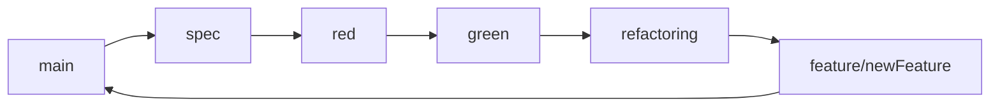
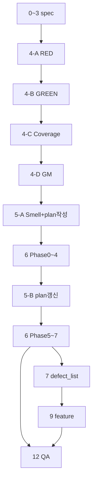

# Feedback Analyzer — TDD/리팩토링 프롬프트 ([P][C][T][F] · 전체 워크플로우)

> **기준일:** 2026-05-22 · **브랜치:** `refactoring` (Phase 0~7 완료)  
> **동기화:** `README.md` TODO · `docs/refactoring_plan.md` v1.1 · `Report/` · `Prompt/`  
> **구성:** 상단 **진행 스냅샷** + **완료·미완료 단계별 복사 프롬프트** ([P][C][T][F])

---

## 진행 스냅샷 (이력 기준)

| # | 단계 | 브랜치 | 산출물 | 상태 | Report |
|---|------|--------|--------|------|--------|
| 0 | `.cursorrules` | spec | `.cursorrules` | ✅ | 00 |
| 1 | 요구사항 | spec | `docs/requirements_analysis.md` | ✅ | 01 |
| 2 | 코드 품질 (레거시 기준선) | spec | `docs/code_quality_report.md` | ✅ | 02 |
| 3 | Test Plan | spec | `docs/test_plan.md` | ✅ | 03 |
| 4-A | RED | red | `tests/*.cpp` | ✅ | 04 |
| 4-B | GREEN FA-TC | green | `tests/support/` | ✅ | 05 |
| 4-C | 커버리지 | green | `docs/coverage_report.md` | ✅ | 06 |
| 4-D | Golden Master | green | `tests/golden/`, `docs/golden_master.md` | ✅ | 07 |
| 5-A | 스멜 점검 + 계획 **작성** | spec/refactor | `code_quality_report` §, `refactoring_plan.md` | ✅ | 08 |
| 5-B | 계획 **갱신** | refactoring | `refactoring_plan.md` (v갱신) | ✅ | 10 |
| 6 | 리팩토링 실행 | refactoring | Phase 0~7 · **20 Step** | ✅ | 09, 10 |
| **7** | **결함 문서화** | refactoring | **`docs/defect_list.md`** | **⏭ 다음** | — |
| 8 | GM 갱신 (§8) | refactor/feature | 4-D와 동일 절차 | ✅ 최초 · Step 후 갱신 | — |
| 9 | 기능 확장 | feature | 미션 6~7 | ⬜ | — |
| 10~12 | 프로세스·QA | spec/main | defect_report 등 | ⬜ | — |

**검증 기준선:** FA-TC **67/67** · GM-01~04 · Domain **≥90%** · Boundary **≥85%**

```powershell
cmake --build build --target feedback_analyzer_tests feedback_analyzer
ctest --test-dir build --output-on-failure
ctest --test-dir build -R "^GoldenMaster$"
.\scripts\run_coverage_gate.ps1 -BuildDir build-cov
```

---

## 사용 방법

1. **진행 스냅샷**에서 현재 단계(#)를 확인한다.
2. Git 브랜치가 표와 일치하는지 확인한다.
3. 아래 **단계별 프롬프트**에서 해당 #의 블록을 복사한다.
4. 단계 종료 시 **후처리 프롬프트**(문서 말미) 1회 실행.
5. 리팩토링 재개: `docs/refactoring_plan.md` + §6 **REFACTOR 단일 Step** (Phase 0~7 완료 — 새 Phase만)

---

## 브랜치 전략



| 브랜치 | `src/cpp/` 수정 | 완료 조건 |
|--------|-----------------|-----------|
| **spec** | ❌ 금지 | 문서·계획만 |
| **red** | ❌ 금지 | 의도적 RED (`tests/`·support만) |
| **green** | ⚠️ **최소만** | FA-TC → 커버리지 → GM |
| **refactoring** | ✅ plan Step 범위 | ctest+GM+커버리지 Green |
| **feature** | ✅ 기능 범위 | TC+커버리지+GM 회귀 |

**green 브랜치 `src/cpp/` 규칙**

| 허용 | 금지·미룸 |
|------|-----------|
| FA-TC·커버리지·GM에 **필요한 최소** 레거시 수정 | God Module·대규모 rename |
| 우선 `tests/support/` | `refactoring_plan` 없는 구조 개편 |
| CoT: support만으로 불가한 이유·최소 diff | 계약 변경 without TC/GM |

**커밋 접두어:** `docs(spec):` · `test(red):` · `feat(green):` · `refactor(phase-N):` · `docs(refactoring):` · `feat(feature):`

**CoT:** 1 TC = 1 Commit · 1 Refactor Step = 1 Commit

**브랜치 전환 (예시):**

```bash
git checkout main && git pull
git checkout -b spec    # 또는 red, green, refactoring, feature/newFeature
```

---

## 공통 컨텍스트

### A. 리팩터링 전 레거시 스냅샷 (단계 0~4·RED/GREEN 재실행 참고)

| 항목 | 내용 |
|------|------|
| 감정 | `TextAnalyzer::sent` — 긍→부→중립 / `Filters::fil` — `S_KEYWORDS`·중립 키워드 매칭 |
| 키워드 | `kw`는 `main`만 / `fil`은 `main` skip → DEF-02 |
| 상태 | `fil_data`, `globalSent/Kw`, God Module `main.cpp` |
| 미사용 | `FileHandler.h` |

**P0 결함:** DEF-01~04 (→ `docs/code_quality_report.md`, `docs/test_plan.md`)

### B. 현재 코드베이스 (refactoring Phase 0~7 이후)

| 항목 | 내용 |
|------|------|
| 진입점 | `main.cpp` (~23줄) · `HttpRouter` · `HtmlRenderer::PageModel` |
| 감성 | `fa::classifySentiment` (`SentimentClassifier`) |
| 필터 | `Filters::filterFeedbacks` · 키워드 필터는 전 서브맵 스캔 |
| 세션 | `Session::getFeedbacks` / `appendFeedback(s)` |
| 삭제됨 | `FileHandler`, `S_KEYWORDS`, `fil_data`, `globalSent/Kw` |

**DEF 해소 Phase:** 0~2 (→ `docs/defect_list.md` TODO #7)

**프롬프트 구조:** `[P]` 역할 · `[C]` 맥락 · `[T]` 작업 · `[F]` 산출물 · `[CoT]` 커밋 단위

---

## 단계별 프롬프트

> 각 절: **상태** · **[P][C][T][F] 복사 블록** · **완료 기준**

---

### 0. 프로젝트 규칙 (.cursorrules) — `spec` · ✅

```
@README.md

[P] 레거시 C++ QA/리팩토링 시니어 엔지니어
[C] Feedback Analyzer C++17 — Cursor AI가 항상 따를 규칙
[T] 프로젝트 루트 `.cursorrules` 작성
    - 기술 스택: C++17, CMake, cpp-httplib, Catch2
    - 브랜치: spec → red → green → refactoring → feature/newFeature
    - spec/red: 기존 src/cpp 레거시 코드 수정 금지
    - green: 최소한의 코드 수정만 가능
    - refactoring: refactoring_plan Phase·1 Step·1 Commit
    - CoT: TC·Refactor 각각 Given-When-Then / 냄새-목표-검증
    - 도메인: DEF-01~04, Mom Test 가설(H1~H6), 미션 1~7 로드맵
    - 테스트: Given-When-Then, 경계(전체/긍정/부정/중립, 카테고리 5종)
    - green 완료: FA-TC 전건 Green → 커버리지 게이트 → Golden Master (순서 고정)
    - 설명은 한글로 표현
    - Commit 시 mesage는 한글로 표현
    - 프롬프트 진행 시 README에 항목 별 TODO를 추가. 진행여부 반영
[F] `.cursorrules` 완성 텍스트 (한글)
```

**완료 기준:** `.cursorrules` · `src/cpp/` diff 0 · Report **00**

---

### 1. 요구사항 분석 — `spec` · ✅

```
@README.md @project_purpose.md 

[P] 시니어 C++ QA 엔지니어
[C] Feedback Analyzer — README·학습 미션 기반 도메인 요구사항
[T] C++ 구현·테스트 관점 요구사항 재정리
    1) 프로젝트 정체성 (학습용 레거시 vs 표면 목적)
    2) HTTP API·데이터 흐름 — 표
    3) 감정·키워드 분류 계약 (Analyzer vs Filters 차이 명시)
    4) CSV 입출력 규칙 vs 구현 갭
    5) Session / fil_data / download 정합성
    6) project_purpose 미션 1~7 매핑
    7) 테스트 시나리오 번호 목록 (40건 이상 권장, TC-ID: FA-001~)
    8) Mom Test 가설·Pass/Fail 신호 요약
[F] Markdown → docs/requirements_analysis.md (한글)
```

**완료 기준:** `docs/requirements_analysis.md` (FA-001~055) · `src/cpp/` diff 0 · Report **01**

---

### 2. 코드 품질 분석 — `spec` · ✅

```
@src/cpp/main.cpp @src/cpp/TextAnalyzer.h @src/cpp/Filters.h 
@src/cpp/Constants.h @src/cpp/Session.h @src/cpp/Feedback.h 
@README.md 

[P] 시니어 C++ 아키텍트 + 모던 C++ 리뷰어
[C] 의도적 코드 스멜 포함 레거시 — SOLID·Code Smell 정적 분석
[T] 품질 분석
    - God Module (main.cpp), Duplicate containsAny, Global State
    - Feature Envy (Filters ↔ Constants), Shotgun Surgery, Lava Flow (FileHandler)
    - DEF-01~04 근거 코드 위치
    - 리팩토링 우선순위 P0~P3 (근거 포함)
[F] docs/code_quality_report.md (한글)
```

**완료 기준:** `docs/code_quality_report.md` · `src/cpp/` diff 0 · Report **02**

---

### 3. 테스트 계획 (Test Plan) — `spec` · ✅

```
@README.md @docs/project_purpose.md @docs/requirements_analysis.md 
@docs/code_quality_report.md @src/cpp/TextAnalyzer.h @src/cpp/Filters.h 

[P] 시니어 QA 리드
[C] spec 브랜치 — **프로덕션 코드 수정 금지**, Test Plan만 작성
[T] 테스트 계획서 작성
    - TDD 5영역 우선순위 (P0/P1/P2)
      1) 감정 분류 일관성 (DEF-01)
      2) 키워드 집계·필터 일관성 (DEF-02)
      3) TextAnalyzer sent/kw 유닛
      4) Filters fil (전체/긍정/부정/중립/카테고리)
      5) CSV·다운로드·Session (DEF-03, DEF-04)
    - TC-ID·Given-When-Then·기대값·RED/GREEN 소유 브랜치
    - 경계값 매트릭스 (빈 입력, 전체, 중립 애매 문장, main-only 키워드)
    - **CoT 템플릿** per TC (커밋 단위 작성 예시 3건)
    - Fake/Fixture: in-memory Feedback 벡터, 샘플 CSV 문자열
    - **커버리지 (green 게이트)**: 측정 대상 파일·Domain/Boundary 정의·90%/85% 통과 기준
    - **Golden Master (green, TC 전건 Green 후)**: 시나리오 ID(GM-01~), 스냅샷 경로, 갱신 규칙
    - red/green 제약: 레거시 파일 변경 없이 테스트 가능한 **Seam** 설계
[F] docs/test_plan.md (한글) + TC-ID 목록
```

**완료 기준:** `docs/test_plan.md` (FA-TC-01~55) · `src/cpp/` diff 0 · Report **03**

---

### 4-A. RED — 실패 테스트 — `red` · ✅

```
@docs/test_plan.md @src/cpp/TextAnalyzer.h @src/cpp/Filters.h
@CMakeLists.txt

[P] 테스트 설계에 강한 시니어 C++ QA
[C] red 브랜치 — **기존 src/cpp 레거시 구현 수정 금지**
[T] Test Plan의 TC를 RED로 구현 (1 TC = 1 Commit)
    [CoT] 각 커밋 전 작성:
      - Given / When / Then / 실패 이유 / 다음 GREEN 최소 변경 가설
    1) Catch2 도입 (FetchContent 등)
    2) 테스트 전용 타겟: feedback_analyzer_tests
    3) 레거시 직접 수정 대신:
       - 순수 함수 추출 **신규 파일** (예: tests/support/KeywordMatcher.hpp) 또는
       - 기존 API를 호출하되 **현재 버그를 고정하는 기대값**으로 RED
    4) 우선순위 P0: FA-TC-01~15 (DEF-01, DEF-02 중심)
    5) 단일 조건 per TEST_CASE, 이름: FA_TC_01_SentimentNeutralMismatch
[F] tests/*.cpp + CMake diff · ctest **의도적 FAIL** · 커밋 로그에 CoT 요약
```

**완료 기준:** FA-TC-01~15 RED · `src/cpp/` diff 0 · ctest 14 PASS / 3 FAIL(의도) · Report **04**

---

### 4-B. GREEN — FA-TC 통과 — `green` · ✅

```
@docs/test_plan.md @tests/ @docs/code_quality_report.md 

[P] 시니어 C++ 개발자 (TDD)
[C] green 브랜치 — **기존 레거시 src/cpp 최소 수정**
[T] RED TC를 1건씩 GREEN (1 TC = 1 Commit)
    [CoT] 각 커밋 전:
      - 실패 원인 / 최소 변경 / 왜 레거시를 건드리지 않는가
    허용 변경:
      - tests/support/ 신규 순수 구현 (Classifier, Matcher)
      - 테스트가 신규 모듈을 링크하도록 CMake 조정
    금지:
      - TextAnalyzer.cpp, Filters.cpp, main.cpp 등 레거시 패치 최소 진행
    GREEN 후: ctest 전체 · 기존 실행파일 feedback_analyzer 빌드 유지
[F] 커밋별 diff + CoT · ctest Green
```

**추가 User (동일 Step):**

```
다음 단계 진행
```

```
전체 Test Case 실행
```

**완료 기준:** FA-TC·GM support Green · `src/cpp/` diff 0(이력) · ctest **63/63** → 이후 67/67 · Report **05**

---

### 4-C. 커버리지 게이트 — `green` · ✅

```
@docs/test_plan.md @tests/ @CMakeLists.txt

[P] 시니어 C++ QA + 빌드 엔지니어
[C] green 브랜치 — FA-TC 전건 Green 직후, Golden Master **이전**
[T] 커버리지 측정·게이트·미달 시 테스트 보강
    1) CMake: `--coverage` 또는 gcov/lcov 타겟 (예: `feedback_analyzer_tests_cov`)
    2) `scripts/run_coverage_gate.ps1` (또는 `.sh`) — Domain / Boundary 구분 집계
    3) 게이트 (test_plan과 동일):
       - Domain (TextAnalyzer, Filters, tests/support 분류 로직): **≥90%**
       - Boundary (빈 입력, 전체, 경계 문장, 예외 분기): **≥85%**
       - 전체 라인: **≥90%** (project_purpose 미션 1)
    4) 미달 시: **tests/ 만** 추가 (1 갭 = 1 CoT = 1 Commit), 레거시 src/cpp 최소 수정.
    5) 통과 시: `docs/coverage_report.md` — 파일별 %, Miss 라인, 측정 명령
[F] 스크립트 + (필요 시) 테스트 diff + coverage_report · 게이트 PASS 로그
```

**완료 기준:** Domain 97.6% · Boundary 85.0% · `run_coverage_gate` PASS · Report **06**

---

### 4-D. Golden Master — 최초 확립 — `green` · ✅

> §8 갱신 절차는 본 절과 동일 — Step·기능 변경 후 재사용

```
@docs/test_plan.md @tests/ @docs/coverage_report.md

[P] Golden Master 회귀 테스트 설계자
[C] green 브랜치 — 유닛/통합 TC·커버리지 게이트 통과 **이후**에만 실행 (최초 GM 확립)
[T]
    [CoT] 시나리오별: Given/When/Then/스냅샷 범위/왜 유닛 Green 이후인가
    1) GM-ID (GM-01~): 집계 결과·CSV 스냅샷 중심 (HTTP/HTML 전체 스냅샷은 P2)
       - GM-01 analyze 집계 · GM-02 filter 중립 · GM-03 download CSV · GM-04 upload CSV
    2) tests/golden/*.approved.txt — 최초 생성 시 실측 캡처·approve 절차 문서화
    3) `tests/test_golden_master.cpp` + CMake `add_test(NAME GoldenMaster ...)`
    4) `scripts/generate_golden_master.ps1` — 갱신 시 FA-TC+커버리지 Green 재확인
    5) docs/golden_master.md — 시나리오·갱신·실패 시 diff 해석
[F] 테스트 코드 + golden 파일 + 문서 · `ctest` **전체** Green (FA-TC + GoldenMaster)
```

**완료 기준:** GM-01~04 PASS · ctest FA-TC+GoldenMaster Green · Report **07**

---

### 5. 리팩토링 계획 — `spec` / `refactoring` · ✅

> **순서:** **5-A** 스멜 점검 + `refactoring_plan.md` **작성** → **5-B** plan **갱신** → **6** Step 실행

#### 5-A. 스멜 점검 + 리팩토링 계획 작성 — `spec` / `refactoring` · ✅

```
@src/cpp/ @docs/code_quality_report.md @docs/test_plan.md
@docs/requirements_analysis.md @README.md

[P] 시니어 C++ 아키텍트 + 모던 C++ 리팩토링 코치
[C] green 완료(FA-TC·커버리지·GM Green) 직후 — **src/cpp/ 수정 금지**, 분석·문서만
[T]
    1) Code Smell 정적 점검
       - @src/cpp/ 전 파일 (httplib 제외)
       - docs/code_quality_report.md(단계 2·레거시) 대비 해소/잔존 diff
       - DEF-01~04·FA-TC·GM 매핑, P0~P3 우선순위
    2) docs/refactoring_plan.md **최초 작성**
       - Phase 0: DEF-01 감정 단일 소스 (Constants 병합)
       - Phase 1: DEF-02 키워드 규칙 통일 (main 키 정책)
       - Phase 2: fil_data / Session / download 일원화
       - Phase 3: containsAny 공통화, 네이밍 (fil→filterFeedbacks)
       - Phase 4: main.cpp 분리 (HtmlRenderer, Router)
       - 각 Step: 목표 / 변경 파일 / 리스크 / 롤백 / ctest / **CoT 질문 3개**
       - **1 Step = 1 Commit** 명시
    - 리팩터링 커밋·구현은 이 단계에서 수행하지 않음
[F]
    - docs/code_quality_report.md §「green 이후」갱신 (한글)
    - docs/refactoring_plan.md (Phase 0~4 체크리스트, 한글)
```

**완료 기준:** `code_quality_report` §갱신 · `refactoring_plan.md` 최초본 · `src/cpp/` diff 0 · Report **08**

---

#### 5-B. 리팩토링 계획 갱신 — `refactoring` · ✅

```
@docs/refactoring_plan.md @docs/code_quality_report.md @docs/test_plan.md
@src/cpp/ @README.md

[P] 모던 C++ 리팩토링 코치
[C] 5-A 완료 · Phase 0~4 리팩토링 **실행 완료 후** (또는 실행 중 잔존 스멜 재평가 시)
    — plan **갱신·추가만**, src/cpp 구현은 **6**에서
[T] docs/refactoring_plan.md **갱신**
    1) code_quality §「green·Phase 0~4 이후」·실제 코드 상태 반영
    2) Phase 0~4 체크리스트 완료 Step [x] 동기화
    3) 잔존 스멜 → **Phase 5~7** Step 추가·상세화
       (헤더/cpp 분리, SentimentClassifier, Session 캡슐화, Logger, PageModel, Router DRY 등)
    4) 각 신규 Step: 목표 / 파일 / 리스크 / 롤백 / ctest·GM / CoT 3문
    5) 버전·변경 이력(§changelog) 갱신
[F] docs/refactoring_plan.md v갱신 (Phase 0~7, 한글) · README refactoring TODO 반영
```

**완료 기준:** `refactoring_plan.md` v1.1 (Phase 5~7 포함) · Report **10**

---

### 6. 리팩토링 실행 — `refactoring` · ✅ Phase 0~7

```
@docs/refactoring_plan.md @tests/ @src/cpp/

[P] 모던 C++ 리팩토링 코치
[C] refactoring — 5-B plan 갱신 반영 · **현재 Step만** 수행
[T] Phase N Step M (한 번에 하나)
    [CoT] 커밋 전 필수: 냄새·목표 / 변경 파일 / 테스트 영향 / 롤백 / ctest 명령
    - Phase 0~4 완료 후 Phase 5~7 진행 (plan은 5-B에서 이미 갱신)
    - 사용자 "진행"/"계속" 전까지 다음 Step 금지
[F] Step diff + ctest Green · 커밋: refactor(phase-N): Step N.M <slug>
```

**Step 진행 (복사용):**

```
계속
```

**완료 기준:** plan 전 Phase 체크 · ctest 67/67 · GM · coverage PASS · Report **09**, **10**

---

**재실행용 (단일 Step 템플릿):**

```
@docs/refactoring_plan.md @tests/ @src/cpp/

[P] 모던 C++ 리팩토링 코치
[C] refactoring — docs/refactoring_plan.md Phase N Step M만
[T] [CoT] 냄새·목표 / 변경 파일 / 테스트 / 롤백 / ctest
[F] refactor(phase-N): Step N.M <slug> · ctest + GoldenMaster Green
```

---

### 7. 결함 분석·문서화 — `refactoring` · ⏭ **다음** (실행용 템플릿)

```
@src/cpp/ @tests/ @docs/requirements_analysis.md @docs/test_plan.md
@docs/refactoring_plan.md @README.md

[P] C++ QA 엔지니어
[C] Phase 0~7 완료 · DEF 문서화
[T] docs/defect_list.md
    - DEF-01~04: 재현·해소 Phase/Step·FA-TC·GM
    - Mom Test H2/H4/H5/H6
    - kw(main) vs fil(전체 서브키) 한계 명시
[F] docs/defect_list.md · README TODO #7 [x]
```

**완료 기준:** defect_list · PR 준비

---

### 8. Golden Master 갱신 — §8 · ✅ (절차)

> **최초 확립:** §4-D와 동일 — **이미 실행 완료**

**Step·기능 후 갱신 (§4-D [T]·[F] 동일):**

```
브랜치 <refactoring|feature/newFeature>. Golden Master 갱신만 (§8, 절차=4-D).
선행: FA-TC 전건 ctest Green && run_coverage_gate PASS.
4-D와 동일 CoT·GM-XX. 변경된 GM-ID만 선택 갱신.
커밋: test(<branch>): GM-XX <slug>
```

---

### 9. 기능 개선 — `feature/newFeature` · ⬜ (실행용 템플릿)

```
@docs/requirements_analysis.md @docs/test_plan.md @tests/ @docs/golden_master.md @src/cpp/

[P] 시니어 C++ 개발자
[C] feature/newFeature — project_purpose 미션 6~7 (Trend, File DB 등)
     green 기준선(FA-TC+커버리지+GM) 이후 확장
     - saveResult 실제 구현
     - 감성 분석 정확도 개선: 단순 키워드 매칭 → 가중치 기반 스코어링으로 업그레이드 
[T] 기능별 **테스트·커버리지·Golden Master·구현** (순서 고정)
    1) test_plan에 기능 TC-ID 추가 (FA-TC-XX) — Given-When-Then·AC 매핑
    2) RED: 기능 TC 1건 = 1 CoT = 1 Commit (`test(feature):` 또는 `test(red):`)
    3) GREEN: 기능 구현 + TC Green (`feat(feature):`, green **최소 수정** 규칙)
    4) 커버리지: 신규·변경 분기 포함 Domain/Boundary 재측정, 미달 시 tests/만
    5) Golden Master (§8, 4-D 동일): 출력·집계·CSV **동작이 바뀌면** GM-ID 갱신
    6) (선택) 해당 기능 범위 refactor — Step마다 ctest+커버리지+GM 회귀
    - 1 기능 = CoT 블록 단위로 1~6 반복
    - 회귀 (매 커밋·merge 전): FA-TC 전건 + run_coverage_gate PASS + GoldenMaster Green
[F] test_plan 갱신 + tests/ + golden/ + coverage_report + 구현 + (선택) feature_changelog.md
```

**기능 단일 (복사용):**

```
브랜치 feature/newFeature. <기능명> 한 건.
TC 추가 → RED → GREEN(최소) → 커버리지 → GM. CoT·1 Commit per 단계.
```

---

### 10. 결함 관리 프로세스 — `spec` · ⬜ (실행용 템플릿)

```
@docs/defect_list.md @docs/test_plan.md

[P] QA 리드
[T] docs/defect_report.md — Severity×ItemType, 템플릿, 메트릭
[F] 프로세스 문서 (한글)
```

---

### 11. 설계 다이어그램 (선택) — `spec` · ⬜ (실행용 템플릿)

```
@src/cpp/ @docs/refactoring_plan.md

[P] 소프트웨어 아키텍트
[T] Mermaid Before/After 클래스·HTTP 흐름
[F] docs/architecture.md
```

---

### 12. QA 종합 검토 — `refactoring` / `main` · ⬜ (실행용 템플릿)

```
@docs/requirements_analysis.md @docs/code_quality_report.md
@docs/test_plan.md @docs/defect_list.md @docs/refactoring_plan.md
@tests/

[P] QA 리드
[T] docs/qa_final_report.md — 커버리지, 결함, Before/After, 회고
[F] ctest·lcov 반영
```

---

## 후처리 프롬프트 (단계 완료 시 1회)

```
[P] 프로젝트 문서·배포 담당
[C] 완료 단계 N, 브랜치명, 산출물 경로
[T] 아래 순서로 진행
    1) Report/NN.<slug>-report-YYYY-MM-DD.md
       - 브랜치, CoT 요약, 변경 파일, ctest/build 결과, 다음 Step/브랜치
    2) Prompt/NN.<slug>-transcript-YYYY-MM-DD_prompt.md Export
       - User 프롬프트 + Assistant 전체 대화 (대화형 형식)
    3) Prompt/full-transcript-refactor-first-YYYY-MM-DD_prompt.md 갱신
    4) README.md 파일에 진행사항 반영
    5) git add → commit (메시지에 브랜치·TC-ID, 한글 설명) → push
[F] 생성 파일 목록 + git 결과 (한글)
```

**슬러그 예:** `spec-test-plan`, `red-fa-tc-01`, `green-fa-tc-01`, `green-coverage-gate`, `green-golden-master`, `green-gm-01`, `refactor-phase0-step1`, `refactor-phase5-7`, `defect-list`, `feature-tc-trend`, `feature-gm-trend`  
**다음 NN:** **11** (`defect-list`)

---

## 단계 의존 관계



---

## TDD·브랜치 빠른 참조

| # | 브랜치 | 상황 | 핵심 지시 |
|---|--------|------|-----------|
| 7 | refactoring | **다음** | **#7 defect_list** → PR → **#9 feature** |
| 1 | spec | 시작 | 코드 수정 금지 · test_plan · TC-ID·CoT |
| 2 | red | 실패 고정 | 레거시 수정 금지 · 1 TC = 1 Commit · ctest FAIL 의도 |
| 3 | green | TC 통과 | 우선 support · 필요 시 src/cpp **최소** |
| 4 | green | 커버리지 | TC Green 후 · Domain≥90% Boundary≥85% |
| 5 | green | GM (4-D) | **커버리지 PASS 후만** · GM-01~ · ctest 전체 |
| 5b | refactor·feature | GM (§8) | **4-D와 동일** · 변경 GM-ID만 · 회귀 3종 Green |
| 6 | refactoring | 구조 | green 완료 후 · plan Step · CoT · Green+GM+커버리지 |
| 7 | feature | 확장 | TC → RED → GREEN → 커버리지 → GM(§8) |

---

## 빠른 복사: 전체 워크플로우

> **순서 고정** · 각 단계 종료 시 **후처리 프롬프트** 1회 · 상세 문구는 위 **단계별 실제 프롬프트** 참조

```
Feedback Analyzer C++17 TDD/리팩토링
브랜치: main → spec → red → green → refactoring → feature/newFeature → main

공통 제약:
- spec/red: 기존 src/cpp 레거시 수정 금지
- green: tests/support 우선 · FA-TC·커버리지·GM에 필요한 src/cpp 최소 수정만
- refactoring: refactoring_plan Phase N Step M · 1 Step = 1 CoT = 1 Commit
- feature: TC 추가 → RED → GREEN → 커버리지 → GM(§8) → (선택) refactor
- TC·Refactor: Given-When-Then / 냄새-목표-검증 CoT 필수

── spec ──
0) @README.md → .cursorrules
1) @README.md @project_purpose.md → docs/requirements_analysis.md
2) @src/cpp/* @README.md → docs/code_quality_report.md
3) @docs/* @TextAnalyzer.h @Filters.h → docs/test_plan.md

── red ──
4-A) @docs/test_plan.md → Catch2·FA-TC-01~15 RED·ctest 의도적 FAIL

── green (순서 고정) ──
4-B) @docs/test_plan.md @tests/ → FA-TC GREEN·support Domain
4-C) @docs/test_plan.md @tests/ @CMakeLists.txt → run_coverage_gate PASS
4-D) @docs/test_plan.md @tests/ @docs/coverage_report.md → GM-01~04 최초

── refactoring 진입 전 ──
5-A) @src/cpp/ @docs/* → code_quality §갱신 + refactoring_plan.md **작성** (Phase 0~4)
5-B) @docs/refactoring_plan.md → plan **갱신** (Phase 0~4 [x] · Phase 5~7 추가)

── refactoring ──
6)  @docs/refactoring_plan.md → Phase Step별 실행 · Step 간 `계속`
8)  Step·기능·출력 변경 시 GM 갱신 (§4-D 동일 절차·선행 Green)

── 문서·확장 ──
7)  @src/cpp/ @tests/ @docs/* → docs/defect_list.md (DEF-01~04·Mom Test)
9)  feature/newFeature — 미션 6~7 · TC→RED→GREEN→커버리지→GM
10) docs/defect_report.md (결함 관리 프로세스)
11) (선택) docs/architecture.md
12) docs/qa_final_report.md

green/refactoring 완료 게이트 (매 Step·merge 전):
- ctest FA-TC 전건 Green (현재 67/67)
- .\scripts\run_coverage_gate.ps1 -BuildDir build-cov  (Domain≥90%, Boundary≥85%)
- ctest -R "^GoldenMaster$" Green

빌드·검증:
  cmake --build build --target feedback_analyzer_tests feedback_analyzer
  ctest --test-dir build --output-on-failure

단계 완료 후처리 (매 NN):
  Report/NN.<slug>-report-YYYY-MM-DD.md
  Prompt/NN.<slug>-transcript-YYYY-MM-DD_prompt.md
  Prompt/full-transcript-refactor-first-YYYY-MM-DD_prompt.md 갱신
  README.md TODO [x] · git commit(한글) · push

현재 진행 위치: #7 defect_list (브랜치 refactoring)
```

---

## 문서 인덱스 (Report / Prompt)

| NN | Report | Prompt |
|----|--------|--------|
| 00 | `Report/00.spec-cursorrules-report-2026-05-22.md` | `Prompt/00.spec-cursorrules-transcript-2026-05-22_prompt.md` |
| 01 | `Report/01.spec-requirements-analysis-report-2026-05-22.md` | `Prompt/01.spec-requirements-analysis-transcript-2026-05-22_prompt.md` |
| 02 | `Report/02.spec-code-quality-report-2026-05-22.md` | `Prompt/02.spec-code-quality-transcript-2026-05-22_prompt.md` |
| 03 | `Report/03.spec-test-plan-report-2026-05-22.md` | `Prompt/03.spec-test-plan-transcript-2026-05-22_prompt.md` |
| 04 | `Report/04.red-catch2-red-tests-report-2026-05-22.md` | `Prompt/04.red-catch2-red-tests-transcript-2026-05-22_prompt.md` |
| 05 | `Report/05.green-fa-tc-pass-report-2026-05-22.md` | `Prompt/05.green-fa-tc-pass-transcript-2026-05-22_prompt.md` |
| 06 | `Report/06.green-coverage-gate-report-2026-05-22.md` | `Prompt/06.green-coverage-gate-transcript-2026-05-22_prompt.md` |
| 07 | `Report/07.green-golden-master-report-2026-05-22.md` | `Prompt/07.green-golden-master-transcript-2026-05-22_prompt.md` |
| 08 | `Report/08.spec-refactoring-plan-report-2026-05-22.md` | `Prompt/08.spec-refactoring-plan-transcript-2026-05-22_prompt.md` |
| 09 | `Report/09.refactor-phase0-4-report-2026-05-22.md` | `Prompt/09.refactor-phase0-4-transcript-2026-05-22_prompt.md` |
| 10 | `Report/10.refactor-phase5-7-report-2026-05-22.md` | `Prompt/10.refactor-phase5-7-transcript-2026-05-22_prompt.md` |
| 11 | `Report/11.defect-list-report-YYYY-MM-DD.md` (예정) | `Prompt/11.defect-list-transcript-YYYY-MM-DD_prompt.md` (예정) |

**통합:** `Prompt/full-transcript-refactor-first-2026-05-22_prompt.md`

*이 파일은 `README.md`·`docs/refactoring_plan.md`와 함께 갱신한다.*
