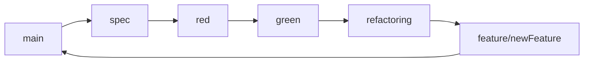
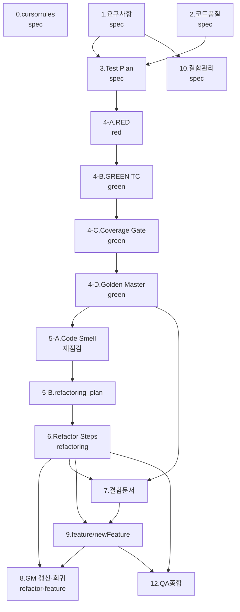

# Feedback Analyzer — 테스트 우선 TDD/리팩토링 프롬프트 (초안)

> 원본: `README.md`, `project_purpose.md`, `prompt1.md`, `src/cpp/`, `docs/TODO.md`  
> 목적: 대화 이력·중복·모호 표현을 제거하고, **브랜치·커밋 단위로 재실행 가능한 프롬프트**로 정리

---

## 사용 방법

1. **공통 컨텍스트**와 **브랜치 전략**을 먼저 읽는다.
2. 현재 Git 브랜치가 해당 단계와 일치하는지 확인한 뒤, 해당 단계 프롬프트를 그대로 복사해 사용한다.
3. 단계는 **의존 순서**를 따른다 (이전 단계 산출물 `@` 참조).
4. **spec**: 프로덕션 코드(`src/cpp/` 기존 파일) 수정 금지 — 문서·테스트 계획만.
5. **red / green**: 기존 `src/cpp/` 레거시 구현 **수정 금지** — 테스트·신규 어댑터/스텁 파일만 추가.
6. **green (마무리)**: FA-TC 전건 Green → **4-C 커버리지 게이트(최초 확립)** → **4-D Golden Master** (순서 고정, 동일 브랜치). 커버리지 PASS 전 GM 금지. **§8**은 동일 절차로 회귀·갱신.
7. **refactoring**: green 완료(TC+커버리지+GM) 후 Phase별 **1 Commit = 1 CoT**.
8. **feature/newFeature**: 신규 기능 = **Test Case 추가 → 커버리지 보강 → Golden Master 갱신** → 구현; 회귀에 FA-TC+커버리지+GM 포함.
9. 세션 종료 시 **후처리 프롬프트**를 한 번 실행한다.

---

## 브랜치 전략 (필수)



| 브랜치 | 역할 | 기존 `src/cpp/` 수정 | 허용 작업 | 완료 조건 |
|--------|------|----------------------|-----------|-----------|
| **spec** | 요구사항·품질·**Test Plan** | ❌ 금지 | `docs/*.md`, `.cursorrules`, `tests/` 골격(빈/RED 스켈레톤) 설계 문서 | `docs/test_plan.md` 확정, 코드 diff 없음 |
| **red** | 실패 테스트만 | ❌ 금지 | `tests/`, `CMakeLists.txt` 테스트 타겟, **신규** 헤더/스텁(링크용) | `ctest` 실패가 **의도된 RED** |
| **green** | 테스트 통과 · **커버리지** · **Golden Master** | ❌ 금지 (레거시 파일) | **신규** support 모듈 · `tests/golden/` · gcov/lcov 스크립트 | **선행:** FA-TC 전건 Green → **커버리지 게이트** → **Golden Master** → refactoring 병합 |
| **refactoring** | 구조 개선 | ✅ 계획서 Phase별 허용 범위만 | `docs/refactoring_plan.md` Step N → 1 Commit → `ctest` Green 유지 | Phase 체크리스트 완료 |
| **feature/newFeature** | 확장 기능 | ✅ 기능 범위 내 | **TC 추가(RED→GREEN)** → **커버리지 보강** → **GM 스냅샷 갱신** → 구현 | 기능 FA-TC Green + `run_coverage_gate` PASS + GM 회귀 Green |

**브랜치 작업 명령 (예시)**

```bash
git checkout main
git pull
git checkout -b spec    # 또는 red, green, refactoring, feature/newFeature
```

**커밋 규칙 (Chain-of-Thought)**

- **Test Case**: 1 TC = 1 CoT 블록 = 1 Commit  
  - CoT 필수 항목: `Given` / `When` / `Then` / `왜 이 순서인가` / `실패 기대 메시지`
- **Refactoring**: 1 Phase Step = 1 CoT 블록 = 1 Commit  
  - CoT 필수 항목: `냄새` / `목표` / `변경 파일` / `롤백 방법` / `ctest` 검증
- 커밋 메시지 접두어: `docs(spec):`, `test(red):`, `feat(green):`, `refactor:`, `feat(feature):`

---

## 공통 컨텍스트 (모든 단계에 적용)

| 항목 | 내용 |
|------|------|
| 프로젝트 | Feedback Analyzer — C++17, CMake 3.14+, cpp-httplib, `http://localhost:8080` |
| 도메인 | 한국어 피드백 → 키워드 분류(5카테고리) → 감정(긍정/중립/부정) → 필터 → CSV 다운로드 |
| 성격 | **의도적 레거시** — 리팩토링·TDD 학습용 (프로덕션 품질 아님) |
| 감정 분류 | `TextAnalyzer::sent` — 긍정 키워드 → 부정 키워드 → **나머지 중립** |
| 필터 감정 | `Filters::fil` — `S_KEYWORDS` 별도 정의, **중립 키워드 매칭 시에만** 중립 |
| 키워드 분류 | `TextAnalyzer::kw` — `"main"` 서브키만 사용 |
| 키워드 필터 | `Filters::fil` — `"main"` 서브키 **스킵** → 집계·필터 **불일치** (P0 버그) |
| 상태 | `Session::currentFeedbacks`, `TextAnalyzer::globalSent/Kw`, `main.cpp` `fil_data` |
| CSV | README: `text` 컬럼 — 구현: **첫 컬럼** + 헤더 1행 스킵 |
| HTTP | `GET /`, `POST /analyze`, `POST /upload`, `POST /filter`, `GET /download` |
| 테스트 | Given-When-Then · Catch2 · 경계·불일치 시나리오 필수 |
| 커버리지 | **green 브랜치**에서 측정 · 목표 **라인 90%+** (미션 1) · 대상: `TextAnalyzer`, `Filters`, `tests/support/` |
| 커버리지 게이트 | Domain(핵심 분류 로직) **≥90%** · Boundary(경계·예외 분기) **≥85%** · 미달 시 **테스트만** 보강 (레거시 수정 금지) |
| Golden Master | **green 4-D**: 최초 커버리지 PASS 후 GM 확립 · **§8**: 4-D와 **동일 절차**로 refactoring·feature 시 회귀·갱신 |
| 리팩토링 | **refactoring** 브랜치 진입 전 green 완료 필수 · ctest+GM+커버리지 Green 유지 |
| 검증 명령 | `cmake --build build && ctest` · `scripts/run_coverage_gate.ps1` (또는 동등 스크립트) |
| 산출물 언어 | 설명·문서 **한글**, 코드·식별자는 기존 규칙 준수 |

**프롬프트 구조:** `[P]` 역할 · `[C]` 맥락 · `[T]` 작업 · `[F]` 산출물 형식 · `[CoT]` 사고 과정(커밋 단위)

**주요 소스 경로**

| 역할 | 경로 |
|------|------|
| 서버·God Module | `src/cpp/main.cpp` |
| 감정·키워드 집계 | `src/cpp/TextAnalyzer.h` |
| 필터 | `src/cpp/Filters.h`, `Filters.cpp` |
| 키워드 사전 | `src/cpp/Constants.h`, `Constants.cpp` |
| 도메인 모델 | `src/cpp/Feedback.h` |
| 세션 | `src/cpp/Session.h`, `Session.cpp` |
| UI 카테고리 | `src/cpp/UIComponents.h`, `UIComponents.cpp` |
| 로깅 | `src/cpp/Logger.h`, `Logger.cpp` |
| 미사용 | `src/cpp/FileHandler.h` |
| 빌드 | `CMakeLists.txt` |
| 학습 목적 | `project_purpose.md` |
| 분석 산출 | `docs/TODO.md` |

**P0 알려진 결함 (테스트·리팩토링 우선 대상)**

| ID | 현상 | 검증 문장 예 |
|----|------|----------------|
| DEF-01 | 감정: Analyzer vs Filters 규칙 불일치 | `보통 배송은 괜찮아요` — 집계 중립 vs 필터 0건 |
| DEF-02 | 키워드: `main` 사용 vs 스킵 | 동일 문장으로 `kw` 카운트 ≠ `fil` 매칭 |
| DEF-03 | `/download` — `fil_data`만 사용 | 필터 전 다운로드 빈/잔여 데이터 |
| DEF-04 | CSV `text` 컬럼 미인식 | 헤더명 `text` 무시, `fields[0]`만 |

---

## 단계별 프롬프트

> **브랜치 열:** 각 단계 제목에 권장 브랜치를 표기한다.

---

### 0. 프로젝트 규칙 (.cursorrules) — `spec`

```
@README.md

[P] 레거시 C++ QA/리팩토링 시니어 엔지니어
[C] Feedback Analyzer C++17 — Cursor AI가 항상 따를 규칙
[T] 프로젝트 루트 `.cursorrules` 작성
    - 기술 스택: C++17, CMake, cpp-httplib, Catch2
    - 브랜치: spec → red → green → refactoring → feature/newFeature
    - spec/red: 기존 src/cpp 레거시 코드 수정 금지
    - green: 최소한의 코드 수정만 가능
    - refactoring: green 후 **코드 스멜 재점검(5-A)** → refactoring_plan(5-B) → Phase·1 Step·1 Commit
    - CoT: TC·Refactor 각각 Given-When-Then / 냄새-목표-검증
    - 도메인: DEF-01~04, Mom Test 가설(H1~H6), 미션 1~7 로드맵
    - 테스트: Given-When-Then, 경계(전체/긍정/부정/중립, 카테고리 5종)
    - green 완료: FA-TC 전건 Green → 커버리지 게이트(최초) → 4-D Golden Master (§8과 동일 절차)
    - feature: TC 추가 → 커버리지 보강 → Golden Master 갱신 → 회귀(FA-TC+커버리지+GM)
    - 설명은 한글로 표현
    - Commit 시 mesage는 한글로 표현    
    - 프롬프트 진행 시 README에 항목 별 TODO를 추가. 진행여부 반영
[F] `.cursorrules` 완성 텍스트 (한글)
```

**완료 기준:** `.cursorrules` 생성 · **코드 diff 없음**

---

### 1. 요구사항 분석 — `spec`

```
@README.md @project_purpose.md

[P] 시니어 C++ QA 엔지니어
[C] Feedback Analyzer — README·학습 미션 기반 도메인 요구사항
[T] C++ 구현·테스트 관점 요구사항 재정리
    1) 프로젝트 정체성 (학습용 레거시 vs 표면 목적)
    2) HTTP API·데이터 흐름 — 표
    3) 감정·키워드 분류 계약 (Analyzer vs Filters 차이 명시)
    4) CSV 입출력 규칙 vs 구현 갭
    5) Session / fil_data / download 정합성
    6) project_purpose 미션 1~7 매핑
    7) 테스트 시나리오 번호 목록 (40건 이상 권장, TC-ID: FA-001~)
    8) Mom Test 가설·Pass/Fail 신호 요약
[F] Markdown → docs/requirements_analysis.md (한글)
```

**완료 기준:** `docs/requirements_analysis.md` · **기존 코드 수정 없음**

---

### 2. 코드 품질 분석 — `spec`

```
@src/cpp/main.cpp @src/cpp/TextAnalyzer.h @src/cpp/Filters.h
@src/cpp/Constants.h @src/cpp/Session.h @src/cpp/Feedback.h
@README.md

[P] 시니어 C++ 아키텍트 + 모던 C++ 리뷰어
[C] 의도적 코드 스멜 포함 레거시 — SOLID·Code Smell 정적 분석
[T] 품질 분석
    - God Module (main.cpp), Duplicate containsAny, Global State
    - Feature Envy (Filters ↔ Constants), Shotgun Surgery, Lava Flow (FileHandler)
    - DEF-01~04 근거 코드 위치
    - 리팩토링 우선순위 P0~P3 (근거 포함)
    - mom test(Rob Fitzpatrick 인터뷰 방법론)에 의한 품질 분석 진행
    - Code Smell 분석석
[F] docs/code_quality_report.md (한글)
```

**완료 기준:** `docs/code_quality_report.md` · **코드 수정 없음**

---

### 3. 테스트 계획 (Test Plan) — `spec` ★

```
@README.md @project_purpose.md @docs/requirements_analysis.md
@docs/code_quality_report.md @src/cpp/TextAnalyzer.h @src/cpp/Filters.h

[P] 시니어 QA 리드
[C] spec 브랜치 — **프로덕션 코드 수정 금지**, Test Plan만 작성
[T] 테스트 계획서 작성
    - TDD 5영역 우선순위 (P0/P1/P2)
      1) 감정 분류 일관성 (DEF-01)
      2) 키워드 집계·필터 일관성 (DEF-02)
      3) TextAnalyzer sent/kw 유닛
      4) Filters fil (전체/긍정/부정/중립/카테고리)
      5) CSV·다운로드·Session (DEF-03, DEF-04)
    - TC-ID·Given-When-Then·기대값·RED/GREEN 소유 브랜치
    - 경계값 매트릭스 (빈 입력, 전체, 중립 애매 문장, main-only 키워드)
    - **CoT 템플릿** per TC (커밋 단위 작성 예시 3건)
    - Fake/Fixture: in-memory Feedback 벡터, 샘플 CSV 문자열
    - **커버리지 (green 게이트)**: 측정 대상 파일·Domain/Boundary 정의·90%/85% 통과 기준
    - **Golden Master**: green **4-D**에서 최초 확립(GM-01~) · **§8**과 동일 절차로 feature 시 TC·커버리지 반영 후 스냅샷 갱신
    - red/green 제약: 레거시 파일 변경 없이 테스트 가능한 **Seam** 설계
    - README.md 에 red/green TODO 추가
[F] docs/test_plan.md (한글) + TC-ID 목록
```

**완료 기준:** `docs/test_plan.md` 확정 · **`src/cpp/` 기존 파일 diff 0**

---

### 4-A. RED — 실패 테스트 (CoT·커밋 단위) — `red`

```
@docs/test_plan.md @src/cpp/TextAnalyzer.h @src/cpp/Filters.h
@CMakeLists.txt

[P] 테스트 설계에 강한 시니어 C++ QA
[C] red 브랜치 — **기존 src/cpp 레거시 구현 수정 금지**
[T] Test Plan의 TC를 RED로 구현 (1 TC = 1 Commit)
    [CoT] 각 커밋 전 작성:
      - Given / When / Then / 실패 이유 / 다음 GREEN 최소 변경 가설
    1) Catch2 도입 (FetchContent 등)
    2) 테스트 전용 타겟: feedback_analyzer_tests
    3) 레거시 직접 수정 대신:
       - 순수 함수 추출 **신규 파일** (예: tests/support/KeywordMatcher.hpp) 또는
       - 기존 API를 호출하되 **현재 버그를 고정하는 기대값**으로 RED
    4) 우선순위 P0: FA-TC-01~15 (DEF-01, DEF-02 중심)
    5) 단일 조건 per TEST_CASE, 이름: FA_TC_01_SentimentNeutralMismatch
[F] tests/*.cpp + CMake diff · ctest **의도적 FAIL** · 커밋 로그에 CoT 요약
```

**완료 기준:** P0 TC RED 전부 커밋됨 · `ctest` 실패가 계획과 일치 · **레거시 .cpp/.h diff 없음**

**RED 단일 TC 프롬프트 (복사용)**

```
브랜치 red. FA-TC-XX 한 건만 RED로 작성해줘.
제약: src/cpp 기존 파일 수정 금지. CoT(Given/When/Then/실패이유) 먼저 보여주고,
tests/ 와 CMake만 변경. 커밋 메시지: test(red): FA-TC-XX <slug>
```

---

### 4-B. GREEN — 최소 통과 (CoT) — `green`

```
@docs/test_plan.md @tests/ @docs/code_quality_report.md

[P] 시니어 C++ 개발자 (TDD)
[C] green 브랜치 — **기존 레거시 src/cpp 최소 수정**
[T] RED TC를 1건씩 GREEN (1 TC = 1 Commit)
    [CoT] 각 커밋 전:
      - 실패 원인 / 최소 변경 / 왜 레거시를 건드리지 않는가
    허용 변경:
      - tests/support/ 신규 순수 구현 (Classifier, Matcher)
      - 테스트가 신규 모듈을 링크하도록 CMake 조정
    금지:
      - TextAnalyzer.cpp, Filters.cpp, main.cpp 등 레거시 패치 최소 진행
    GREEN 후: ctest 전체 · 기존 실행파일 feedback_analyzer 빌드 유지
[F] 커밋별 diff + CoT · ctest Green
```

**완료 기준:** test_plan **FA-TC 전건** Green · **레거시 본체 diff 없음** (신규 support 모듈만)  
→ 이후 **4-C 커버리지(최초 확립)** → **4-D Golden Master** (같은 `green` 브랜치, 커버리지 PASS 후만)

**GREEN 단일 TC 프롬프트 (복사용)**

```
브랜치 green. FA-TC-XX만 GREEN.
제약: 레거시 src/cpp 최소 수정. 요청시 진행. tests/support 신규 코드만.
CoT 후 구현. 커밋: feat(green): FA-TC-XX <slug>. ctest 확인.
```

---

### 4-C. 커버리지 게이트 — `green` ★

> **선행 조건:** 4-B에서 test_plan **FA-TC 전건** `ctest` Green  
> **다음 단계:** 4-D Golden Master (동일 `green` 브랜치, **최초 커버리지 PASS 후만**)

```
@docs/test_plan.md @tests/ @CMakeLists.txt

[P] 시니어 C++ QA + 빌드 엔지니어
[C] green 브랜치 — FA-TC 전건 Green 직후, Golden Master **이전**
[T] 커버리지 측정·게이트·미달 시 테스트 보강
    1) CMake: `--coverage` 또는 gcov/lcov 타겟 (예: `feedback_analyzer_tests_cov`)
    2) `scripts/run_coverage_gate.ps1` (또는 `.sh`) — Domain / Boundary 구분 집계
    3) 게이트 (test_plan과 동일):
       - Domain (TextAnalyzer, Filters, tests/support 분류 로직): **≥90%**
       - Boundary (빈 입력, 전체, 경계 문장, 예외 분기): **≥85%**
       - 전체 라인: **≥90%** (project_purpose 미션 1)
    4) 미달 시: **tests/ 만** 추가 (1 갭 = 1 CoT = 1 Commit), 레거시 src/cpp 최소 수정.
    5) 통과 시: `docs/coverage_report.md` — 파일별 %, Miss 라인, 측정 명령
    6) 통과 확인 후 **반드시 4-D Golden Master** 진행 (이 단계에서 GM 파일 생성·갱신 금지)
[F] 스크립트 + (필요 시) 테스트 diff + coverage_report · 게이트 PASS 로그
```

**완료 기준:** `run_coverage_gate` PASS · `docs/coverage_report.md` · `ctest` 전건 Green 유지  
→ **다음:** 4-D Golden Master (동일 `green` 브랜치)

**커버리지 단일 갭 프롬프트 (복사용)**

```
브랜치 green. 커버리지 게이트 FAIL 구간만 보강해줘.
선행: FA-TC 전건 Green 확인됨.
제약: 레거시 src/cpp 최소 수정. CoT 후 커밋: test(green): coverage-<slug>
완료: run_coverage_gate PASS && ctest Green
다음: 4-D Golden Master — 커버리지 PASS 확인 후에만
```

---

### 4-D. Golden Master / 회귀 — `green` ★

> **선행 조건 (필수):**  
> 1) 4-B — test_plan **FA-TC 전건** `ctest` Green  
> 2) 4-C — **커버리지 게이트** PASS (최초 확립)  
> **금지:** TC 미완료·커버리지 FAIL 상태에서 Golden 파일 생성/갱신  
> **브랜치:** `refactoring` / `feature` **진입 전** `green`에서 완료 · 이후 갱신은 **§8** (동일 절차)

```
@docs/test_plan.md @tests/ @docs/coverage_report.md

[P] Golden Master 회귀 테스트 설계자
[C] green 브랜치 — 유닛/통합 TC·커버리지 게이트 통과 **이후**에만 실행 (최초 GM 확립)
[T]
    [CoT] 시나리오별: Given/When/Then/스냅샷 범위/왜 유닛 Green 이후인가
    1) GM-ID (GM-01~): 집계 결과·CSV 스냅샷 중심 (HTTP/HTML 전체 스냅샷은 P2)
       - GM-01 analyze 집계 · GM-02 filter 중립 · GM-03 download CSV · GM-04 upload CSV
    2) tests/golden/*.approved.txt — 최초 생성 시 실측 캡처·approve 절차 문서화
    3) `tests/test_golden_master.cpp` + CMake `add_test(NAME GoldenMaster ...)`
    4) `scripts/generate_golden_master.ps1` — 갱신 시 FA-TC+커버리지 Green 재확인
    5) docs/golden_master.md — 시나리오·갱신·실패 시 diff 해석
[F] 테스트 코드 + golden 파일 + 문서 · `ctest` **전체** Green (FA-TC + GoldenMaster)
```

**완료 기준:** Golden Master ctest PASS · FA-TC·커버리지 게이트 **회귀 Green** · `green` → `refactoring` 병합 가능

**Golden Master 프롬프트 (복사용)**

```
브랜치 green. Golden Master만 진행해줘. (4-D: 최초 확립)
선행 확인: FA-TC 전건 ctest Green && run_coverage_gate PASS.
위 조건 미충족이면 Golden 작업 중단하고 부족 항목부터 완료.
CoT 후 GM-XX 하나씩 커밋: test(green): GM-XX <slug>
```

---

### 5. 리팩토링 계획 — `spec` 또는 `refactoring` 진입 전

> **순서 고정:** **5-A 코드 스멜 재점검** → **5-B 리팩토링 로드맵 작성**  
> green 기준선(FA-TC + 커버리지 + GM) 확보 **이후**, `src/cpp/` **현재 상태**를 기준으로 스멜을 다시 본 뒤 Phase를 설계한다.  
> (단계 2 `code_quality_report.md`는 **리팩터링 전** 레거시 스냅샷 — 5-A에서 **갱신·보완** 필수)

---

#### 5-A. 코드 스멜 재점검 (선행) — `spec` 또는 `refactoring` ★

```
@src/cpp/ @docs/code_quality_report.md @docs/test_plan.md
@docs/requirements_analysis.md @README.md

[P] 시니어 C++ 아키텍트 + 모던 C++ 리팩토링 코치
[C] green **완료 후** · **src/cpp/ 프로덕션 코드 수정 금지** (읽기·문서만)
[T] 현재 코드베이스 Code Smell 정적 분석
    1) @src/cpp/ 전 파일 스캔 (httplib.h 등 서드파티 제외)
    2) 단계 2 보고서와 **diff**: 이미 해소된 스멜 vs **잔존** 스멜
    3) 스멜 분류 (근거: 파일·심볼·행 범위)
       - God Module / God Object (Session 전역 상태 등)
       - Duplicate Code (classifySentiment, containsAny, 타임스탬프 등)
       - Feature Envy (Constants map 구조 결합)
       - Shotgun Surgery (카테고리·키워드 이중 정의)
       - Long Method / Long Parameter List (renderPage, registerRoutes)
       - Header에 비즈니스 로직 (Logger, Filters 등)
       - Lava Flow / Dead Parameter / Magic String
    4) DEF-01~04와 매핑: **결함 해소 여부** · **잔여 비대칭**(kw `main` vs fil 전체 서브키 등)
    5) 스멜 → **리팩토링 Phase/Step 후보** 표 (우선순위 P0~P3)
    6) **테스트 축**: 각 스멜이 FA-TC·GM-ID 중 무엇으로 검증되는지 1줄씩
[F] docs/code_quality_report.md **갱신** (§「green 이후·리팩터링 전」 또는 동등 절 추가)
    · 잔존 스멜 요약 표 + Phase 후보 매핑 포함
```

**완료 기준:** `src/cpp/` diff 0 · 스멜 목록·우선순위·TC/GM 매핑이 문서에 있음 · **5-B 착수 가능**

**5-A 단독 프롬프트 (복사용)**

```
브랜치 spec 또는 refactoring. green 완료(FA-TC+커버리지+GM) 확인 후
5-A만 진행: @src/cpp/ 코드 스멜 재점검.
제약: src/cpp 수정 금지. docs/code_quality_report.md 갱신.
DEF-01~04 해소/잔존, P0~P3, FA-TC·GM 매핑 표 포함.
```

---

#### 5-B. 리팩토링 로드맵 작성 — `spec` 또는 `refactoring`

```
@docs/code_quality_report.md @docs/test_plan.md @docs/requirements_analysis.md
@src/cpp/ @docs/golden_master.md

[P] 모던 C++ 리팩토링 코치
[C] green 기준선 + **5-A 스멜 재점검 완료** — **실행 가능한 Phase 로드맵**
[T] docs/refactoring_plan.md 작성
    - **입력:** 5-A 잔존 스멜·P0~P3 · DEF-01~04 · AC-SENT/KW/DL (test_plan)
    - Phase 0~4: DEF·God Module·중복 제거 (green Domain 계약에 레거시 정합)
    - Phase 5~N: 5-A **잔존 스멜** 기반 후속 Phase (헤더/cpp 분리, SentimentClassifier, Session 캡슐화 등)
    - 각 Step: 목표 / 변경 파일(레거시 허용) / 리스크 / 롤백 / ctest·GM / **CoT 질문 3개**
    - **1 Step = 1 Commit** · 커밋 메시지 `refactor(phase-N): Step N.M …`
    - @README.md 에 green 완료조건 아래 refactoring TODO·Phase 표 추가
[F] docs/refactoring_plan.md (Phase 0~N 체크리스트, 한글)
```

**완료 기준:** 로드맵 문서 · Phase가 **5-A 스멜 우선순위**와 정합 · (선택) spec에서 작성, **실행은 refactoring** 브랜치

---

### 6. 리팩토링 실행 (Step-by-Step) — `refactoring`

```
@docs/refactoring_plan.md @tests/ @src/cpp/

[P] 모던 C++ 리팩토링 코치
[C] refactoring 브랜치 — 계획서 **현재 Step만** 수행
[T] Phase N Step M (한 번에 하나)
    [CoT] 커밋 전 필수:
      1) 냄새·목표  2) 변경 파일  3) 테스트 영향  4) 롤백  5) ctest 명령
    - 동작 변경 시: test_plan TC 먼저 갱신 또는 보강
    - Step 완료: cmake --build build && ctest
    - 사용자가 "진행"/"계속" 할 때까지 다음 Step 금지
[F] Step diff + ctest Green · 커밋: refactor: PhaseN-StepM <slug>
```

**완료 기준:** `refactoring_plan.md` 전 Phase 체크 · 회귀 Green

**REFACTOR 단일 Step 프롬프트 (복사용)**

```
브랜치 refactoring. docs/refactoring_plan.md Phase N Step M만 실행.
CoT 5항목 먼저. Step 하나·커밋 하나. ctest Green 필수.
```

---

### 7. 결함 분석·문서화 — `green` (Golden Master 후) 또는 `refactoring`

```
@src/cpp/ @tests/ @docs/requirements_analysis.md @docs/test_plan.md

[P] C++ QA 엔지니어
[C] DEF-01~04 및 FA-TC 결과 대조
[T]
    A) ctest·요구사항·경계값 분석 — 버그 위치, Severity, 최소 수정안
    B) docs/defect_list.md (DEF-001~, ItemType, Steps, Expected, Actual)
[F] A) 수정은 refactoring Step과 연동 · B) 문서 (한글)
```

**완료 기준:** `docs/defect_list.md` + 관련 Step Green

---

### 8. Golden Master / 회귀 — 갱신·회귀 ★

> **절차:** **4-D와 동일** ([T]·[F]·완료 기준·CoT·커밋 규칙 그대로 적용)  
> **적용 시점:** refactoring Step 완료 후 · `feature/newFeature` (§9) · 동작·출력 변경 시 스냅샷 재approve  
> **선행 조건 (필수):** FA-TC 전건 `ctest` Green · `run_coverage_gate` PASS  
> **금지:** TC·커버리지 FAIL 상태에서 `tests/golden/` 갱신  
> **green 최초 확립:** **4-D**에서 1회 수행 — 본 절(§8)은 이후 **갱신·회귀**용

```
@docs/test_plan.md @tests/ @docs/coverage_report.md @docs/golden_master.md

[P] Golden Master 회귀 테스트 설계자
[C] refactoring · feature/newFeature — **4-D와 동일 절차**로 GM 유지·갱신
[T] 4-D [T] 항목 1~5 동일 실행
    - 변경된 GM-ID만 선택 갱신 가능 (1 GM = 1 CoT = 1 Commit)
    - `scripts/generate_golden_master.ps1` 실행 전 FA-TC+커버리지 Green 재확인
    - docs/golden_master.md · test_plan GM 시나리오 동기화
[F] 4-D [F]와 동일 · `ctest` 전체 Green (FA-TC + GoldenMaster)
```

**완료 기준:** 4-D **완료 기준**과 동일 · 해당 Step/기능 merge 전 회귀 Green

**Golden Master 갱신 프롬프트 (복사용)**

```
브랜치 <refactoring|feature/newFeature>. Golden Master 갱신만 진행해줘. (§8, 절차=4-D)
선행: FA-TC 전건 ctest Green && run_coverage_gate PASS.
4-D와 동일 CoT·GM-XX 절차. 변경 GM-ID만: test(<branch>): GM-XX <slug>
```

---

### 9. 기능 개선 — `feature/newFeature`

```
@docs/requirements_analysis.md @docs/test_plan.md @tests/ @docs/golden_master.md @src/cpp/

[P] 시니어 C++ 개발자
[C] feature/newFeature — project_purpose 미션 6~7 (Trend, File DB 등)
     green 기준선(FA-TC+최초 커버리지+GM) 확보 **이후** 확장
[T] 기능별 **테스트·커버리지·Golden Master·구현** (순서 고정)
    1) test_plan에 기능 TC-ID 추가 (FA-TC-XX) — Given-When-Then·AC 매핑
    2) RED: 기능 TC 1건 = 1 CoT = 1 Commit (`test(feature):` 또는 `test(red):`)
    3) GREEN: 기능 구현 + TC Green (`feat(feature):`)
    4) **커버리지**: 신규·변경 분기 포함 — Domain/Boundary 게이트 재측정, 미달 시 tests/만 보강
    5) **Golden Master (§8, 4-D와 동일 절차)**: 출력·집계·CSV 등 **동작이 바뀌면** GM-ID 스냅샷 갱신
       - `scripts/generate_golden_master.ps1` — FA-TC+커버리지 Green 재확인 후 approve
       - docs/golden_master.md · test_plan GM 시나리오 동기화
    6) (선택) 해당 기능 범위 refactor — Step당 ctest+커버리지+GM 회귀
    - 1 기능 = CoT 블록 단위로 위 1~5 반복
    - **회귀 (매 커밋·merge 전):** FA-TC 전건 + run_coverage_gate PASS + GoldenMaster ctest Green
[F] test_plan 갱신 + tests/ + (필요 시) golden/ + coverage_report + 구현 + docs/feature_changelog.md (선택)
```

**완료 기준:** 기능 FA-TC Green · 커버리지 게이트 PASS · GM 회귀 Green · main merge 준비

**기능 단일 추가 프롬프트 (복사용)**

```
브랜치 feature/newFeature. <기능명> 한 건만 추가해줘.
순서: test_plan TC 추가 → RED → GREEN → 커버리지 보강(run_coverage_gate) → Golden Master 갱신(해당 GM-ID).
제약: 각 단계 CoT 후 1 Commit. 회귀: FA-TC + 커버리지 + GM 전부 Green.
```

---

### 10. 결함 관리 프로세스 — `spec`

```
@docs/defect_list.md @docs/test_plan.md

[P] QA 리드
[T] docs/defect_report.md — Severity×ItemType, 보고 템플릿, 메트릭
[F] 프로세스 문서 (한글)
```

**완료 기준:** `docs/defect_report.md`

---

### 11. 설계 다이어그램 (선택) — `spec`

```
@src/cpp/ @docs/refactoring_plan.md

[P] 소프트웨어 아키텍트
[T] Mermaid — Before/After 클래스·HTTP 흐름
[F] docs/architecture.md
```

---

### 12. QA 종합 검토 — `refactoring` 또는 `main` 직전

```
@docs/requirements_analysis.md @docs/code_quality_report.md
@docs/test_plan.md @docs/defect_list.md @docs/refactoring_plan.md
@tests/

[P] QA 리드
[T] docs/qa_final_report.md — 커버리지, 결함 패턴, Before/After, AI 회고
[F] ctest·lcov 수치 반영 후 작성
```

**완료 기준:** `docs/qa_final_report.md`

---

## 후처리 프롬프트 (각 단계 완료 후 1회)

```
[P] 프로젝트 문서·배포 담당
[C] 완료 단계 N, 브랜치명, 산출물 경로
[T] 아래 순서로 진행
    1) Report/NN.<slug>-report-YYYY-MM-DD.md
       - 브랜치, CoT 요약, 변경 파일, ctest/build 결과, 다음 Step/브랜치
    2) Prompt/NN.<slug>-transcript-YYYY-MM-DD_prompt.md Export
	- User 프롬프트 + Assistant 전체 대화 (대화형 형식)
    3) Prompt/full-transcript-refactor-first-YYYY-MM-DD_prompt.md 갱신
    4) README.md 파일에 진행사항 반영
    5) git add → commit (메시지에 브랜치·TC-ID, 한글 설명) → push
[F] 생성 파일 목록 + git 결과 (한글)
```

**슬러그 예:** `spec-test-plan`, `red-fa-tc-01`, `green-fa-tc-01`, `green-coverage-gate`, `green-golden-master`, `green-gm-01`, `refactor-phase0-step1`, `feature-tc-trend`, `feature-coverage-trend`, `feature-gm-trend`

---

## 단계·브랜치 의존 관계



---

## TDD·브랜치 빠른 참조

| # | 브랜치 | 상황 | 핵심 지시 |
|---|--------|------|-----------|
| 1 | spec | 시작 | 코드 수정 금지 · test_plan.md · TC-ID·CoT 템플릿 |
| 2 | red | 실패 고정 | 레거시 수정 금지 · 1 TC = 1 Commit · ctest FAIL 의도 |
| 3 | green | TC 통과 | support만 · FA-TC **전건** Green |
| 4 | green | 커버리지 | TC Green 후 · Domain≥90% Boundary≥85% · tests만 보강 |
| 5 | green | Golden Master (4-D) | **최초 커버리지 PASS 후만** · GM-01~ · ctest 전체 Green |
| 5-A | spec/refactor | 코드 스멜 재점검 | green 후 `@src/cpp/` 스캔 · `code_quality_report` 갱신 · **src/cpp diff 0** |
| 5-B | spec/refactor | refactoring_plan | **5-A 완료 후** · 잔존 스멜·DEF·TC 기반 Phase 0~N 로드맵 |
| 5b | refactor·feature | Golden Master (§8) | **4-D와 동일 절차** · 변경 GM-ID 갱신 · 회귀 3종 Green |
| 6 | refactoring | 구조 | **5-B plan 확정 후** · Step·CoT·Green+GM+커버리지 회귀 |
| 7 | feature | 확장 | TC 추가→RED→GREEN→**커버리지**→**GM 갱신** · FA-TC+커버리지+GM 회귀 |

---

## 원본 대비 최적화 요약

| 개선 항목 | 내용 |
|-----------|------|
| 프로젝트 특화 | SHealth 템플릿 → Feedback Analyzer, DEF-01~04, HTTP/Session |
| 브랜치 전략 | spec → red → green → refactoring → feature/newFeature 명시 |
| 코드 수정 경계 | spec/red/green 레거시 금지 · refactor/feature만 계획 범위 허용 |
| CoT·커밋 | TC·Refactor 각각 1 Commit 단위 CoT 필수 |
| README·미션 | project_purpose 1~7단계를 단계 1·3·6·9·12에 매핑 |
| 의존성 | `@` 참조·선행 docs·브랜치 표기 |
| green 게이트 | FA-TC 전건 → 최초 커버리지(90/85%) → 4-D Golden Master → **5-A 스멜 재점검** → 5-B plan → refactoring |
| GM 갱신 | §8 = 4-D와 동일 절차 · refactoring·feature Step/기능 후 |
| feature 확장 | TC 추가 → 커버리지 보강 → Golden Master 갱신 → 회귀 3종(FA-TC+커버리지+GM) |

---

## 빠른 복사: 전체 워크플로우 (한 번에 지시할 때)

```
Feedback Analyzer C++17 TDD/리팩토링을 아래 순서·브랜치로 진행해줘.

브랜치: spec → red → green → refactoring → feature/newFeature
제약:
- spec: 코드 수정 금지, docs/test_plan.md 작성
- red/green: 기존 src/cpp 레거시 수정 금지
- refactoring: refactoring_plan Step별 1 Commit, CoT 5항목, ctest Green
- TC·Refactor: Chain-of-Thought 후 1건=1커밋

0) spec — .cursorrules
1) spec — @README.md @project_purpose.md → docs/requirements_analysis.md
2) spec — @src/cpp → docs/code_quality_report.md
3) spec — Test Plan → docs/test_plan.md (TC FA-001~, CoT 템플릿)
4-A) red — P0 TC RED, tests만, 레거시 diff 0
4-B) green — FA-TC 전건 GREEN (support만, 레거시 diff 0)
4-C) green — 커버리지 게이트 최초 확립 (Domain≥90%, Boundary≥85%, scripts/run_coverage_gate)
4-D) green — Golden Master 최초 확립 (4-C PASS 후, GM-01~, ctest 전체 Green)
8) refactor·feature — Golden Master 갱신·회귀 (4-D와 동일 절차)
5-A) spec/refactor — @src/cpp/ 코드 스멜 재점검 → docs/code_quality_report.md 갱신 (src/cpp diff 0)
5-B) spec/refactor — docs/refactoring_plan.md (5-A 잔존 스멜·DEF·TC 기반 Phase 0~N)
6) refactoring — Step-by-step, 1 Commit/Step, ctest+GM+커버리지 회귀
7) defect_list.md + 결함 Step 연동
9) feature/newFeature — TC→커버리지→GM 갱신 후 구현 (미션 6~7, 회귀 3종)
10) spec — defect_report.md
11) (선택) architecture.md
12) qa_final_report.md

green 완료 조건 (refactoring 진입 전):
- FA-TC 전건 ctest Green
- run_coverage_gate PASS (Domain≥90%, Boundary≥85%)
- Golden Master ctest Green

검증: cmake --build build && ctest && scripts/run_coverage_gate.ps1
각 단계: Report + Prompt transcript + full-transcript 갱신 + git commit/push
설명은 한글.
```
